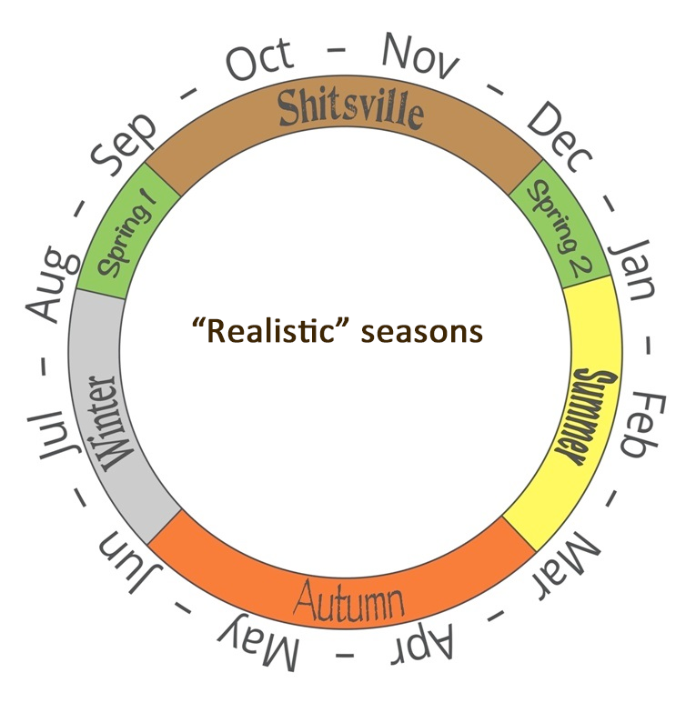

```{r setup, include = FALSE}

# Clear workspace
rm(list = ls(all.names = TRUE))

# Set default chunk options
knitr::opts_chunk$set(echo = FALSE, warning = FALSE, message = FALSE)

# Load packages
library(dplyr)
library(tidyr)
library(lubridate)
library(moments)
library(ggplot2)
library(GGally)
library(nortest)
library(Hotelling)
library(grid)
library(gridExtra)
library(pheatmap)
library(viridis)
library(RColorBrewer)
library(cluster)
library(factoextra)
library(vegan)
library(caret)
```

\newpage

# Abstract

Wellington's weather is notoriously unpredictable and in 2014 Adam Shand proposed that Wellington's weather would be more realistically described by a new and unconventional seasonal classification that splits spring into two periods (August and December) and renames the period from September to November as "Shitsville" [@shandtweet]. This proposal has received support, with several hundred retweets and a website based upon it [@realseason]. We investigated whether these "real" seasons in fact provide a better classification of the weather using daily Wellington and Auckland weather data from 2017 to 2021. If the real seasons performed better, it would suggest that serious consideration should be given to a proposal to change to the seasonal naming system.

We used four different methods and across all four we obtained similar results. Silhouette plots suggested that the conventional seasons are better than real seasons at grouping together days with similar weather. We found larger distances between seasonal summary statistics and lower standard deviations for conventional seasons than real seasons, suggesting that conventional seasons are better at separating similar observations into more separate groups. And finally we found that k-means clustering based on daily weather data groups days into categories that are more similar to conventional seasons than real seasons. These results held true for Wellington and Auckland and we conclude that our evidence does not support a proposal to change the seasonal naming system.

We also found that that neither seasonal classification performed particularly well at partitioning days into groups with similar weather. This concords with what is likely be most New Zealanders' subjective experience of unpredictable weather, no matter what the season. Our findings remind us to acknowledge that the seasons are in fact based on the tilt of the Earth’s axis relative to the sun, with weather an incidental outcome of this tilt rather than a key driver of how seasons are classified.


\newpage

# Introduction

Wellington is notorious for its windy and unpredictable weather. The city has large public artworks celebrating the wind (Figure&nbsp;\@ref(fig:blownaway)) and several classic New Zealand popular songs refer to Wellington's weather with lyrics such as, _"I wish I was in Wellington, the weather's not so great."_ [@muttonwgtn] and _"She said the weather's crap, I said you'll come around ... You can't beat Wellington on a good day."_ [@datsunwgtn].

```{r blownaway, fig.cap = "The 'blown away' sign in Miramar, Wellington. Image by Wainuiomartian, CC BY-SA 4.0 https://creativecommons.org/licenses/by-sa/4.0, via Wikimedia Commons", fig.align = "center",  out.width = "80%", fig.show = "hold"}

# Display image of blown away sign
  knitr::include_graphics("../images/Wellington_blown_away_sign.jpg")
```


Anecdotally, the weather in Wellington does not appear to be clearly demarcated by the seasons and in 2014 Adam Shand posted a tweet proposing an alternative way of classifying Wellington's seasons [@shandtweet]. We reproduce this alternative classification in Figure&nbsp;\@ref(fig:realseasonimg), alongside the conventional seasons for comparison. Adam Shand's 2014 tweet has been retweeted several hundred times and has given rise to a website that displays the "realistic" season for the current date [@realseason]. Interestingly, the website refers to the schematic as _"A Realistic New Zealand Calendar"_, suggesting that the authors now hold the view that it applies to all of New Zealand, not just Wellington.

```{r realseasonimg, fig.cap = "Schematic of the conventional seasons (a), and the alternative classification proposed by Adam Shand (b). Images are adapted from https://www.realnzweather.com.", fig.subcap = c("", ""), fig.ncol = 2, fig.align = "center",  out.width = "50%", fig.show = "hold"}

# Display image of conventional seasons
  knitr::include_graphics("../images/conventionalweather_forslides.png")
# Display image of 'Real NZ Weather' scheme
  
```

In this report we use five years of weather data from Wellington and Auckland cities and we investigate, for both cities, which seasonal classification better fits the weather data: the conventional seasons, or the realistic seasons proposed by @shandtweet. We ask the question: _should we change the seasonal naming system for Wellington and/or Auckland?_ 

This gives rise to the two key sub-questions that the analysis in this report focuses on:

* Which classification better partitions observed weather patterns in Wellington?
* Which classification better partitions observed weather patterns in Auckland?

These questions have important public policy implications. If the realistic seasons are a better classifier it would establish the beginnings of an evidence base supporting a change to the seasonal naming system for New Zealand or for specific cities. While such a change could be disruptive, it could also capture public imagination in a similar manner to the Laser Kiwi flag [@laserkiwi]. 

In this report we investigate the relative performance of each classification at grouping together days with similar weather values. We assess performance using distance metrics, standard deviations, silhouette plots, and a comparison with groupings created by k-means clustering.

\newpage


# Methodology

## Wellington and Auckland weather datasets {#method-data}

We use daily data for the 5-year period from  1 January 2017 to 31 December 2021, from Auckland and Wellington cities, collected from the Motat Ews weather station (Auckland) and the Kelburn Aws station (Wellington).

Data was downloaded from New Zealand's National Insitute for Water and Atmospheric Research (NIWA) National Climate Database [@cliflo] on 9 August, 2022.


## Variables {#method-vars}

The dataset contains 7 variables of interest. These are:

* Station `(Nominal)`: the weather station at which the observation was made.
* Date(NZST) `(Date)`: the date on which the observation was made.
* Max Temperature `(Numeric)`: maximum temperature recorded in the 24 hour period. Units: degrees Celsius.
* Min Temperature `(Numeric)`: minimum temperature recorded in the 24 hour period. Units: degrees Celsius.
* Global Radiation `(Numeric)`: solar radiation incident on the earth’s surface during the 24 hour period. This includes both radiation from direct sunlight and from diffuse (scattering) sources in the earth’s atmosphere such as clouds. Units: megajoules per square metre.
* Wind `(Numeric)`: the total distance travelled by surface wind during the 24 hour period. Units: kilometres.
* Rainfall `(Numeric)`: the amount of precipitation within the 24 hour period. Units: millimetres.

We also derived the following variables from Date(NZST):

* Season `(Nominal)`: the season of the observation, based on the conventional four seasons:
  * Spring: September, October and November.
  * Summer: December, January and February.
  * Autumn: March, April and May.
  * Winter: June, July and August.
* Real Season `(Nominal)`: the alternative season of the observation, based on the 'Real NZ Weather' categorisation [@realseason]. The seasons in this categorisation correspond to the following months
  * Spring 1_2: August and December
  * Shitsville: September, October and November (the same dates as the conventional spring season).
  * Summer: January and February.
  * Autumn: March, April and May (the same dates as the conventional autumn season).
  * Winter: June and July.
  
## Exploratory data analysis {#method-EDA}

The methods used in our exploratory data analysis were:

* Tables of basic summary statistics (sample size, minimum, first quartile, median, third quartile, maximum, mean, standard deviation, skewness, and kurtosis).
* Boxplots of distribution of all numeric variables split by city and season (for both season and real season).
* Pairs plots showing densities of the distribution of varaibles, scatter plots, and correlation coefficients (for both season and real season).
* Tables of Anderson-Darling test for normality by season and city.
* Hotelling test for equality of means by season and city.
* Variance test for equality of variances season and city.


## Comparison of the distances between seasonal summary statistics for the season and real season classifications {#method-distance}

For both season and real season, and separately for Auckland and Wellington, we calculated seasonal summary statistics for each weather variable. This gave us a total of 29 values for each season: minimum(Tmax), first quartile(Tmax), median(Tmax), third quartile(Tmax), maximum(Tmax), mean(Tmax), minimum(Tmin), first quartile(Tmin), median(Tmin), third quartile(Tmin), maximum(Tmin), mean(Tmin), minimum(GlobalRad), first quartile(GlobalRad), median(GlobalRad), third quartile(GlobalRad), maximum(GlobalRad), mean(GlobalRad), minimum(WindRun), first quartile(WindRun), median(WindRun), third quartile(WindRun), maximum(WindRun), mean(WindRun), first quartile(log(Rainfall)), median(log(Rainfall)), third quartile(Rainfall), maximum(Rainfall), mean(Rainfall). Tables of these summary statistics are provided in [Appendix A](#appA).

The log of rainfall was used instead of raw rainfall values where it was necessary because all of the summary statistics for rainfall equalled zero. Each weather variable has 6 summary statistics that were used in distance calculations, with the exception of rainfall/log(rainfall), where the minimum was omitted because it showed no variation across seasons. 

Thus we obtained 4 new vectors for the season classification and 5 for the real season classification. Given:  

Each weather variable in:  
$W = \{Tmax,\ Tmin,\ GlobalRad,\ WindRun,\ Rainfall\ or\ log(Rainfall)\}$

And each summary statistic in:  
$S = \{minimum,\ first\ quartile,\ median,\ third\ quartile,\ maximum,\ mean\}$

For the season classification we obtained the 4 vectors:

$X_{Spring} = \{S_1(W_1), S_2(W_2), S_3(W_3), ... , S_6(W_5)\}$  
$X_{Summer} = \{S_1(W_1), S_2(W_2), S_3(W_3), ... , S_6(W_5)\}$  
$X_{Autumn} = \{S_1(W_1), S_2(W_2), S_3(W_3), ... , S_6(W_5)\}$  
$X_{Winter} = \{S_1(W_1), S_2(W_2), S_3(W_3), ... , S_6(W_5)\}$  

(with the exception of the minimum of $Rainfall\ or\ log(Rainfall)$)

And for the real season classification we obtained the 5 vectors:

$X_{Spring1\_2} = \{S_1(W_1), S_2(W_2), S_3(W_3), ... , S_6(W_5)\}$  
$X_{Shitsville} = \{S_1(W_1), S_2(W_2), S_3(W_3), ... , S_6(W_5)\}$  
$X_{Summer} = \{S_1(W_1), S_2(W_2), S_3(W_3), ... , S_6(W_5)\}$  
$X_{Autumn} = \{S_1(W_1), S_2(W_2), S_3(W_3), ... , S_6(W_5)\}$  
$X_{Winter} = \{S_1(W_1), S_2(W_2), S_3(W_3), ... , S_6(W_5)\}$  

(with the exception of the minimum of $Rainfall\ or\ log(Rainfall)$)

For each seasonal classification and city, we calculated the Canberra distances between the seasons (i.e. between vectors $X_{Spring}$, $X_{Summer}$, $X_{Autumn}$, and $X_{Winter}$ for season, and between $X_{Spring1\_2}$, $X_{Shitsville}$, $X_{Summer}$, $X_{Autumn}$, and $X_{Winter}$ for real season).

The Canberra distance between seasons $i$ and $j$ is computed as:

$d_C(X_i, X_j) = \displaystyle\sum_{\ell=1}^{29}\frac{\mid x_\ell - y_\ell\mid}{\mid x_\ell\mid  + \mid y_\ell\mid }$

We chose the Canberra distance because its denominator provides a form of scaling that prevents variables with larger values and variances (such as the WindRun summary statistics) from dominating the calculated distances. An alternative would be to normalise summary statistics for each weather variable by calculating their Z-scores. However, we expected (and found) that standardisation to zero mean and unit variance almost completely eliminated the overall differences in distances between the seasonal classifications, meaning that we could not use the average distance between seasons (computed using normalised data) to compare the classifications. The Canberra distance provides a good solution, levelling out the influence of different weather variables, but not forcing all summary statistics to have the same variance. 

We compared the Canberra distances between the conventional and real season classifications. The rationale is that larger distances should be found for the classification that more effectively separates days into groups with dissimilar weather values.


## Comparison of the standard deviations of the season and real season weather variables {#method-sd}

For both season and real season, and separately for Auckland and Wellington, we calculated the standard deviations of each weather variable by season. The standard deviations for the season and the real season classifications were compared, with the rationale that lower standard deviations should be found for the classification that more effectively groups together days with similar weather values.

All standard deviations can be found in the summary statistic tables in [Appendix A](#appA).


## Comparison of silhouette plots for the season and real season classifications {#method-silhouette}

We constructed silhouette plots from standardised daily weather data for season and real season and separately for Wellington and Auckland. The weather variables used in these plots were Tmax, Tmin, GlobalRad, WindRun, and Rainfall. We did not use log values for rainfall. Euclidean distances were used to construct the silhouette coefficients for each day and the plots display each day's silhouette coefficient. 


The silhouette coefficient indicates how similar the day's observation is to the representative point for the season to which it is assigned, versus its similarity to the representative point of the next closest season. Positive values indicate that the day has been assigned to the season it is most similar to, while negative values indicate that the day is more similar to a different season. Where $a_{(i)}$ is the distance from the observation to all other observations in its season and $b_{(i)}$ is the distance from the observation to all observations in the next closest season, the silhouette coefficient ($s_{(i)}$) is calculated as:

$s_{(i)} = \frac{b_{(i)} - a_{(i)}}{max(b_{(i)}, a_{(i)})}$


## Comparison of k-means clusters to the season and real season classifications {#method-cluster}

We used k-means clustering to create new weather-based classifications of daily data into 4 and 5 groups. The clustering used standardised daily weather data and was done separately for Wellington and Auckland. We used the Hartigan-Wong k-means clustering algorithm with 50 randomly assigned start points and 100 maximum iterations.

We investigated the quality of the k-means clusters using cluster plots and silhouette plots. We then assessed the performance of the conventional season classification against the 4 k-means clusters and the real season classification against the 5 k-means clusters. This follows the rationale that if the k-means clusters represent an optimal clustering of days with similar weather, then the season classification that is most similar to the k-means clusters may be a better classifier of the weather. 

Once the k-means clusters were produced, the next task was to determine which season should be matched to which cluster. We chose the best match as the one that gave the highest number of correct predictions.

For the best match, we then computed confusion matrices and assessed the performance of each seasonal classification relative to the k-means clusters using overall accuracy, macro precision, macro recall, and macro F1 scores. In the description of these measures below, a true positive value ($TP_i$) is where the seasonal classification correctly predicts that an observation is a member of the class, a true negative ($TN_i$) is where the seasonal classification correctly predicts that an observation is not a part of the class, a false positive ($FP_i$) is where the seasonal classification incorrectly predicts that an observation is part of the class, and a false negative ($FN_i$) is where the seasonal classification incorrectly predicts that an observation is not part of the class.


* __Overall accuracy:__ the overall proportion of correct predictions, across all classes.
* __Macro precision:__ a measure of the proportion of predictions, for each class, that are correct. This measure averages the precision values across classes, where precision is calculated as:

   $PPV_i = \frac{TP_i}{TP_i + FP_i}$

* __Macro recall:__ a measure of the proportion of observations that are of the k-means class, that were correctly predicted as such by the seasonal classification. This is the average of the recall values across classes, where recall is calculated as:

   $TPR_i = \frac{TP_i}{TP_i + FN_i}$

* __Macro F1:__ a measure of the harmonic mean of precision and recall, which is a better measure of overall accuracy in situations where classes are unbalanced. This is computed as the average of the F1 scores across the classes, where the F1 score is calculated as:

   $F1\ score_i = \frac{2(PPV_i \times TPR_i)}{PPV_i + TPR_i}$


## Software {#method-software}

All computations were performed using the statistical software R. We used the R packages: 
dplyr, tidyr, lubridate, moments, ggplot2, GGally, nortest, Hotelling, grid, gridExtra, pheatmap, viridis, RColorBrewer, cluster, factoextra, vegan, and caret.

\newpage


# Results

```{r loaddata, echo=FALSE}

# Load and clean dataset

# Load data
  climate <- read.csv("../data/RAW_climate_data_20220809.csv")


# Create tables for each variable ----

  ## Wind run (rows 10 to 3656) ----
  
    # Select rows
    wind <- climate[c(10:3655), ]
    # Add column names
    names(wind) <- climate[9, ]
    # Remove un-needed vars, rename some vars
    wind <- wind %>% 
      dplyr::select(Station, `Date(NZST)`, `WindRun` = `WindRUN(km)`)


  ## Rainfall (rows 3659 to 7301) ----

    # Select rows
    rain <- climate[c(3659:7300), ]
    # Add column names
    names(rain) <- climate[3658, ]
    # Remove un-needed vars, rename some vars for clarity
    rain <- rain %>%
      dplyr::select(Station, `Date(NZST)`, `Rainfall` = `Amount(mm)`)


  ## Max/min temps (rows 7304 to 10955) ----
    # Select rows
    temp <- climate[c(7304:10954), ]
    # Add column names
    names(temp) <- climate[7303, ]
    # Remove un-needed vars, rename some vars for clarity
    temp <- temp %>% 
      dplyr::select(Station, `Date(NZST)`, `Tmax` = `Tmax(C)`, `Tmin` = `Tmin(C)`) 


  ## Daily global radiation (rows 10958 to 14580) ----
    # Select rows
    rad <- climate[c(10958:14579), ]
    # Add column names
    names(rad) <- climate[10957, ]
    # Remove un-needed vars, rename some vars for clarity
    rad <- rad %>% 
      dplyr::select(Station, `Date(NZST)`, `GlobalRad` = `Amount(MJ/m2)`)
    
    
# Join all weather variables into one dataframe ----
# Start with temp table as it is complete

  weather <- temp %>%
      left_join(rad, by = c("Station", "Date(NZST)")) %>%
      left_join(wind, by = c("Station", "Date(NZST)")) %>%
      left_join(rain, by = c("Station", "Date(NZST)")) 
    
    
# Tidy weather variables ----
  # Tmax and Tmin have "-" for NA entries and the numeric variables are currently set as character vars

  ## Edit "-" in Tmax and Tmin to NA ----
    weather <- weather %>% 
      mutate(Tmax = na_if(Tmax, "-"),
             Tmin = na_if(Tmin, "-"))

  ## Edit the measures from character vars to numeric ----
    weather <- weather %>% 
      mutate(Tmax = as.numeric(Tmax),
             Tmin = as.numeric(Tmin),
             GlobalRad = as.numeric(GlobalRad),
             WindRun = as.numeric(WindRun),
             Rainfall = as.numeric(Rainfall)) %>% 
      # Create log(rainfall) variable for days with >0 rain
      mutate(logRainfall = ifelse(Rainfall > 0, log(Rainfall), NA))


# Create season and realseason variables ----
    
  # Create month column
    weather <- weather %>% 
      # Create month column to use in generating season variables
      mutate(month = month(dmy(`Date(NZST)`)))%>%
      # Create conventional season variable
      mutate(season = case_when(month < 3 | month == 12  ~ "Summer",
                                month > 2 & month < 6 ~ "Autumn",
                                month > 5 & month < 9 ~ "Winter",
                                month > 8 & month <12 ~ "Spring")) %>% 
      # Create real season variable
      mutate(realseason = case_when(month < 3 ~ "Summer",
                                    month > 2 & month < 6 ~ "Autumn",
                                    month > 5 & month < 8 ~ "Winter",
                                    month == 8 ~ "Spring 1",
                                    month == 12 ~ "Spring 2",
                                    month > 8 & month < 12 ~ "Shitsville")) %>% 
      # Create second real season variable with Spring 1 and 2 combined
      mutate(realseason2 = ifelse(realseason %in% c("Spring 1",  "Spring 2"),
                                  "Spring1_2",
                                  realseason)) %>% 
      # Order season variables chronologically for plotting
      mutate(season = factor(season,
                             levels = c("Spring", "Summer", "Autumn", "Winter")),
             realseason2 = factor(realseason2, 
                                  levels = c("Spring1_2", "Shitsville", "Summer", "Autumn", "Winter")))
    
  
# Create city variable (shorter name than station is better for plots)
    weather <- weather %>%
      mutate(city = sub("\\,.*", "", Station)) # extracts the string up to the comma
    
    
# remove the tables we no longer need ----
  rm(climate, rad, rain, temp, wind)
```


```{r sumstatsdataset, echo = F}

# Create datasets for each season classification

season_weather <- weather %>% 
  dplyr::select(city, season, Tmax, Tmin, GlobalRad, WindRun, Rainfall, logRainfall)

realseason_weather <- weather %>% 
  dplyr::select(city, realseason2, Tmax, Tmin, GlobalRad, WindRun, Rainfall, logRainfall)


# Create summary statistics dataframe for the season classification
  # Used rainfall stats based on log rainfall, where the summary stats for rainfall are uninformative.
  # So that each weather variable will be treated equally by the distance measure, each has 6 summary 
  # stats (plus sd and sample size.) Except that neither Rainfall nor logRainfall werre useful for the 
  # minimum, so only 5 for rainfall

season_summstats <- season_weather %>%
  # group by city and season so that the mutate function will give group-wise results
  group_by(city, season) %>%
  # for each city and season, calculate summary statistics
  mutate(Tmax_sample_size = length(na.omit(Tmax)),
         Tmax_minimum = min(Tmax, na.rm = T),
         Tmax_first_quartile = quantile(Tmax, .25, names = F, na.rm = T),
         Tmax_median = median(Tmax, na.rm = T),
         Tmax_third_quartile = quantile(Tmax, .75, names = F, na.rm = T),
         Tmax_maximum = max(Tmax, na.rm = T),
         Tmax_mean = mean(Tmax, na.rm = T),
         Tmax_sd = sd(Tmax, na.rm = T),
         Tmin_sample_size = length(na.omit(Tmin)),
         Tmin_minimum = min(Tmin, na.rm = T),
         Tmin_first_quartile = quantile(Tmin, .25, names = F, na.rm = T),
         Tmin_median = median(Tmin, na.rm = T),
         Tmin_third_quartile = quantile(Tmin, .75, names = F, na.rm = T),
         Tmin_maximum = max(Tmin, na.rm = T),
         Tmin_mean = mean(Tmin, na.rm = T),
         Tmin_sd = sd(Tmin, na.rm = T),
         GlobalRad_sample_size = length(na.omit(GlobalRad)),
         GlobalRad_minimum = min(GlobalRad, na.rm = T),
         GlobalRad_first_quartile = quantile(GlobalRad, .25, names = F, na.rm = T),
         GlobalRad_median = median(GlobalRad, na.rm = T),
         GlobalRad_third_quartile = quantile(GlobalRad, .75, names = F, na.rm = T),
         GlobalRad_maximum = max(GlobalRad, na.rm = T),
         GlobalRad_mean = mean(GlobalRad, na.rm = T),
         GlobalRad_sd = sd(GlobalRad, na.rm = T),
         WindRun_sample_size = length(na.omit(WindRun)),
         WindRun_minimum = min(WindRun, na.rm = T),
         WindRun_first_quartile = quantile(WindRun, .25, names = F, na.rm = T),
         WindRun_median = median(WindRun, na.rm = T),
         WindRun_third_quartile = quantile(WindRun, .75, names = F, na.rm = T),
         WindRun_maximum = max(WindRun, na.rm = T),
         WindRun_mean = mean(WindRun, na.rm = T),
         WindRun_sd = sd(WindRun, na.rm = T),
         Rainfall_sample_size = length(na.omit(Rainfall)),
         Rainfall_third_quartile = quantile(Rainfall, .75, names = F, na.rm = T),
         Rainfall_maximum = max(Rainfall, na.rm = T),
         Rainfall_mean = mean(Rainfall, na.rm = T),
         Rainfall_sd = sd(Rainfall, na.rm = T),
         logRainfall_sample_size = length(na.omit(logRainfall)), # has smaller sample sizes than rainfall because restricted to days with >0 rain
         logRainfall_first_quartile = quantile(logRainfall, .25, names = F, na.rm = T),
         logRainfall_median = median(logRainfall, na.rm = T),
         ) %>% 
  # remove original weather variable measurements
  dplyr::select(-Tmax, -Tmin, -GlobalRad, -WindRun, -Rainfall, -logRainfall) %>% 
  # retain rows with unique values only
  distinct() %>% 
  # remove grouping (as it may interfere with further analysis of the dataset)
  ungroup()


# Create summary statistics dataframe for the real season classification

realseason_summstats <- realseason_weather %>%
  # group by city and realseason2 so that the mutate function will give group-wise results
  group_by(city, realseason2) %>%
  # for each city and realseason2, calculate summary statistics
  mutate(Tmax_sample_size = length(na.omit(Tmax)),
         Tmax_minimum = min(Tmax, na.rm = T),
         Tmax_first_quartile = quantile(Tmax, .25, names = F, na.rm = T),
         Tmax_median = median(Tmax, na.rm = T),
         Tmax_third_quartile = quantile(Tmax, .75, names = F, na.rm = T),
         Tmax_maximum = max(Tmax, na.rm = T),
         Tmax_mean = mean(Tmax, na.rm = T),
         Tmax_sd = sd(Tmax, na.rm = T),
         Tmin_sample_size = length(na.omit(Tmin)),
         Tmin_minimum = min(Tmin, na.rm = T),
         Tmin_first_quartile = quantile(Tmin, .25, names = F, na.rm = T),
         Tmin_median = median(Tmin, na.rm = T),
         Tmin_third_quartile = quantile(Tmin, .75, names = F, na.rm = T),
         Tmin_maximum = max(Tmin, na.rm = T),
         Tmin_mean = mean(Tmin, na.rm = T),
         Tmin_sd = sd(Tmin, na.rm = T),
         GlobalRad_sample_size = length(na.omit(GlobalRad)),
         GlobalRad_minimum = min(GlobalRad, na.rm = T),
         GlobalRad_first_quartile = quantile(GlobalRad, .25, names = F, na.rm = T),
         GlobalRad_median = median(GlobalRad, na.rm = T),
         GlobalRad_third_quartile = quantile(GlobalRad, .75, names = F, na.rm = T),
         GlobalRad_maximum = max(GlobalRad, na.rm = T),
         GlobalRad_mean = mean(GlobalRad, na.rm = T),
         GlobalRad_sd = sd(GlobalRad, na.rm = T),
         WindRun_sample_size = length(na.omit(WindRun)),
         WindRun_minimum = min(WindRun, na.rm = T),
         WindRun_first_quartile = quantile(WindRun, .25, names = F, na.rm = T),
         WindRun_median = median(WindRun, na.rm = T),
         WindRun_third_quartile = quantile(WindRun, .75, names = F, na.rm = T),
         WindRun_maximum = max(WindRun, na.rm = T),
         WindRun_mean = mean(WindRun, na.rm = T),
         WindRun_sd = sd(WindRun, na.rm = T),
         Rainfall_sample_size = length(na.omit(Rainfall)),
         Rainfall_third_quartile = quantile(Rainfall, .75, names = F, na.rm = T),
         Rainfall_maximum = max(Rainfall, na.rm = T),
         Rainfall_mean = mean(Rainfall, na.rm = T),
         Rainfall_sd = sd(Rainfall, na.rm = T),
         logRainfall_sample_size = length(na.omit(logRainfall)), # has smaller sample sizes than rainfall because restricted to days with >0 rain
         logRainfall_first_quartile = quantile(logRainfall, .25, names = F, na.rm = T),
         logRainfall_median = median(logRainfall, na.rm = T),
         ) %>% 
  # remove original weather variable measurements
  dplyr::select(-Tmax, -Tmin, -GlobalRad, -WindRun, -Rainfall, -logRainfall) %>% 
  # retain rows with unique values only
  distinct() %>% 
  # remove grouping (as it may interfere with further analysis of the dataset)
  ungroup()
```

## Exploratory data analysis {#results-EDA}


### Summary statistics by city and season

Tables of summary statistics for daily weather data by season and city are provided in [Appendix A](#appA)

Our main observations based on these summary statistics are as follows.

* The rainfall for both Wellington and Auckland appears to have a heavy right skew with the minimum through to median value often being 0 for all seasons regardless of city, and then the max value being significantly larger.
* Wellington has much higher median WindRun for all seasons compared to Auckland.
* Auckland has a higher median Tmax value for all seasons compared to the equivalent season for Wellington.
* Auckland also has a higher median GlobalRad value for all seasons compared to the equivalent season for Wellington.
* The skewness and kurtosis values for nearly all variables for all seasons indicate that most of these variables may not be normally distributed.
* The median values for all weather variables between Spring1_2 and Shitsville for the realseason classification are all very similar to one another, which isn't a great sign for this system being more accurate.


### Boxplots of weather variables by city by season

Figure&nbsp;\@ref(fig:boxplotseason) shows boxplots of the distribution of each variable by city and conventional season. From these plots we draw the following conclusions.

__Global radiation__

* For global radiation, summer has the highest average and median values and winter the lowest. Global radiation is a measure of direct and diffuse sunlight, so this is consistent with changes in day length across seasons. 
* The distribution of global radiation values is more spread out in summer and has the lowest spread in winter. This may relate to cloud cover, with the longer summer days giving rise to more variation because there is more time for cloud cover to have an effect.
* There are some high outlier days for global radiation in both cities in winter, and some low outliers for Auckland in summer.

__Rainfall__

* log(Rainfall) appears very similarly distributed across cities and seasons, although there may be more variablity in Wellington's rainfall in autumn and winter and more variability for Auckland in summer.

__Maximum temperature__

* Across every season, Auckland has higher maximum temperatures. The bottom of the interquartile range of Auckland's maximum temperatures is level with the top of the interquartile range of Wellington's maximum temperatures, suggesting that 75% of Auckland's days reach maximum temperatures that are only reached by 25% of Wellington's days.
* There are some high and low outlier values for maximum temperature in both cities and during all seasons.

__Minimum temperature__

* Minimum temperatures are less different between Wellington and Auckland than maximum temperatures, but mean and median minimum temperatures are somewhat lower in Wellington than in Auckland.

__Wind run__

* Wind run shows the most dramatic difference between Wellington and Auckland. Mean and median values in Wellington are approximately twice those of Auckland, and around 75% of Wellington's days recorded wind run values that were reached by only 25% of Auckland's days.
* Wellington also shows more variability in wind run values than Auckland.
* Wellington and Auckland both have some high outlier values for wind run, reflecting some very windy days. However Wellington's high outliers are much higher than Auckland's.

```{r boxplotseason, warning = F, fig.cap = "Boxplots of the distribution of each weather variable by city and season. The units of each weather variable are given in the Methods section. Data is pooled for the 5 year period: 2017-2021.", fig.height = 8}

# groom data

  weather_long <- weather %>% 
  # Remove Rainfall variable (will use log(Rainfall) instead
  dplyr::select(-Rainfall) %>% 
    # Gather into long format
    pivot_longer(cols = c(Tmax, Tmin, GlobalRad, WindRun, logRainfall),
                 names_to = "weather_var",
                 values_to = "value")


# boxplots colour coded by city and faceted by season

  ggplot(data = weather_long, aes(x = city, y = value)) +
    geom_boxplot(aes(fill = city), notch = T) +
    facet_grid(rows = vars(weather_var),
               cols = vars(season),
               scales = "free") +
    scale_fill_brewer(palette = "Accent") + # nicer colours than the ggplot defaults (& colour blind-friendly)
    theme_minimal() +
    theme(
      # remove unnecessary axis/legend titles and labels
      axis.title = element_blank(),
      axis.text.x = element_blank(),
      legend.title = element_blank()
    )
```


### Boxplots of weather variables by city and real season

Figure&nbsp;\@ref(fig:boxplotrealseason) shows boxplots of the distribution of each variable by city and season. From these plots we see the following key differences compared to conventional seasons.

* In both Auckland and Wellington, Spring1_2 and Shitsville appear to have very similar weather patterns.
* We do not see evidence for higher rainfall or wind during Shitsville as compared to Spring1_2.


```{r boxplotrealseason, warning = F, fig.cap = "Boxplots of the distribution of each weather variable by city and the alternative 'real season' categorisation. The units of each weather variable are given in the Methods section. Data is pooled for the 5 year period 2017-2021.", fig.height = 8}

# groom data

  weather_long <- weather %>% 
  # Remove Rainfall variable (will use log(Rainfall) instead
  dplyr::select(-Rainfall) %>% 
    # Gather into long format
    pivot_longer(cols = c(Tmax, Tmin, GlobalRad, WindRun, logRainfall),
                 names_to = "weather_var",
                 values_to = "value") %>% 
  # Order seasons so they display chronologically
  mutate(realseason2 = factor(realseason2, levels = c("Spring1_2", "Shitsville", "Summer", "Autumn", "Winter")))


# boxplots colour coded by city and faceted by season

  ggplot(data = weather_long, aes(x = city, y = value)) +
    geom_boxplot(aes(fill = city), notch = T) +
    facet_grid(rows = vars(weather_var),
               cols = vars(realseason2),
               scales = "free") +
    scale_fill_brewer(palette = "Accent") + # nicer colours than the ggplot defaults (& colour blind-friendly)
    theme_minimal() +
    theme(
      # remove unnecessary axis/legend titles and labels
      axis.title = element_blank(),
      axis.text.x = element_blank(),
      legend.title = element_blank()
    )
```


### Pairs plot of the relationships between weather variables by season

We draw the following main conclusions from the pairs plot for conventional seasons (Figure&nbsp;\@ref(fig:pairplotseason)).

__Maximum and minimum temperatures__

* Maximum and minimum temperatures are strongly (and significantly) positively correlated during all seasons, although the correlation may be more moderate in winter.
* The relationship between maximum and minimum temperature appears (from the scatter plot) to be linear.

__Relationships between temperature and global radiation__

* Maximum temperature is positively correlated with global radiation during all seasons except summer, consistent with sunshine being a driver of higher temperatures. We are uncertain why this relationship is not apparent in summer.
* Minimum temperature has a weak (but significant) negative correlation with global radiation in summer and winter, but an overall positive correlation when aggregated across seasons. This was unexpected, but it may indicate that:
  * when data is pooled across all seasons, higher temperatures and more sunshine are generally found together due to seasonal effects.
  * when season is allowed for, sunny clear days (with higher global radiation values) are associated with clear nights, which tend to be colder due to the absence of the insulating effect of clouds.

__Relationships between temperature and wind__

* There is a moderate to strong negative correlation between maximum temperature and wind run across all seasons.
* The relationship between minimum temperature and wind run is not consistent across seasons, with the only clear result being a significant positive correlation in winter.

__Relationships between wind and global radiation__

* Similar to wind and maximum temperature, we see negative correlations between global radiation and wind. The correlations are moderate to weak, but they are consistent across all seasons.

__Relationships between rainfall and other variables__

* Rainfall shows weak but significant negative correlations with global radiation, across all seasons. This is consistent with the idea that rain requires cloud cover, which also reduces radiation from the sun.
* Rainfall is negatively correlated with maximum temperatures but none of these correlations are significant.
* The only convincingly significant correlation between rainfall and minimum temperature is in winter, where it is positively correlated with higher minimum temperatures. This is consistent with the interpretation that cloudy nights are somewhat warmer.
* Rainfall and wind run are positively correlated in all seasons.
* In the scatterplots, log(Rainfall) appears non-continuous at lower values. This is a combination of the effect of the log transformation on the lowest values, and the fact that rainfall measurements are rounded to the nearest 0.2mm.

```{r pairplotseason, fig.cap = "Pairs plot showing the relationships between the weather variables for spring (teal), summer (orange), autumn (purple), and winter (pink). Two dimensional scatterplots for each pair of variables are in the lower left panels, with observations colour-coded by season. A histogram of the variable distributions by season is shown in the diagonal, and correlation coefficients are shown in the upper right panels. Asterisks indicate the significance levels of the correlaion coefficients, with *** indicating p < 0.001, ** p < 0.01, and * p < 0.05. Units of measurement are described in the Methods section of this report.",  out.width = "100%", fig.align = "centre", fig.height = 6, fig.show = "hold", warning = F}

# Pairs plot colour coded by season
ggpairs(weather %>% 
          dplyr::select(c(GlobalRad, logRainfall, Tmax, Tmin, WindRun)),
        aes(alpha = 0.1, colour = weather$season),
        upper = list(continuous = wrap("cor", size = 2.8)),
        lower = list(continuous = wrap("points", alpha = 0.2))) +
  scale_fill_brewer(palette = "Dark2") +
  scale_color_brewer(palette = "Dark2") +
  # set theme
  theme_minimal()

```


### Pairs plot of the relationships between weather variables by real season

As shown in Figure&nbsp;\@ref(fig:pairplotrealseason), we see the following main differences in the correlations between weather variables when we compare Spring1_2 and Shitsville.

* Global radiation and maximum temperature appear to be more strongly positively correlated in Spring1_2 than in Shitsville. This might relate to the presence of longer December days in the Spring1_2 period.
* We see a significant moderate positive correlation between minimum temperatures and global radiation during Spring1_2 but not during Shitsville.
* The positive correlation between minimum and maximum temperature is stronger in Spring1_2 than in Shitsville.
* There is a moderate negative correlation between wind run and maximum temperature during Shitsville. While this correlation is also present (and significant) during Spring1_2, it is weaker.

It is difficult to speculate on the causes of these differences, but at least some may relate to the more variable day lengths in Spring1_2 than Shitsville.

```{r pairplotrealseason, fig.cap = "Pairs plot showing the relationships between the weather variables for spring 1 and 2 (teal), shitsville (orange), summer (purple), and autumn (pink), and winter (green). Two dimensional scatterplots for each pair of variables are in the lower left panels, with observations colour-coded by season. A histogram of the variable distributions by season is shown in the diagonal, and the correlation coefficients are shown in the upper right panels. Asterisks indicate the significance levels of the correlaion coefficients, with *** indicating p < 0.001, ** indicating p < 0.01, and * indicating p < 0.05. Units of measurement are described in the Methods section of this report.",  out.width = "100%", fig.align = "centre", fig.height = 6, fig.show = "hold", warning = F}

# Pairs plot colour coded by season
ggpairs(weather %>% 
          dplyr::select(c(GlobalRad, logRainfall, Tmax, Tmin, WindRun)),
        aes(alpha = 0.1, colour = weather$realseason2),
        upper = list(continuous = wrap("cor", size = 2.8)),
        lower = list(continuous = wrap("points", alpha = 0.2))) +
  scale_fill_brewer(palette = "Dark2") +
  scale_color_brewer(palette = "Dark2") +
  # set theme
  theme_minimal()

```


### Anderson-Darling test of Normality

```{r sepdata, echo=FALSE}

# Create separate datasets by city and season and city and realseason

W_spring <- weather %>% 
  dplyr::filter(city == "Wellington" & season == "Spring") %>% 
  dplyr::select(Tmax, Tmin, GlobalRad, WindRun, Rainfall)

W_summer <- weather %>% 
  dplyr::filter(city == "Wellington" & season == "Summer") %>% 
  dplyr::select(Tmax, Tmin, GlobalRad, WindRun, Rainfall)

W_autumn <- weather %>% 
  dplyr::filter(city == "Wellington" & season == "Autumn") %>% 
  dplyr::select(Tmax, Tmin, GlobalRad, WindRun, Rainfall)

W_winter <- weather %>% 
  dplyr::filter(city == "Wellington" & season == "Winter") %>% 
  dplyr::select(Tmax, Tmin, GlobalRad, WindRun, Rainfall)

A_spring <- weather %>% 
  dplyr::filter(city == "Auckland" & season == "Spring") %>% 
  dplyr::select(Tmax, Tmin, GlobalRad, WindRun, Rainfall)

A_summer <- weather %>% 
  dplyr::filter(city == "Auckland" & season == "Summer") %>% 
  dplyr::select(Tmax, Tmin, GlobalRad, WindRun, Rainfall)

A_autumn <- weather %>% 
  dplyr::filter(city == "Auckland" & season == "Autumn") %>% 
  dplyr::select(Tmax, Tmin, GlobalRad, WindRun, Rainfall)

A_winter <- weather %>% 
  dplyr::filter(city == "Auckland" & season == "Winter") %>% 
  dplyr::select(Tmax, Tmin, GlobalRad, WindRun, Rainfall)

W_Rspring1_2 <- weather %>% 
  dplyr::filter(city == "Wellington" & realseason2 == "Spring1_2") %>% 
  dplyr::select(Tmax, Tmin, GlobalRad, WindRun, Rainfall)

W_Rshitsville <- weather %>% 
  dplyr::filter(city == "Wellington" & realseason2 == "Shitsville") %>% 
  dplyr::select(Tmax, Tmin, GlobalRad, WindRun, Rainfall)

W_Rsummer <- weather %>% 
  dplyr::filter(city == "Wellington" & realseason2 == "Summer") %>% 
  dplyr::select(Tmax, Tmin, GlobalRad, WindRun, Rainfall)

W_Rautumn <- weather %>% 
  dplyr::filter(city == "Wellington" & realseason2 == "Autumn") %>% 
  dplyr::select(Tmax, Tmin, GlobalRad, WindRun, Rainfall)

W_Rwinter <- weather %>% 
  dplyr::filter(city == "Wellington" & realseason2 == "Winter") %>% 
  dplyr::select(Tmax, Tmin, GlobalRad, WindRun, Rainfall)

A_Rspring1_2 <- weather %>% 
  dplyr::filter(city == "Auckland" & realseason2 == "Spring1_2") %>% 
  dplyr::select(Tmax, Tmin, GlobalRad, WindRun, Rainfall)

A_Rshitsville <- weather %>% 
  dplyr::filter(city == "Auckland" & realseason2 == "Shitsville") %>% 
  dplyr::select(Tmax, Tmin, GlobalRad, WindRun, Rainfall)

A_Rsummer <- weather %>% 
  dplyr::filter(city == "Auckland" & realseason2 == "Summer") %>% 
  dplyr::select(Tmax, Tmin, GlobalRad, WindRun, Rainfall)

A_Rautumn <- weather %>% 
  dplyr::filter(city == "Auckland" & realseason2 == "Autumn") %>% 
  dplyr::select(Tmax, Tmin, GlobalRad, WindRun, Rainfall)

A_Rwinter <- weather %>% 
  dplyr::filter(city == "Auckland" & realseason2 == "Winter") %>% 
  dplyr::select(Tmax, Tmin, GlobalRad, WindRun, Rainfall)
```

We used the Anderson Darling test of normality to determine whether each weather variable, in each city and each season, is normally distributed. This is in preparation for further analysis where non-normality can influence the choice of method, the conclusions that can be drawn from different methods and decisions to transform non-normal variables. The null hypothesis for this test is that the data being tested is normally distributed. If the p-value for this test is > 0.05 then we do not have evidence to reject the null hypothesis of normality at the 5% significance level.

Table&nbsp;\@ref(tab:ADWseason) presents the results of Anderson-Darling tests for the conventional season classification in Wellington. 

We *don't have enough evidence to reject* normality at the 5% significance level for the following variables for Wellington by season:

* Spring: Tmax
* Summer: Tmax
* Autumn: Tmax, Tmin

All other variables appear to be non-normally distributed.

```{r ADWseason, echo=FALSE}
# Test of normality for Wellington by season
norm_W_spring1 <- ad.test(W_spring$Tmax)$p.value
norm_W_spring2 <- ad.test(W_spring$Tmin)$p.value
norm_W_spring3 <- ad.test(W_spring$GlobalRad)$p.value
norm_W_spring4 <- ad.test(W_spring$WindRun)$p.value
norm_W_spring5 <- ad.test(W_spring$Rainfall)$p.value

norm_W_summer1 <- ad.test(W_summer$Tmax)$p.value
norm_W_summer2 <- ad.test(W_summer$Tmin)$p.value
norm_W_summer3 <- ad.test(W_summer$GlobalRad)$p.value
norm_W_summer4 <- ad.test(W_summer$WindRun)$p.value
norm_W_summer5 <- ad.test(W_summer$Rainfall)$p.value

norm_W_autumn1 <- ad.test(W_autumn$Tmax)$p.value
norm_W_autumn2 <- ad.test(W_autumn$Tmin)$p.value
norm_W_autumn3 <- ad.test(W_autumn$GlobalRad)$p.value
norm_W_autumn4 <- ad.test(W_autumn$WindRun)$p.value
norm_W_autumn5 <- ad.test(W_autumn$Rainfall)$p.value

norm_W_winter1 <- ad.test(W_winter$Tmax)$p.value
norm_W_winter2 <- ad.test(W_winter$Tmin)$p.value
norm_W_winter3 <- ad.test(W_winter$GlobalRad)$p.value
norm_W_winter4 <- ad.test(W_winter$WindRun)$p.value
norm_W_winter5 <- ad.test(W_winter$Rainfall)$p.value

norm_W_df <- data.frame(Tmax = c(norm_W_spring1,norm_W_summer1,norm_W_autumn1,norm_W_winter1), 
                        Tmin = c(norm_W_spring2,norm_W_summer2,norm_W_autumn2,norm_W_winter2), 
                        GlobalRad = c(norm_W_spring3,norm_W_summer3,norm_W_autumn3,norm_W_winter3), 
                        WindRun = c(norm_W_spring4,norm_W_summer4,norm_W_autumn4,norm_W_winter4), 
                        Rainfall = c(norm_W_spring5,norm_W_summer5,norm_W_autumn5,norm_W_winter5), 
                        row.names = c('Spring', 'Summer', 'Autumn', 'Winter'))

knitr::kable(norm_W_df,
               caption = "Table of p-values from Anderson Darling test of normality for Wellington by season for all variables",
               format = "markdown",
               digits = 6)
```


Table&nbsp;\@ref(tab:ADAseason) presents the results of Anderson-Darling tests for the conventional season classification in Auckland. 

We find that we *don't have enough evidence to reject* normality at the 5% significance level for the following variables for Auckland by season:

* Autumn: Tmax, Tmin

All other variables appear to be non-normally distributed.


```{r ADAseason, echo=FALSE}
# Test of normality for Auckland by season
norm_A_spring1 <- ad.test(A_spring$Tmax)$p.value
norm_A_spring2 <- ad.test(A_spring$Tmin)$p.value
norm_A_spring3 <- ad.test(A_spring$GlobalRad)$p.value
norm_A_spring4 <- ad.test(A_spring$WindRun)$p.value
norm_A_spring5 <- ad.test(A_spring$Rainfall)$p.value

norm_A_summer1 <- ad.test(A_summer$Tmax)$p.value
norm_A_summer2 <- ad.test(A_summer$Tmin)$p.value
norm_A_summer3 <- ad.test(A_summer$GlobalRad)$p.value
norm_A_summer4 <- ad.test(A_summer$WindRun)$p.value
norm_A_summer5 <- ad.test(A_summer$Rainfall)$p.value

norm_A_autumn1 <- ad.test(A_autumn$Tmax)$p.value
norm_A_autumn2 <- ad.test(A_autumn$Tmin)$p.value
norm_A_autumn3 <- ad.test(A_autumn$GlobalRad)$p.value
norm_A_autumn4 <- ad.test(A_autumn$WindRun)$p.value
norm_A_autumn5 <- ad.test(A_autumn$Rainfall)$p.value

norm_A_winter1 <- ad.test(W_winter$Tmax)$p.value
norm_A_winter2 <- ad.test(W_winter$Tmin)$p.value
norm_A_winter3 <- ad.test(W_winter$GlobalRad)$p.value
norm_A_winter4 <- ad.test(W_winter$WindRun)$p.value
norm_A_winter5 <- ad.test(W_winter$Rainfall)$p.value

norm_A_df <- data.frame(Tmax = c(norm_A_spring1,norm_A_summer1,norm_A_autumn1,norm_A_winter1), 
                        Tmin = c(norm_A_spring2,norm_A_summer2,norm_A_autumn2,norm_A_winter2), 
                        GlobalRad = c(norm_A_spring3,norm_A_summer3,norm_A_autumn3,norm_A_winter3), 
                        WindRun = c(norm_A_spring4,norm_A_summer4,norm_A_autumn4,norm_A_winter4), 
                        Rainfall = c(norm_A_spring5,norm_A_summer5,norm_A_autumn5,norm_A_winter5), 
                        row.names = c('Spring', 'Summer', 'Autumn', 'Winter'))

knitr::kable(norm_A_df,
               caption = "Table of p-values from Anderson Darling test of normality for Auckland by season for all variables",
               format = "markdown",
               digits = 6)
```

Table&nbsp;\@ref(tab:ADWrealseason) presents the results of Anderson-Darling tests for the real season classification in Wellington.

We *don't have enough evidence to reject* normality at the 5% significance level for the following variables for Wellington by real season:

* Shitsville: Tmax
* Summer: Tmax
* Autumn: Tmax, Tmin
* Winter: Tmin

All other variables appear to be non-normally distributed.


```{r ADWrealseason, echo=FALSE}
# Test of normality for Wellington by real season
norm_W_Rspring1_2_1 <- ad.test(W_Rspring1_2$Tmax)$p.value
norm_W_Rspring1_2_2 <- ad.test(W_Rspring1_2$Tmin)$p.value
norm_W_Rspring1_2_3 <- ad.test(W_Rspring1_2$GlobalRad)$p.value
norm_W_Rspring1_2_4 <- ad.test(W_Rspring1_2$WindRun)$p.value
norm_W_Rspring1_2_5 <- ad.test(W_Rspring1_2$Rainfall)$p.value

norm_W_Rshitsville1 <- ad.test(W_Rshitsville$Tmax)$p.value
norm_W_Rshitsville2 <- ad.test(W_Rshitsville$Tmin)$p.value
norm_W_Rshitsville3 <- ad.test(W_Rshitsville$GlobalRad)$p.value
norm_W_Rshitsville4 <- ad.test(W_Rshitsville$WindRun)$p.value
norm_W_Rshitsville5 <- ad.test(W_Rshitsville$Rainfall)$p.value

norm_W_Rsummer1 <- ad.test(W_Rsummer$Tmax)$p.value
norm_W_Rsummer2 <- ad.test(W_Rsummer$Tmin)$p.value
norm_W_Rsummer3 <- ad.test(W_Rsummer$GlobalRad)$p.value
norm_W_Rsummer4 <- ad.test(W_Rsummer$WindRun)$p.value
norm_W_Rsummer5 <- ad.test(W_Rsummer$Rainfall)$p.value

norm_W_Rautumn1 <- ad.test(W_Rautumn$Tmax)$p.value
norm_W_Rautumn2 <- ad.test(W_Rautumn$Tmin)$p.value
norm_W_Rautumn3 <- ad.test(W_Rautumn$GlobalRad)$p.value
norm_W_Rautumn4 <- ad.test(W_Rautumn$WindRun)$p.value
norm_W_Rautumn5 <- ad.test(W_Rautumn$Rainfall)$p.value

norm_W_Rwinter1 <- ad.test(W_Rwinter$Tmax)$p.value
norm_W_Rwinter2 <- ad.test(W_Rwinter$Tmin)$p.value
norm_W_Rwinter3 <- ad.test(W_Rwinter$GlobalRad)$p.value
norm_W_Rwinter4 <- ad.test(W_Rwinter$WindRun)$p.value
norm_W_Rwinter5 <- ad.test(W_Rwinter$Rainfall)$p.value

norm_RW_df <- data.frame(Tmax = c(norm_W_Rspring1_2_1,norm_W_Rshitsville1 ,norm_W_Rsummer1,norm_W_Rautumn1,norm_W_Rwinter1), 
                        Tmin = c(norm_W_Rspring1_2_2,norm_W_Rshitsville2,norm_W_Rsummer2,norm_W_Rautumn2,norm_W_Rwinter2), 
                        GlobalRad = c(norm_W_Rspring1_2_3,norm_W_Rshitsville3,norm_W_Rsummer3,norm_W_Rautumn3,norm_W_Rwinter3), 
                        WindRun = c(norm_W_Rspring1_2_4,norm_W_Rshitsville4,norm_W_Rsummer4,norm_W_Rautumn4,norm_W_Rwinter4), 
                        Rainfall = c(norm_W_Rspring1_2_5,norm_W_Rshitsville5,norm_W_Rsummer5,norm_W_Rautumn5,norm_W_Rwinter5), 
                        row.names = c('Spring1_2', 'Shitsville', 'Summer', 'Autumn', 'Winter'))

knitr::kable(norm_RW_df,
               caption = "Table of p-values from Anderson Darling test of normality for Wellington by real season for all variables",
               format = "markdown",
               digits = 6)
```

Table&nbsp;\@ref(tab:ADArealseason) presents the results of Anderson-Darling tests for the real season classification in Auckland.

We *don't have enough evidence to reject* normality at the 5% significance level for the following variables for Auckland by real season:

* Summer: Tmax
* Autumn: Tmax, Tmin
* Winter: Tmax, Tmin

All other variables appear to be non-normally distributed.


```{r ADArealseason, echo=FALSE}
# Test of normality for Auckland by real season
norm_A_Rspring1_2_1 <- ad.test(A_Rspring1_2$Tmax)$p.value
norm_A_Rspring1_2_2 <- ad.test(A_Rspring1_2$Tmin)$p.value
norm_A_Rspring1_2_3 <- ad.test(A_Rspring1_2$GlobalRad)$p.value
norm_A_Rspring1_2_4 <- ad.test(A_Rspring1_2$WindRun)$p.value
norm_A_Rspring1_2_5 <- ad.test(A_Rspring1_2$Rainfall)$p.value

norm_A_Rshitsville1 <- ad.test(A_Rshitsville$Tmax)$p.value
norm_A_Rshitsville2 <- ad.test(A_Rshitsville$Tmin)$p.value
norm_A_Rshitsville3 <- ad.test(A_Rshitsville$GlobalRad)$p.value
norm_A_Rshitsville4 <- ad.test(A_Rshitsville$WindRun)$p.value
norm_A_Rshitsville5 <- ad.test(A_Rshitsville$Rainfall)$p.value

norm_A_Rsummer1 <- ad.test(A_Rsummer$Tmax)$p.value
norm_A_Rsummer2 <- ad.test(A_Rsummer$Tmin)$p.value
norm_A_Rsummer3 <- ad.test(A_Rsummer$GlobalRad)$p.value
norm_A_Rsummer4 <- ad.test(A_Rsummer$WindRun)$p.value
norm_A_Rsummer5 <- ad.test(A_Rsummer$Rainfall)$p.value

norm_A_Rautumn1 <- ad.test(A_Rautumn$Tmax)$p.value
norm_A_Rautumn2 <- ad.test(A_Rautumn$Tmin)$p.value
norm_A_Rautumn3 <- ad.test(A_Rautumn$GlobalRad)$p.value
norm_A_Rautumn4 <- ad.test(A_Rautumn$WindRun)$p.value
norm_A_Rautumn5 <- ad.test(A_Rautumn$Rainfall)$p.value

norm_A_Rwinter1 <- ad.test(A_Rwinter$Tmax)$p.value
norm_A_Rwinter2 <- ad.test(A_Rwinter$Tmin)$p.value
norm_A_Rwinter3 <- ad.test(A_Rwinter$GlobalRad)$p.value
norm_A_Rwinter4 <- ad.test(A_Rwinter$WindRun)$p.value
norm_A_Rwinter5 <- ad.test(A_Rwinter$Rainfall)$p.value

norm_RA_df <- data.frame(Tmax = c(norm_A_Rspring1_2_1,norm_A_Rshitsville1 ,norm_A_Rsummer1,norm_A_Rautumn1,norm_A_Rwinter1), 
                        Tmin = c(norm_A_Rspring1_2_2,norm_A_Rshitsville2,norm_A_Rsummer2,norm_A_Rautumn2,norm_A_Rwinter2), 
                        GlobalRad = c(norm_A_Rspring1_2_3,norm_A_Rshitsville3,norm_A_Rsummer3,norm_A_Rautumn3,norm_A_Rwinter3), 
                        WindRun = c(norm_A_Rspring1_2_4,norm_A_Rshitsville4,norm_A_Rsummer4,norm_A_Rautumn4,norm_A_Rwinter4), 
                        Rainfall = c(norm_A_Rspring1_2_5,norm_A_Rshitsville5,norm_A_Rsummer5,norm_A_Rautumn5,norm_A_Rwinter5), 
                        row.names = c('Spring1_2', 'Shitsville', 'Summer', 'Autumn', 'Winter'))

knitr::kable(norm_RA_df,
               caption = "Table of p-values from Anderson Darling test of normality for Auckland by real season for all variables",
               format = "markdown",
               digits = 6)
```


### Tests for equality of means for season

We use Hotelling tests for the equality of means by season. The null hypothesis of this test is that the means for both the Wellington variable and the Auckland variable are equal. This means that if the p-value is greater than 0.05 we cannot reject the null hypothesis at the 5% significance level.

From Table&nbsp;\@ref(tab:hotelseason) we conclude that *we do not have enough evidence* to reject the null hypothesis of equal means between equivalent variables for Auckland and Wellington by season at the 5% significance level for the following variables:

* Summer: GlobalRad, Rainfall
* Autumn: Rainfall
* Winter: Tmin, Rainfall

This means that we do not have evidence for differences between Wellington and Auckland for Summer mean GlobalRad and Rainfall, Autumn mean Rainfall, or Winter mean Tmin and Rainfall. For all other variables we do reject the null hypothesis, suggesting that there are significant differences in the seasonal weather patterns between Wellington and Auckland.

```{r hotelseason, echo=FALSE}
# test of equality of means between Wellington and Auckland by season
mean_1 <- (hotelling.test(subset(weather, city == "Wellington" & season == "Spring")['Tmax'], 
                          subset(weather, city == "Auckland" & season == "Spring")['Tmax']))$pval
mean_2 <- (hotelling.test(subset(weather, city == "Wellington" & season == "Spring")['Tmin'], 
                          subset(weather, city == "Auckland" & season == "Spring")['Tmin']))$pval
mean_3 <- (hotelling.test(na.omit(subset(weather, city == "Wellington" & season == "Spring")['GlobalRad']), 
                          na.omit(subset(weather, city == "Auckland" & season == "Spring")['GlobalRad'])))$pval
mean_4 <- (hotelling.test(subset(weather, city == "Wellington" & season == "Spring")['WindRun'], 
                          subset(weather, city == "Auckland" & season == "Spring")['WindRun']))$pval
mean_5 <- (hotelling.test(subset(weather, city == "Wellington" & season == "Spring")['Rainfall'], 
                          subset(weather, city == "Auckland" & season == "Spring")['Rainfall']))$pval

mean_6 <- (hotelling.test(na.omit(subset(weather, city == "Wellington" & season == "Summer")['Tmax']), 
                          na.omit(subset(weather, city == "Auckland" & season == "Summer")['Tmax'])))$pval
mean_7 <- (hotelling.test(na.omit(subset(weather, city == "Wellington" & season == "Summer")['Tmin']), 
                          na.omit(subset(weather, city == "Auckland" & season == "Summer")['Tmin'])))$pval
mean_8 <- (hotelling.test(na.omit(subset(weather, city == "Wellington" & season == "Summer")['GlobalRad']), 
                          na.omit(subset(weather, city == "Auckland" & season == "Summer")['GlobalRad'])))$pval
mean_9 <- (hotelling.test(subset(weather, city == "Wellington" & season == "Summer")['WindRun'], 
                          subset(weather, city == "Auckland" & season == "Summer")['WindRun']))$pval
mean_10 <- (hotelling.test(na.omit(subset(weather, city == "Wellington" & season == "Summer")['Rainfall']), 
                          na.omit(subset(weather, city == "Auckland" & season == "Summer")['Rainfall'])))$pval

mean_11 <- (hotelling.test(subset(weather, city == "Wellington" & season == "Autumn")['Tmax'], 
                          subset(weather, city == "Auckland" & season == "Autumn")['Tmax']))$pval
mean_12 <- (hotelling.test(subset(weather, city == "Wellington" & season == "Autumn")['Tmin'], 
                          subset(weather, city == "Auckland" & season == "Autumn")['Tmin']))$pval
mean_13 <- (hotelling.test(na.omit(subset(weather, city == "Wellington" & season == "Autumn")['GlobalRad']), 
                          na.omit(subset(weather, city == "Auckland" & season == "Autumn")['GlobalRad'])))$pval
mean_14 <- (hotelling.test(na.omit(subset(weather, city == "Wellington" & season == "Autumn")['WindRun']), 
                          na.omit(subset(weather, city == "Auckland" & season == "Autumn")['WindRun'])))$pval
mean_15 <- (hotelling.test(na.omit(subset(weather, city == "Wellington" & season == "Autumn")['Rainfall']), 
                          na.omit(subset(weather, city == "Auckland" & season == "Autumn")['Rainfall'])))$pval

mean_16 <- (hotelling.test(na.omit(subset(weather, city == "Wellington" & season == "Winter")['Tmax']), 
                          na.omit(subset(weather, city == "Auckland" & season == "Winter")['Tmax'])))$pval
mean_17 <- (hotelling.test(na.omit(subset(weather, city == "Wellington" & season == "Winter")['Tmin']), 
                          na.omit(subset(weather, city == "Auckland" & season == "Winter")['Tmin'])))$pval
mean_18 <- (hotelling.test(na.omit(subset(weather, city == "Wellington" & season == "Winter")['GlobalRad']), 
                          na.omit(subset(weather, city == "Auckland" & season == "Winter")['GlobalRad'])))$pval
mean_19 <- (hotelling.test(na.omit(subset(weather, city == "Wellington" & season == "Winter")['WindRun']), 
                          na.omit(subset(weather, city == "Auckland" & season == "Winter")['WindRun'])))$pval
mean_20 <- (hotelling.test(na.omit(subset(weather, city == "Wellington" & season == "Winter")['Rainfall']), 
                          na.omit(subset(weather, city == "Auckland" & season == "Winter")['Rainfall'])))$pval

mean_season_df <- data.frame(Tmax = c(mean_1,mean_6,mean_11,mean_16), 
                        Tmin = c(mean_2,mean_7,mean_12,mean_17), 
                        GlobalRad = c(mean_3,mean_8,mean_13,mean_18), 
                        WindRun = c(mean_4,mean_9,mean_14,mean_19), 
                        Rainfall = c(mean_5,mean_10,mean_15,mean_20), 
                        row.names = c('Spring', 'Summer', 'Autumn', 'Winter'))

knitr::kable(mean_season_df,
               caption = "Table of p-values from test to compare means between Wellington and Auckland by season for all variables",
               format = "markdown",
               digits = 6)
```


### Tests for equality of variance for season

We use F-tests of equality of variances for the season classification, with results shown in Table&nbsp;\@ref(tab:varseason). The null hypothesis for this test is that there is equal variance between the Wellington variable and the Auckland equivalent of that variable. This means that if the p-value is greater than 0.05 we cannot reject the null hypothesis at the 5% significance level.

Results in Table&nbsp;\@ref(tab:varseason) suggest *we do not have enough evidence* to reject the null hypothesis of equal variance between equivalent variables for Auckland and Wellington by season at the 5% significance level for the following variables:

* Spring: Tmax
* Summer: Tmin
* Autumn: Rainfall
* Winter: GlobalRad

For the remaining variables we do reject the null hypothesis and conclude that variances are not equal. This may be a problem for some hypothesis testing.

It is interesting that none of the variables that have equal variance between Wellington and Auckland are the same for each season.

```{r varseason, echo=FALSE}
# Variance test between Wellington and Auckland by season
var_1 <- var.test(subset(weather, city == "Wellington" & season == "Spring")$Tmax, 
                    subset(weather, city == "Auckland" & season == "Spring")$Tmax)$p.value
var_2 <- var.test(subset(weather, city == "Wellington" & season == "Spring")$Tmin, 
                    subset(weather, city == "Auckland" & season == "Spring")$Tmin)$p.value
var_3 <- var.test(subset(weather, city == "Wellington" & season == "Spring")$GlobalRad, 
                    subset(weather, city == "Auckland" & season == "Spring")$GlobalRad)$p.value
var_4 <- var.test(subset(weather, city == "Wellington" & season == "Spring")$WindRun, 
                    subset(weather, city == "Auckland" & season == "Spring")$WindRun)$p.value
var_5 <- var.test(subset(weather, city == "Wellington" & season == "Spring")$Rainfall, 
                    subset(weather, city == "Auckland" & season == "Spring")$Rainfall)$p.value

var_6 <- var.test(subset(weather, city == "Wellington" & season == "Summer")$Tmax, 
                    subset(weather, city == "Auckland" & season == "Summer")$Tmax)$p.value
var_7 <- var.test(subset(weather, city == "Wellington" & season == "Summer")$Tmin, 
                    subset(weather, city == "Auckland" & season == "Summer")$Tmin)$p.value
var_8 <- var.test(subset(weather, city == "Wellington" & season == "Summer")$GlobalRad, 
                    subset(weather, city == "Auckland" & season == "Summer")$GlobalRad)$p.value
var_9 <- var.test(subset(weather, city == "Wellington" & season == "Summer")$WindRun, 
                    subset(weather, city == "Auckland" & season == "Summer")$WindRun)$p.value
var_10 <- var.test(subset(weather, city == "Wellington" & season == "Summer")$Rainfall, 
                    subset(weather, city == "Auckland" & season == "Summer")$Rainfall)$p.value

var_11 <- var.test(subset(weather, city == "Wellington" & season == "Autumn")$Tmax, 
                    subset(weather, city == "Auckland" & season == "Autumn")$Tmax)$p.value
var_12 <- var.test(subset(weather, city == "Wellington" & season == "Autumn")$Tmin, 
                    subset(weather, city == "Auckland" & season == "Autumn")$Tmin)$p.value
var_13 <- var.test(subset(weather, city == "Wellington" & season == "Autumn")$GlobalRad, 
                    subset(weather, city == "Auckland" & season == "Autumn")$GlobalRad)$p.value
var_14 <- var.test(subset(weather, city == "Wellington" & season == "Autumn")$WindRun, 
                    subset(weather, city == "Auckland" & season == "Autumn")$WindRun)$p.value
var_15 <- var.test(subset(weather, city == "Wellington" & season == "Autumn")$Rainfall, 
                    subset(weather, city == "Auckland" & season == "Autumn")$Rainfall)$p.value

var_16 <- var.test(subset(weather, city == "Wellington" & season == "Winter")$Tmax, 
                    subset(weather, city == "Auckland" & season == "Winter")$Tmax)$p.value
var_17 <- var.test(subset(weather, city == "Wellington" & season == "Winter")$Tmin, 
                    subset(weather, city == "Auckland" & season == "Winter")$Tmin)$p.value
var_18 <- var.test(subset(weather, city == "Wellington" & season == "Winter")$GlobalRad, 
                    subset(weather, city == "Auckland" & season == "Winter")$GlobalRad)$p.value
var_19 <- var.test(subset(weather, city == "Wellington" & season == "Winter")$WindRun, 
                    subset(weather, city == "Auckland" & season == "Winter")$WindRun)$p.value
var_20 <- var.test(subset(weather, city == "Wellington" & season == "Winter")$Rainfall, 
                    subset(weather, city == "Auckland" & season == "Winter")$Rainfall)$p.value

Var_season_df <- data.frame(Tmax = c(var_1,var_6,var_11,var_16), 
                        Tmin = c(var_2,var_7,var_12,var_17), 
                        GlobalRad = c(var_3,var_8,var_13,var_18), 
                        WindRun = c(var_4,var_9,var_14,var_19), 
                        Rainfall = c(var_5,var_10,var_15,var_20), 
                        row.names = c('Spring', 'Summer', 'Autumn', 'Winter'))

knitr::kable(Var_season_df,
               caption = "Table of p-values from F-test to compare variances between Wellington and Auckland by season for all variables",
               format = "markdown",
               digits = 6)
```


### Tests for equality of means for real season

Hotelling tests of equality of means for the real season classification (Table&nbsp;\@ref(tab:hotelrealseason)) show that *we do not have enough evidence* to reject the null hypothesis of equal means between equivalent variables for Auckland and Wellington by real season at the 5% significance level for the following variables:

* Spring1_2: Rainfall
* Summer: GlobalRad, Rainfall
* Autumn: Rainfall
* Winter: Rainfall

This means that we do not have evidence for differences between Wellington and Auckland for Spring1_2 mean Rainfall, Summer mean GlobalRad and Rainfall, Autumn mean Rainfall, and Winter mean Rainfall. For all other variables we do reject the null hypothesis, suggesting that there are significant differences in the seasonal weather patterns between Wellington and Auckland when using the real season categorisation.

```{r hotelrealseason, echo=FALSE}
# test of equality of means between Wellington and Auckland by real season
Rmean_1 <- (hotelling.test(subset(weather, city == "Wellington" & realseason2 == "Spring1_2")['Tmax'], 
                          subset(weather, city == "Auckland" & realseason2 == "Spring1_2")['Tmax']))$pval
Rmean_2 <- (hotelling.test(na.omit(subset(weather, city == "Wellington" & realseason2 == "Spring1_2")['Tmin']), 
                          na.omit(subset(weather, city == "Auckland" & realseason2 == "Spring1_2")['Tmin'])))$pval
Rmean_3 <- (hotelling.test(na.omit(subset(weather, city == "Wellington" & realseason2 == "Spring1_2")['GlobalRad']), 
                          na.omit(subset(weather, city == "Auckland" & realseason2 == "Spring1_2")['GlobalRad'])))$pval
Rmean_4 <- (hotelling.test(na.omit(subset(weather, city == "Wellington" & realseason2 == "Spring1_2")['WindRun']),
                          na.omit(subset(weather, city == "Auckland" & realseason2 == "Spring1_2")['WindRun'])))$pval
Rmean_5 <- (hotelling.test(na.omit(subset(weather, city == "Wellington" & realseason2 == "Spring1_2")['Rainfall']), 
                          na.omit(subset(weather, city == "Auckland" & realseason2 == "Spring1_2")['Rainfall'])))$pval

Rmean_6 <- (hotelling.test(subset(weather, city == "Wellington" & realseason2 == "Shitsville")['Tmax'], 
                          subset(weather, city == "Auckland" & realseason2 == "Shitsville")['Tmax']))$pval
Rmean_7 <- (hotelling.test(subset(weather, city == "Wellington" & realseason2 == "Shitsville")['Tmin'], 
                          subset(weather, city == "Auckland" & realseason2 == "Shitsville")['Tmin']))$pval
Rmean_8 <- (hotelling.test(na.omit(subset(weather, city == "Wellington" & realseason2 == "Shitsville")['GlobalRad']), 
                          na.omit(subset(weather, city == "Auckland" & realseason2 == "Shitsville")['GlobalRad'])))$pval
Rmean_9 <- (hotelling.test(subset(weather, city == "Wellington" & realseason2 == "Shitsville")['WindRun'], 
                          subset(weather, city == "Auckland" & realseason2 == "Shitsville")['WindRun']))$pval
Rmean_10 <- (hotelling.test(subset(weather, city == "Wellington" & realseason2 == "Shitsville")['Rainfall'], 
                          subset(weather, city == "Auckland" & realseason2 == "Shitsville")['Rainfall']))$pval

Rmean_11 <- (hotelling.test(na.omit(subset(weather, city == "Wellington" & realseason2 == "Summer")['Tmax']), 
                          na.omit(subset(weather, city == "Auckland" & realseason2 == "Summer")['Tmax'])))$pval
Rmean_12 <- (hotelling.test(na.omit(subset(weather, city == "Wellington" & realseason2 == "Summer")['Tmin']), 
                          na.omit(subset(weather, city == "Auckland" & realseason2 == "Summer")['Tmin'])))$pval
Rmean_13 <- (hotelling.test(na.omit(subset(weather, city == "Wellington" & realseason2 == "Summer")['GlobalRad']),
                          na.omit(subset(weather, city == "Auckland" & realseason2 == "Summer")['GlobalRad'])))$pval
Rmean_14 <- (hotelling.test(subset(weather, city == "Wellington" & realseason2 == "Summer")['WindRun'], 
                          subset(weather, city == "Auckland" & realseason2 == "Summer")['WindRun']))$pval
Rmean_15 <- (hotelling.test(na.omit(subset(weather, city == "Wellington" & realseason2 == "Summer")['Rainfall']), 
                          na.omit(subset(weather, city == "Auckland" & realseason2 == "Summer")['Rainfall'])))$pval

Rmean_16 <- (hotelling.test(subset(weather, city == "Wellington" & realseason2 == "Autumn")['Tmax'], 
                          subset(weather, city == "Auckland" & realseason2 == "Autumn")['Tmax']))$pval
Rmean_17 <- (hotelling.test(subset(weather, city == "Wellington" & realseason2 == "Autumn")['Tmin'], 
                          subset(weather, city == "Auckland" & realseason2 == "Autumn")['Tmin']))$pval
Rmean_18 <- (hotelling.test(na.omit(subset(weather, city == "Wellington" & realseason2 == "Autumn")['GlobalRad']),
                          na.omit(subset(weather, city == "Auckland" & realseason2 == "Autumn")['GlobalRad'])))$pval
Rmean_19 <- (hotelling.test(na.omit(subset(weather, city == "Wellington" & realseason2 == "Autumn")['WindRun']), 
                          na.omit(subset(weather, city == "Auckland" & realseason2 == "Autumn")['WindRun'])))$pval
Rmean_20 <- (hotelling.test(na.omit(subset(weather, city == "Wellington" & realseason2 == "Autumn")['Rainfall']), 
                          na.omit(subset(weather, city == "Auckland" & realseason2 == "Autumn")['Rainfall'])))$pval

Rmean_21 <- (hotelling.test(na.omit(subset(weather, city == "Wellington" & realseason2 == "Winter")['Tmax']), 
                          na.omit(subset(weather, city == "Auckland" & realseason2 == "Winter")['Tmax'])))$pval
Rmean_22 <- (hotelling.test(na.omit(subset(weather, city == "Wellington" & realseason2 == "Winter")['Tmin']), 
                          na.omit(subset(weather, city == "Auckland" & realseason2 == "Winter")['Tmin'])))$pval
Rmean_23 <- (hotelling.test(na.omit(subset(weather, city == "Wellington" & realseason2 == "Winter")['GlobalRad']),
                          na.omit(subset(weather, city == "Auckland" & realseason2 == "Winter")['GlobalRad'])))$pval
Rmean_24 <- (hotelling.test(na.omit(subset(weather, city == "Wellington" & realseason2 == "Winter")['WindRun']), 
                          na.omit(subset(weather, city == "Auckland" & realseason2 == "Winter")['WindRun'])))$pval
Rmean_25 <- (hotelling.test(na.omit(subset(weather, city == "Wellington" & realseason2 == "Winter")['Rainfall']), 
                          na.omit(subset(weather, city == "Auckland" & realseason2 == "Winter")['Rainfall'])))$pval

mean_Rseason_df <- data.frame(Tmax = c(Rmean_1,Rmean_6,Rmean_11,Rmean_16,Rmean_21), 
                        Tmin = c(Rmean_2,Rmean_7,Rmean_12,Rmean_17,Rmean_22), 
                        GlobalRad = c(Rmean_3,Rmean_8,Rmean_13,Rmean_18,Rmean_23), 
                        WindRun = c(Rmean_4,Rmean_9,Rmean_14,Rmean_19,Rmean_24), 
                        Rainfall = c(Rmean_5,Rmean_10,Rmean_15,Rmean_20,Rmean_25), 
                        row.names = c('Spring1_2', 'Shitsville', 'Summer', 'Autumn', 'Winter'))

knitr::kable(mean_Rseason_df,
               caption = "Table of p-values from test to compare means between Wellington and Auckland by real season for all variables",
               format = "markdown",
               digits = 6)
```


### Tests for equality of variance for real season

F-tests for equality of variances in the real season classification (Table&nbsp;\@ref(tab:varrealseason)) show that *we do not have enough evidence* to reject the null hypothesis of equal variance between equivalent variables for Auckland and Wellington by season at the 5% significance level for the following variables:

* Spring1_2: Tmax, GlobalRad
* Shitsville: Tmax
* Summer: Tmin, Rainfall
* Autumn: Rainfall
* Winter: GlobalRad

For the remaining variables we do reject the null hypothesis and conclude that variances are not equal. This may be a problem for some hypothesis testing.

It is interesting that the variables for which we don't reject the null hypotheses of equal variance between Wellington and Auckland for are very similar for realseason as the variables identified for season, with Summer only gaining the Rainfall variable, and Spring1_2 and Shitsville from realseason having very similar variables to Spring for season.

```{r varrealseason, echo=FALSE}
# Variance test between Wellington and Auckland by real eason
Rvar_1 <- var.test(subset(weather, city == "Wellington" & realseason2 == "Spring1_2")$Tmax, 
                    subset(weather, city == "Auckland" & realseason2 == "Spring1_2")$Tmax)$p.value
Rvar_2 <- var.test(subset(weather, city == "Wellington" & realseason2 == "Spring1_2")$Tmin, 
                    subset(weather, city == "Auckland" & realseason2 == "Spring1_2")$Tmin)$p.value
Rvar_3 <- var.test(subset(weather, city == "Wellington" & realseason2 == "Spring1_2")$GlobalRad, 
                    subset(weather, city == "Auckland" & realseason2 == "Spring1_2")$GlobalRad)$p.value
Rvar_4 <- var.test(subset(weather, city == "Wellington" & realseason2 == "Spring1_2")$WindRun, 
                    subset(weather, city == "Auckland" & realseason2 == "Spring1_2")$WindRun)$p.value
Rvar_5 <- var.test(subset(weather, city == "Wellington" & realseason2 == "Spring1_2")$Rainfall, 
                    subset(weather, city == "Auckland" & realseason2 == "Spring1_2")$Rainfall)$p.value

Rvar_6 <- var.test(subset(weather, city == "Wellington" & realseason2 == "Shitsville")$Tmax, 
                    subset(weather, city == "Auckland" & realseason2 == "Shitsville")$Tmax)$p.value
Rvar_7 <- var.test(subset(weather, city == "Wellington" & realseason2 == "Shitsville")$Tmin, 
                    subset(weather, city == "Auckland" & realseason2 == "Shitsville")$Tmin)$p.value
Rvar_8 <- var.test(subset(weather, city == "Wellington" & realseason2 == "Shitsville")$GlobalRad, 
                    subset(weather, city == "Auckland" & realseason2 == "Shitsville")$GlobalRad)$p.value
Rvar_9 <- var.test(subset(weather, city == "Wellington" & realseason2 == "Shitsville")$WindRun, 
                    subset(weather, city == "Auckland" & realseason2 == "Shitsville")$WindRun)$p.value
Rvar_10 <- var.test(subset(weather, city == "Wellington" & realseason2 == "Shitsville")$Rainfall, 
                    subset(weather, city == "Auckland" & realseason2 == "Shitsville")$Rainfall)$p.value

Rvar_11 <- var.test(subset(weather, city == "Wellington" & realseason2 == "Summer")$Tmax, 
                    subset(weather, city == "Auckland" & realseason2 == "Summer")$Tmax)$p.value
Rvar_12 <- var.test(subset(weather, city == "Wellington" & realseason2 == "Summer")$Tmin, 
                    subset(weather, city == "Auckland" & realseason2 == "Summer")$Tmin)$p.value
Rvar_13 <- var.test(subset(weather, city == "Wellington" & realseason2 == "Summer")$GlobalRad, 
                    subset(weather, city == "Auckland" & realseason2 == "Summer")$GlobalRad)$p.value
Rvar_14 <- var.test(subset(weather, city == "Wellington" & realseason2 == "Summer")$WindRun, 
                    subset(weather, city == "Auckland" & realseason2 == "Summer")$WindRun)$p.value
Rvar_15 <- var.test(subset(weather, city == "Wellington" & realseason2 == "Summer")$Rainfall, 
                    subset(weather, city == "Auckland" & realseason2 == "Summer")$Rainfall)$p.value

Rvar_16 <- var.test(subset(weather, city == "Wellington" & realseason2 == "Autumn")$Tmax, 
                    subset(weather, city == "Auckland" & realseason2 == "Autumn")$Tmax)$p.value
Rvar_17 <- var.test(subset(weather, city == "Wellington" & realseason2 == "Autumn")$Tmin, 
                    subset(weather, city == "Auckland" & realseason2 == "Autumn")$Tmin)$p.value
Rvar_18 <- var.test(subset(weather, city == "Wellington" & realseason2 == "Autumn")$GlobalRad, 
                    subset(weather, city == "Auckland" & realseason2 == "Autumn")$GlobalRad)$p.value
Rvar_19 <- var.test(subset(weather, city == "Wellington" & realseason2 == "Autumn")$WindRun, 
                    subset(weather, city == "Auckland" & realseason2 == "Autumn")$WindRun)$p.value
Rvar_20 <- var.test(subset(weather, city == "Wellington" & realseason2 == "Autumn")$Rainfall, 
                    subset(weather, city == "Auckland" & realseason2 == "Autumn")$Rainfall)$p.value

Rvar_21 <- var.test(subset(weather, city == "Wellington" & realseason2 == "Winter")$Tmax, 
                    subset(weather, city == "Auckland" & realseason2 == "Winter")$Tmax)$p.value
Rvar_22 <- var.test(subset(weather, city == "Wellington" & realseason2 == "Winter")$Tmin, 
                    subset(weather, city == "Auckland" & realseason2 == "Winter")$Tmin)$p.value
Rvar_23 <- var.test(subset(weather, city == "Wellington" & realseason2 == "Winter")$GlobalRad, 
                    subset(weather, city == "Auckland" & realseason2 == "Winter")$GlobalRad)$p.value
Rvar_24 <- var.test(subset(weather, city == "Wellington" & realseason2 == "Winter")$WindRun, 
                    subset(weather, city == "Auckland" & realseason2 == "Winter")$WindRun)$p.value
Rvar_25 <- var.test(subset(weather, city == "Wellington" & realseason2 == "Winter")$Rainfall, 
                    subset(weather, city == "Auckland" & realseason2 == "Winter")$Rainfall)$p.value

Var_Rseason_df <- data.frame(Tmax = c(Rvar_1,Rvar_6,Rvar_11,Rvar_16,Rvar_21), 
                        Tmin = c(Rvar_2,Rvar_7,Rvar_12,Rvar_17,Rvar_22), 
                        GlobalRad = c(Rvar_3,Rvar_8,Rvar_13,Rvar_18,Rvar_23), 
                        WindRun = c(Rvar_4,Rvar_9,Rvar_14,Rvar_19,Rvar_24), 
                        Rainfall = c(Rvar_5,Rvar_10,Rvar_15,Rvar_20,Rvar_25), 
                        row.names = c('Spring1_2', 'Shitsville', 'Summer', 'Autumn', 'Winter'))

knitr::kable(Var_Rseason_df,
               caption = "Table of p-values from F-test to compare variances between Wellington and Auckland by real season for all variables",
               format = "markdown",
               digits = 6)
```


## Comparison of the distances between seasonal summary statistics for season and real season {#results-distances}

As described in the [Methodology](#method-distance), for both season and real season, and separately for Auckland and Wellington, we calculated seasonal summary statistics for each weather variable. We then used the summary statistics as a new dataset, in which each observation was a season and each variable was a summary statistic. We calculated Canberra distances between the observations (seasons). Below we compare the distances obtained from the season and real season classifications. We postulate that the classification that generates greater overall distances between seasons is a more effective separator of days into groups with dissimilar weather values.

```{r computedistances}

# Create Wellington dataset for season
W_season_summstats <- season_summstats %>% 
  filter(city == "Wellington") %>% 
  dplyr::select(-c(# remove city variable because not numeric
    city, 
    # remove sample sizes because not relevant to calculating distances
    Tmax_sample_size, Tmin_sample_size, GlobalRad_sample_size, WindRun_sample_size, Rainfall_sample_size, logRainfall_sample_size,
    # remove SDs because we want them to be consistently small, not distant therefore don't include in distance measure
    Tmax_sd, Tmin_sd, GlobalRad_sd, WindRun_sd, Rainfall_sd))


# Create Auckland dataset for season
A_season_summstats <- season_summstats %>% 
  filter(city == "Auckland") %>% 
  dplyr::select(-c(# remove city variable because not numeric
    city, 
    # remove sample sizes because not relevant to calculating distances
    Tmax_sample_size, Tmin_sample_size, GlobalRad_sample_size, WindRun_sample_size, Rainfall_sample_size, logRainfall_sample_size,
    # remove SDs because we want them to be consistently small, not distant therefore don't include in distance measure
    Tmax_sd, Tmin_sd, GlobalRad_sd, WindRun_sd, Rainfall_sd))


# Create Wellington dataset for realseason
W_realseason_summstats <- realseason_summstats %>% 
  filter(city == "Wellington") %>% 
  rename(season = realseason2) %>% 
  dplyr::select(-c(# remove city variable because not numeric
    city, 
    # remove sample sizes because not relevant to calculating distances
    Tmax_sample_size, Tmin_sample_size, GlobalRad_sample_size, WindRun_sample_size, Rainfall_sample_size, logRainfall_sample_size,
    # remove SDs because we want them to be consistently small, not distant therefore don't include in distance measure
    Tmax_sd, Tmin_sd, GlobalRad_sd, WindRun_sd, Rainfall_sd))


# Create Auckland dataset for realseason
A_realseason_summstats <- realseason_summstats %>% 
  filter(city == "Auckland") %>% 
  rename(season = realseason2) %>% 
  dplyr::select(-c(# remove city variable because not numeric
    city, 
    # remove sample sizes because not relevant to calculating distances
    Tmax_sample_size, Tmin_sample_size, GlobalRad_sample_size, WindRun_sample_size, Rainfall_sample_size, logRainfall_sample_size,
    # remove SDs because we want them to be consistently small, not distant therefore don't include in distance measure
    Tmax_sd, Tmin_sd, GlobalRad_sd, WindRun_sd, Rainfall_sd))


# Source function to compute Canberra distances:

compute_can_dists <- function(data, season1, season2) { # data is a dataframe, season1 and season2 are strings
  
  # Filter for season1 and season2 then remove season variable from df
  df <- data %>% 
    filter(season %in% c(season1, season2)) %>% 
  dplyr::select(-season)
  
  # Compute coordinate-wise distances
  coord_fun <- function(x) {
    (abs(diff(x))) / (abs(max(x)) + abs(min(x)))
  }
  coords <-  apply(df, 2, coord_fun)
  
  # Sum the coordinate-wise distances
  can_distance <- colSums(as.matrix(coords))
  
  # Name the distance for the seasons
  season_cf <- paste0(season1, " vs ", season2)
  names(can_distance) <- season_cf
  
  can_distance
}

# Compute distances for Wellington, season

W_season_dists <- data.frame(t(cbind(
  t(compute_can_dists(W_season_summstats, "Spring", "Summer")),
  t(compute_can_dists(W_season_summstats, "Spring", "Autumn")),
  t(compute_can_dists(W_season_summstats, "Spring", "Winter")),
  t(compute_can_dists(W_season_summstats, "Summer", "Autumn")),
  t(compute_can_dists(W_season_summstats, "Summer", "Winter")),
  t(compute_can_dists(W_season_summstats, "Autumn", "Winter"))
  )))
  # Edit column name
  colnames(W_season_dists) <- "Canberra distance"
  # Create a row for the average distance across all seasons
  avg <- mean(W_season_dists[ , 1])
  names(avg) <- "Canberra distance"
  W_season_dists <- rbind(W_season_dists, t(avg))
  row.names(W_season_dists)[nrow(W_season_dists)] <- "Average distance"


# Compute distances for Auckland, season

A_season_dists <- data.frame(t(cbind(
  t(compute_can_dists(A_season_summstats, "Spring", "Summer")),
  t(compute_can_dists(A_season_summstats, "Spring", "Autumn")),
  t(compute_can_dists(A_season_summstats, "Spring", "Winter")),
  t(compute_can_dists(A_season_summstats, "Summer", "Autumn")),
  t(compute_can_dists(A_season_summstats, "Summer", "Winter")),
  t(compute_can_dists(A_season_summstats, "Autumn", "Winter"))
  )))
  # Edit column name
  colnames(A_season_dists) <- "Canberra distance"
  # Create a row for the average distance across all seasons
  avg <- mean(A_season_dists[ , 1])
  names(avg) <- "Canberra distance"
  A_season_dists <- rbind(A_season_dists, t(avg))
  row.names(A_season_dists)[nrow(A_season_dists)] <- "Average distance"


# Compute distances for Wellington, realseason

W_realseason_dists <- data.frame(t(cbind(
  t(compute_can_dists(W_realseason_summstats, "Spring1_2", "Shitsville")),
  t(compute_can_dists(W_realseason_summstats, "Spring1_2", "Summer")),
  t(compute_can_dists(W_realseason_summstats, "Spring1_2", "Autumn")),
  t(compute_can_dists(W_realseason_summstats, "Spring1_2", "Winter")),
  t(compute_can_dists(W_realseason_summstats, "Shitsville", "Summer")),
  t(compute_can_dists(W_realseason_summstats, "Shitsville", "Autumn")),
  t(compute_can_dists(W_realseason_summstats, "Shitsville", "Winter")),
  t(compute_can_dists(W_realseason_summstats, "Summer", "Autumn")),
  t(compute_can_dists(W_realseason_summstats, "Summer", "Winter")),
  t(compute_can_dists(W_realseason_summstats, "Autumn", "Winter"))
  )))
  # Edit column name
  colnames(W_realseason_dists) <- "Canberra distance"
  # Create a row for the average distance across all seasons
  avg <- mean(W_realseason_dists[ , 1])
  names(avg) <- "Canberra distance"
  W_realseason_dists <- rbind(W_realseason_dists, t(avg))
  row.names(W_realseason_dists)[nrow(W_realseason_dists)] <- "Average distance"


# Compute distances for Auckland, realseason

A_realseason_dists <- data.frame(t(cbind(
  t(compute_can_dists(A_realseason_summstats, "Spring1_2", "Shitsville")),
  t(compute_can_dists(A_realseason_summstats, "Spring1_2", "Summer")),
  t(compute_can_dists(A_realseason_summstats, "Spring1_2", "Autumn")),
  t(compute_can_dists(A_realseason_summstats, "Spring1_2", "Winter")),
  t(compute_can_dists(A_realseason_summstats, "Shitsville", "Summer")),
  t(compute_can_dists(A_realseason_summstats, "Shitsville", "Autumn")),
  t(compute_can_dists(A_realseason_summstats, "Shitsville", "Winter")),
  t(compute_can_dists(A_realseason_summstats, "Summer", "Autumn")),
  t(compute_can_dists(A_realseason_summstats, "Summer", "Winter")),
  t(compute_can_dists(A_realseason_summstats, "Autumn", "Winter"))
  )))
  # Edit column name
  colnames(A_realseason_dists) <- "Canberra distance"
  # Create a row for the average distance across all seasons
  avg <- mean(A_realseason_dists[ , 1])
  names(avg) <- "Canberra distance"
  A_realseason_dists <- rbind(A_realseason_dists, t(avg))
  row.names(A_realseason_dists)[nrow(A_realseason_dists)] <- "Average distance"

```

```{r computeavgSDs}

# Create Wellington dataset for season SDs
W_season_SDs <- season_summstats %>% 
  filter(city == "Wellington") %>% 
  # retain only the season and standard deviations for each weather variable and rename variables
  dplyr::select(season, 
                Tmax_sd, 
                Tmin_sd, 
                GlobalRad_sd, 
                WindRun_sd, 
                Rainfall_sd)
  # add row with the average SD across the seasons for each weather variable
  avg <- data.frame(t(colMeans(W_season_SDs[ , c(2:6)]))) %>% 
    mutate(season = "Average across seasons")
  W_season_SDs <- bind_rows(W_season_SDs, avg) %>% 
    # rename variables
      dplyr::select(season,
                    `sd(Tmax)` = Tmax_sd,
                    `sd(Tmin)` = Tmin_sd,
                    `sd(GlobalRad)` = GlobalRad_sd,
                    `sd(WindRun)` = WindRun_sd,
                    `sd(Rainfall)` = Rainfall_sd)

# Create Auckland dataset for season SDs
A_season_SDs <- season_summstats %>% 
  filter(city == "Auckland") %>% 
  # retain only the season and standard deviations for each weather variable and rename variables
  dplyr::select(season, 
                Tmax_sd, 
                Tmin_sd, 
                GlobalRad_sd, 
                WindRun_sd, 
                Rainfall_sd)
  # add row with the average SD across the seasons for each weather variable
  avg <- data.frame(t(colMeans(A_season_SDs[ , c(2:6)]))) %>% 
    mutate(season = "Average across seasons")
  A_season_SDs <- bind_rows(A_season_SDs, avg) %>% 
    # rename variables
      dplyr::select(season,
                    `sd(Tmax)` = Tmax_sd,
                    `sd(Tmin)` = Tmin_sd,
                    `sd(GlobalRad)` = GlobalRad_sd,
                    `sd(WindRun)` = WindRun_sd,
                    `sd(Rainfall)` = Rainfall_sd)

# Create Wellington dataset for real season SDs
W_realseason_SDs <- realseason_summstats %>% 
  filter(city == "Wellington") %>% 
  # retain only the season and standard deviations for each weather variable and rename variables
  dplyr::select(season = realseason2, 
                Tmax_sd, 
                Tmin_sd, 
                GlobalRad_sd, 
                WindRun_sd, 
                Rainfall_sd)
  # add row with the average SD across the seasons for each weather variable
  avg <- data.frame(t(colMeans(W_realseason_SDs[ , c(2:6)]))) %>% 
    mutate(season = "Average across seasons")
  W_realseason_SDs <- bind_rows(W_realseason_SDs, avg) %>% 
    # rename variables
      dplyr::select(season,
                    `sd(Tmax)` = Tmax_sd,
                    `sd(Tmin)` = Tmin_sd,
                    `sd(GlobalRad)` = GlobalRad_sd,
                    `sd(WindRun)` = WindRun_sd,
                    `sd(Rainfall)` = Rainfall_sd)

# Create Auckland dataset for real season SDs
A_realseason_SDs <- realseason_summstats %>% 
  filter(city == "Auckland") %>% 
  # retain only the season and standard deviations for each weather variable and rename variables
  dplyr::select(season = realseason2, 
                Tmax_sd, 
                Tmin_sd, 
                GlobalRad_sd, 
                WindRun_sd, 
                Rainfall_sd)
  # add row with the average SD across the seasons for each weather variable
  avg <- data.frame(t(colMeans(A_realseason_SDs[ , c(2:6)]))) %>% 
    mutate(season = "Average across seasons")
  A_realseason_SDs <- bind_rows(A_realseason_SDs, avg) %>% 
    # rename variables
      dplyr::select(season,
                    `sd(Tmax)` = Tmax_sd,
                    `sd(Tmin)` = Tmin_sd,
                    `sd(GlobalRad)` = GlobalRad_sd,
                    `sd(WindRun)` = WindRun_sd,
                    `sd(Rainfall)` = Rainfall_sd)
```

### Overall distances between seasons are greater for the season classification than the real season classification, for both cities

We find that, for both Wellington and Auckland, the average distance between seasons is greater for the conventional season classification (Tables&nbsp;\@ref(tab:Wseasontabledistances) and&nbsp;\@ref(tab:Aseasontabledistances)) than for the real season classification (Tables&nbsp;\@ref(tab:Wrealseasontabledistances) and&nbsp;\@ref(tab:Arealseasontabledistances)). The difference is more pronounced for Auckland than for Wellington. For Wellington, the average Canberra distance between seasons is 5.25 for conventional seasons and only slightly lower, at 5.19 for  real seasons. For Auckland, the average Canberra distance between seasons is 6.32 for conventional seasons and 5.90 for real seasons. While these differences between classifications are only moderate, they suggest that conventional seasons may be a slightly better fit with observed weather patterns, for both cities.

```{r Wseasontabledistances}

# Wellington conventional seasons
  knitr::kable(W_season_dists,
               format = "markdown",
               caption = "Canberra distances for the conventional season classification, Wellington",
               digits = 3) 
```

```{r Wrealseasontabledistances}

# Wellington real season
  knitr::kable(W_realseason_dists,
               format = "markdown",
               caption = "Canberra distances for the real season classification, Wellington",
               digits = 3) 
```


```{r Aseasontabledistances}

# Auckland conventional seasons
  knitr::kable(A_season_dists,
               format = "markdown",
               caption = "Canberra distances for the conventional season classification, Auckland",
               digits = 3) 
```

```{r Arealseasontabledistances}

# Auckland real season
  knitr::kable(A_realseason_dists,
               format = "markdown",
               caption = "Canberra distances for the real season classification, Auckland",
               digits = 3) 
```


A comparison of the distances between specific seasons shows that, for conventional seasons, the largest distances are between summer and winter (as we would expect) and the smallest distances are between spring and autumn and between spring and summer (Figures&nbsp;\@ref(fig:Wdistanceheatmaps)a and&nbsp;\@ref(fig:Adistanceheatmaps)a). The real season classification also has its largest distances between summer and winter. Notably, given that a central tenet of the real season classification is that there is a difference between Spring1_2 and Shitsville weather, we see only small distances between these two seasons (Figures&nbsp;\@ref(fig:Wdistanceheatmaps)b and&nbsp;\@ref(fig:Adistanceheatmaps)b). This suggests that Spring1_2 and Shitsville may not have especially different weather patterns.


```{r Wdistanceheatmapsdata}

# Construct matrix for seasons heatmap, row by row
  # position 1 = Spring, 2 = Summer, 3 = Autumn, 4 = Winter
  Spring <- c(NA, W_season_dists[1, 1], W_season_dists[2, 1], W_season_dists[3, 1])
  Summer <- c(W_season_dists[1, 1], NA, W_season_dists[4, 1],  W_season_dists[5, 1])
  Autumn <- c(W_season_dists[2, 1],  W_season_dists[4, 1], NA,  W_season_dists[6, 1])
  Winter <- c(W_season_dists[3, 1],  W_season_dists[5, 1], W_season_dists[6, 1], NA)

  W_season_dist_matrix <- rbind(Spring, Summer, Autumn, Winter)
  colnames(W_season_dist_matrix) <- c("Spring", "Summer", "Autumn", "Winter")
  
# Construct matrix for realseasons heatmap, row by row
  # position 1 = Spring1_2, 2 = Shitsville, 3 = Summer, 4 = Autumn, 5 = Winter 
  Spring1_2 <- c(NA, W_realseason_dists[1, 1], W_realseason_dists[2, 1], W_realseason_dists[3, 1], W_realseason_dists[4, 1])
  Shitsville <- c(W_realseason_dists[1, 1], NA, W_realseason_dists[5, 1], W_realseason_dists[6, 1], W_realseason_dists[7, 1])
  Summer <- c(W_realseason_dists[2, 1], W_realseason_dists[5, 1], NA, W_realseason_dists[8, 1], W_realseason_dists[9, 1])
  Autumn <- c(W_realseason_dists[3, 1], W_realseason_dists[6, 1], W_realseason_dists[8, 1], NA, W_realseason_dists[10, 1])
  Winter <- c(W_realseason_dists[4, 1], W_realseason_dists[7, 1], W_realseason_dists[9, 1], W_realseason_dists[10, 1], NA)

  W_realseason_dist_matrix <- rbind(Spring1_2, Shitsville, Summer, Autumn, Winter)
  colnames(W_realseason_dist_matrix) <- c("Spring1_2", "Shitsville", "Summer", "Autumn", "Winter")
```

```{r Wdistanceheatmaps, fig.cap = "Heatmaps of the Canberra distances computed between each season for Wellington, comparing the season classifications. Darker colours correspond to shorter distances and lighter colours to longer distances.", fig.subcap = c("conventional seasons", "real seasons"), fig.ncol = 1, out.width = "80%", fig.align = "center", fig.show = "hold"}

# conventional seasons
pheatmap(W_season_dist_matrix,
         scale = "none", 
         cluster_rows = F,
         cluster_cols = F,
         legend = F,
         display_numbers = T,
         number_format =  "%.2f",
         color = mako(10),
         na_col = "white",
         fontsize_number = 18,
         number_color = c(rep("white", 7), "black", rep("white", 5), "black", "white"),
         fontsize = 14)

# real seasons
pheatmap(W_realseason_dist_matrix,
         scale = "none", 
         cluster_rows = F,
         cluster_cols = F,
         legend = F,
         display_numbers = T,
         number_format =  "%.2f",
         color = mako(10),
         na_col = "white",
         fontsize_number = 18,
         number_color = c(rep("white", 14), "black", rep("white", 7), "black", "white"),
         fontsize = 14)

```


```{r Adistanceheatmapsdata}

# Construct matrix for seasons heatmap, row by row
  # position 1 = Spring, 2 = Summer, 3 = Autumn, 4 = Winter
  Spring <- c(NA, A_season_dists[1, 1], A_season_dists[2, 1], A_season_dists[3, 1])
  Summer <- c(A_season_dists[1, 1], NA, A_season_dists[4, 1],  A_season_dists[5, 1])
  Autumn <- c(A_season_dists[2, 1],  A_season_dists[4, 1], NA,  A_season_dists[6, 1])
  Winter <- c(A_season_dists[3, 1],  A_season_dists[5, 1], A_season_dists[6, 1], NA)

  A_season_dist_matrix <- rbind(Spring, Summer, Autumn, Winter)
  colnames(A_season_dist_matrix) <- c("Spring", "Summer", "Autumn", "Winter")
  
# Construct matrix for realseasons heatmap, row by row
  # position 1 = Spring1_2, 2 = Shitsville, 3 = Summer, 4 = Autumn, 5 = Winter 
  Spring1_2 <- c(NA, A_realseason_dists[1, 1], A_realseason_dists[2, 1], A_realseason_dists[3, 1], A_realseason_dists[4, 1])
  Shitsville <- c(A_realseason_dists[1, 1], NA, A_realseason_dists[5, 1], A_realseason_dists[6, 1], A_realseason_dists[7, 1])
  Summer <- c(A_realseason_dists[2, 1], A_realseason_dists[5, 1], NA, A_realseason_dists[8, 1], A_realseason_dists[9, 1])
  Autumn <- c(A_realseason_dists[3, 1], A_realseason_dists[6, 1], A_realseason_dists[8, 1], NA, A_realseason_dists[10, 1])
  Winter <- c(A_realseason_dists[4, 1], A_realseason_dists[7, 1], A_realseason_dists[9, 1], A_realseason_dists[10, 1], NA)

  A_realseason_dist_matrix <- rbind(Spring1_2, Shitsville, Summer, Autumn, Winter)
  colnames(A_realseason_dist_matrix) <- c("Spring1_2", "Shitsville", "Summer", "Autumn", "Winter")
```

```{r Adistanceheatmaps, fig.cap = "Heatmaps of the Canberra distances computed between each season for Auckland, comparing the season classifications. Darker colours correspond to shorter distances and lighter colours to longer distances.", fig.subcap = c("conventional seasons", "real seasons"), fig.ncol = 1, out.width = "80%", fig.align = "center", fig.show = "hold"}

# conventional seasons
pheatmap(A_season_dist_matrix,
         scale = "none", 
         cluster_rows = F,
         cluster_cols = F,
         legend = F,
         display_numbers = T,
         number_format =  "%.2f",
         color = mako(10),
         na_col = "white",
         fontsize_number = 18,
         number_color = c(rep("white", 7), "black", rep("white", 5), "black", "white"),
         fontsize = 14)

# real seasons
pheatmap(A_realseason_dist_matrix,
         scale = "none", 
         cluster_rows = F,
         cluster_cols = F,
         legend = F,
         display_numbers = T,
         number_format =  "%.2f",
         color = mako(10),
         na_col = "white",
         fontsize_number = 18,
         number_color = c(rep("white", 14), "black", rep("white", 7), "black", "white"),
         fontsize = 14)
```


## Comparison of the standard deviations of the season and real season weather variables {#results-sd}

We computed the standard deviations of each weather variable, for each season and city (see [Methodology](#method-sd)). Below we compare the standard deviations obtained for the season and real season classifications. The classification that groups together days with more similar weather values should have lower standard deviations.

### For both cities, most standard deviations are smaller for the season classification than for real season

When the standard deviations for each weather variable are averaged across seasons, we find that most averages are smaller for the conventional season classification than for the real season classification, both for Wellington (Tables&nbsp;\@ref(tab:WseasontableSDs) and&nbsp;\@ref(tab:WrealseasontableSDs)) and Auckland (Tables&nbsp;\@ref(tab:AseasontableSDs) and&nbsp;\@ref(tab:ArealseasontableSDs)). The exceptions to this are the average standard deviations for rainfall in Wellington and Auckland, and for global radiation and wind run in Auckland, where we see higher average standard deviations for the conventional season classification. However, average standard deviation differences between the classifications are not especially pronounced. 

Of note is that, for both cities, the standard deviations of all weather variables except wind run are higher for the real season Spring1_2 than for the conventional season of Spring. The Spring1_2 standard deviations are also among some of the highest standard deviations seen for any of the seasons in the real season classification. This suggests that Spring1_2 may be grouping together days with dissimilar weather. This is not especially surprising for the global radiation value, given that Spring1_2 groups together two parts of the year where the day lengths are different, but it is interesting that it also holds true for other weather variables. 

Overall, these results suggest that the conventional season classification may be a slightly better fit with observed weather patterns.


```{r WseasontableSDs}

# Wellington conventional seasons
  knitr::kable(W_season_SDs,
               format = "markdown",
               caption = "Standard deviations for the conventional season classification, Wellington",
               digits = 2) 
```

```{r WrealseasontableSDs}
# Wellington real season
  knitr::kable(W_realseason_SDs,
               format = "markdown",
               caption = "Standard deviations for the real season classification, Wellington",
               digits = 2) 
```


```{r AseasontableSDs}

# Auckland conventional seasons
  knitr::kable(A_season_SDs,
               format = "markdown",
               caption = "Standard deviations for the conventional season classification, Auckland",
               digits = 2) 
```

```{r ArealseasontableSDs}
# Auckland real season
  knitr::kable(A_realseason_SDs,
               format = "markdown",
               caption = "Standard deviations for the real season classification, Auckland",
               digits = 2) 
```


## Comparison of silhouette plots for the season and real season classifications {#results-silhouettes}

We compared the season and real season classifications using silhouette plots of standardised daily weather data, as described in the [Methodology](#method-silhouette). We reason that the classification that more effectively groups together days with similar weather will have higher silhouette coefficient values, on average.


```{r silhouettedata}

# For each city/season categorisation create a dataframe of daily data with only the standardised numeric vars (and no NAs) and a corresponding one-column dataframe of the season classifications

  # Wellington non-standardised
    W_dailyweather <- weather %>% 
    filter(city == "Wellington") %>% 
    dplyr::select(Tmax, Tmin, GlobalRad, WindRun, Rainfall, season, realseason2) %>% 
    # remove observations with any NA values:
    filter(complete.cases(.))

    # column of season values where 1 = Spring, 2 = Summer, 3 = Autumn, 4 = Winter
    W_dailyweather_season <- W_dailyweather %>% 
      dplyr::select(season) %>% 
      mutate(season_code_1 = recode(season, 
                             "Spring" = 1,
                             "Summer" = 2, 
                             "Autumn" = 3, 
                             "Winter" = 4))
    # column of realseason values where 1 = Spring1_2, 2 = Shitsville, 3 = Summer, 4 = Autumn, 5 = Winter
    W_dailyweather_realseason <- W_dailyweather %>% 
      dplyr::select(realseason2) %>%
      mutate(realseason_code_1 = recode(realseason2, 
                             "Spring1_2" = 1,
                             "Shitsville" = 2,
                             "Summer" = 3, 
                             "Autumn" = 4, 
                             "Winter" = 5))
    # dataframe with standardised numeric variables only
    W_dailyweatherN <-  W_dailyweather %>% 
      dplyr::select(-c(season, realseason2)) %>% 
      scale()
    
    
  # Auckland
  A_dailyweather <- weather %>% 
    filter(city == "Auckland") %>% 
    dplyr::select(Tmax, Tmin, GlobalRad, WindRun, Rainfall, season, realseason2) %>% 
    # remove observations with any NA values:
    filter(complete.cases(.))

    # column of season values where 1 = Spring, 2 = Summer, 3 = Autumn, 4 = Winter
    A_dailyweather_season <- A_dailyweather %>% 
      dplyr::select(season) %>% 
      mutate(season_code_1 = recode(season, 
                             "Spring" = 1,
                             "Summer" = 2, 
                             "Autumn" = 3, 
                             "Winter" = 4))
    # column of realseason values where 1 = Spring1_2, 2 = Shitsville, 3 = Summer, 4 = Autumn, 5 = Winter
    A_dailyweather_realseason <- A_dailyweather %>% 
      dplyr::select(realseason2) %>%
      mutate(realseason_code_1 = recode(realseason2, 
                             "Spring1_2" = 1,
                             "Shitsville" = 2,
                             "Summer" = 3, 
                             "Autumn" = 4, 
                             "Winter" = 5))
    # dataframe with standardised numeric variables only
    A_dailyweatherN <-  A_dailyweather %>% 
      dplyr::select(-c(season, realseason2)) %>% 
      scale()
```


### For both cities, average silhouette widths are higher for the season classification than for real season

Figure&nbsp;\@ref(fig:WprintsilhouetteN) compares the silhouette plots between season and real season for Wellington. Figure&nbsp;\@ref(fig:Aprintsilhouette) makes the same comparison for Auckland.

For both cities we see that the average silhouette width is higher for the conventional season classification than for real season, suggesting that the conventional seasons are better at grouping together days with similar weather. Notably for the real season classification, is that every silhouette coefficient in Spring1_2 is negative, indicating that every single day would be more appropriately classified into a different season (Figures&nbsp;\@ref(fig:WprintsilhouetteN)b and&nbsp;\@ref(fig:Aprintsilhouette)b).

Interestingly, the silhouette plots also indicate that neither seasonal classification does an especially good job of classifying together days with similar weather. The classifications perform reasonably well for summer and winter, with positive silhouette coefficients for most days and silhouette widths ranging from 0.13 to 0.25. Spring and autumn perform poorly, however, with negative silhouette coefficients for most days and silhouette widths below zero for both cities (Figures&nbsp;\@ref(fig:WprintsilhouetteN)a and&nbsp;\@ref(fig:Aprintsilhouette)a).


```{r WcreatesilhouetteN, results = "hide"}

  # calculate dissimilarities
  disW_N <- vegdist(W_dailyweatherN, method = "euclidean")

  # create special palette for season so the seasonal colours match across plots
  season_cols <- brewer.pal(5, "Dark2")[c(1, 3, 4, 5)]
  
  # make silhouette plot for season
  Wsil_seasonN <- fviz_silhouette(silhouette(W_dailyweather_season$season_code_1, disW_N)) +
    ylim(c(-0.5, 0.5)) +
    ggtitle("") +
    scale_fill_manual(values = season_cols, labels = c("Spring", "Summer", "Autumn", "Winter")) +
    scale_color_manual(values = season_cols) +
    guides(col = FALSE) +
    theme(
      legend.title = element_blank(),
      legend.position = "bottom"
    )
  
  # Obtain average silhouette widths for each cluster
  W_season_avgsil <- Wsil_seasonN$data %>%
    group_by(cluster) %>% 
    mutate(avg_width = mean(sil_width)) %>% 
    dplyr::select(cluster, avg_width) %>% 
    distinct()
           
  
  # make silhouette plot for realseason
   Wsil_realseasonN <- fviz_silhouette(silhouette(W_dailyweather_realseason$realseason_code_1, disW_N)) +
    ylim(c(-0.5, 0.5)) +
    ggtitle("") +
    scale_fill_brewer(palette = "Dark2", labels = c("Spring1_2", "Shitsville", "Summer", "Autumn", "Winter")) +
    scale_color_brewer(palette = "Dark2") +
    guides(col = FALSE) +
    theme(
      legend.title = element_blank(),
      legend.position = "bottom"
    )
   
  # Obtain average silhouette widths for each cluster
  W_realseason_avgsil <- Wsil_realseasonN$data %>%
    group_by(cluster) %>% 
    mutate(avg_width = mean(sil_width)) %>% 
    dplyr::select(cluster, avg_width) %>% 
    distinct()
```

```{r WprintsilhouetteN, fig.cap = "Silhouette plots for Welllington showing the silhouette widths for standardised daily data from each season, comparing the two season classifications. The silhouette width for each season is displayed in the text above each season's values and the average silhouette width across all seasons is indicated by the red dashed line and the text at the bottom of the chart", fig.subcap = c("conventional seasons", "real seasons"), fig.ncol = 1, out.width = "90%", fig.align = "center", fig.show = "hold"}

# print silhouette plot for Wellington conventional seasons
Wsil_seasonN +
  # avg silhouette width label
  geom_text(label = paste0("average silhouette width: ", round(mean(Wsil_seasonN$data$sil_width), 3)), 
              x = 1400, y = -0.5, col = "black", check_overlap = T) +
  # spring silhouette width label
  geom_text(label = round(W_season_avgsil$avg_width[1], 3),  
            x = 210, y = 0.3, col = season_cols[1], check_overlap = T) +
  # summer silhouette width label
  geom_text(label = round(W_season_avgsil$avg_width[2], 3),  
            x = 700, y = 0.3, col = season_cols[2], check_overlap = T) +
  # autumn silhouette width label
  geom_text(label = round(W_season_avgsil$avg_width[3], 3),  
            x = 1100, y = 0.3, col = season_cols[3], check_overlap = T) +
  # winter silhouette width label
  geom_text(label = round(W_season_avgsil$avg_width[4], 3),  
            x = 1650, y = 0.3, col = season_cols[4], check_overlap = T)

# print silhouette plot for Wellington real seasons
Wsil_realseasonN +
  # avg silhouette width label
  geom_text(label = paste0("average silhouette width: ", round(mean(Wsil_realseasonN$data$sil_width), 3)),
            x = 1400, y = -0.5, col = "black", check_overlap = T) +
  # spring1_2 silhouette width label
  geom_text(label = round(W_realseason_avgsil$avg_width[1], 3),  
            x = 145, y = 0.3, col = brewer.pal(5, "Dark2")[1], check_overlap = T) +
  # shitsville silhouette width label
  geom_text(label = round(W_realseason_avgsil$avg_width[2], 3),  
            x = 525, y = 0.3, col = brewer.pal(5, "Dark2")[2], check_overlap = T) +
  # summer silhouette width label
  geom_text(label = round(W_realseason_avgsil$avg_width[3], 3),  
            x = 920, y = 0.3, col = brewer.pal(5, "Dark2")[3], check_overlap = T) +
  # autumn silhouette width label
  geom_text(label = round(W_realseason_avgsil$avg_width[4], 3),  
            x = 1250, y = 0.3, col = brewer.pal(5, "Dark2")[4], check_overlap = T) +
  # winter silhouette width label
  geom_text(label = round(W_realseason_avgsil$avg_width[5], 3),  
            x = 1700, y = 0.3, col = brewer.pal(5, "Dark2")[5], check_overlap = T)
```

```{r AcreatesilhouetteN, results = "hide"}

  # calculate dissimilarities
  disA_N <- vegdist(A_dailyweatherN, method = "euclidean")
  
  # make silhouette plot for season
  Asil_seasonN <- fviz_silhouette(silhouette(A_dailyweather_season$season_code_1, disA_N)) +
    ylim(c(-0.5, 0.5)) +
    ggtitle("") +
    scale_fill_manual(values = season_cols, labels = c("Spring", "Summer", "Autumn", "Winter")) +
    scale_color_manual(values = season_cols) +
    guides(col = FALSE) +
    theme(
      legend.title = element_blank(),
      legend.position = "bottom"
    )
  
  # Obtain average silhouette widths for each cluster
  A_season_avgsil <- Asil_seasonN$data %>%
    group_by(cluster) %>% 
    mutate(avg_width = mean(sil_width)) %>% 
    dplyr::select(cluster, avg_width) %>% 
    distinct()
  
  
  # make silhouette plot for realseason
   Asil_realseasonN <- fviz_silhouette(silhouette(A_dailyweather_realseason$realseason_code_1, disA_N)) +
    ylim(c(-0.5, 0.5)) +
    ggtitle("") +
    scale_fill_brewer(palette = "Dark2", labels = c("Spring1_2", "Shitsville", "Summer", "Autumn", "Winter")) +
    scale_color_brewer(palette = "Dark2") +
    guides(col = FALSE) +
    theme(
      legend.title = element_blank(),
      legend.position = "bottom"
    )
   
  # Obtain average silhouette widths for each cluster
  A_realseason_avgsil <- Asil_realseasonN$data %>%
    group_by(cluster) %>% 
    mutate(avg_width = mean(sil_width)) %>% 
    dplyr::select(cluster, avg_width) %>% 
    distinct()
```


```{r Aprintsilhouette, fig.cap = "Silhouette plots for Auckland showing the silhouette widths for standardised daily data from each season, comparing the two season classifications. The silhouette width for each season is displayed in the text above each season's values and the average silhouette width across all seasons is indicated by the red dashed line and the text at the bottom of the chart", fig.subcap = c("conventional seasons", "real seasons"), fig.ncol = 1, out.width = "90%", fig.align = "center", fig.show = "hold"}

# print silhouette plot for Auckland conventional seasons
Asil_seasonN +
  # avg silhouette width label
  geom_text(label = paste0("average silhouette width: ", round(mean(Asil_seasonN$data$sil_width), 3)), 
              x = 1400, y = -0.5, col = "black", check_overlap = T) +
  # spring silhouette width label
  geom_text(label = round(A_season_avgsil$avg_width[1], 3),  
            x = 210, y = 0.3, col = season_cols[1], check_overlap = T) +
  # summer silhouette width label
  geom_text(label = round(A_season_avgsil$avg_width[2], 3),  
            x = 750, y = 0.3, col = season_cols[2], check_overlap = T) +
  # autumn silhouette width label
  geom_text(label = round(A_season_avgsil$avg_width[3], 3),  
            x = 1150, y = 0.3, col = season_cols[3], check_overlap = T) +
  # winter silhouette width label
  geom_text(label = round(A_season_avgsil$avg_width[4], 3),  
            x = 1660, y = 0.3, col = season_cols[4], check_overlap = T)

# print silhouette plot for Auckland real seasons
Asil_realseasonN  +
  # avg silhouette width label
  geom_text(label = paste0("average silhouette width: ", round(mean(Asil_realseasonN$data$sil_width), 3)),
            x = 1400, y = -0.5, col = "black", check_overlap = T) +
  # spring1_2 silhouette width label
  geom_text(label = round(A_realseason_avgsil$avg_width[1], 3),  
            x = 165, y = 0.3, col = brewer.pal(5, "Dark2")[1], check_overlap = T) +
  # shitsville silhouette width label
  geom_text(label = round(A_realseason_avgsil$avg_width[2], 3),  
            x = 545, y = 0.3, col = brewer.pal(5, "Dark2")[2], check_overlap = T) +
  # summer silhouette width label
  geom_text(label = round(A_realseason_avgsil$avg_width[3], 3),  
            x = 980, y = 0.3, col = brewer.pal(5, "Dark2")[3], check_overlap = T) +
  # autumn silhouette width label
  geom_text(label = round(A_realseason_avgsil$avg_width[4], 3),  
            x = 1310, y = 0.3, col = brewer.pal(5, "Dark2")[4], check_overlap = T) +
  # winter silhouette width label
  geom_text(label = round(A_realseason_avgsil$avg_width[5], 3),  
            x = 1770, y = 0.3, col = brewer.pal(5, "Dark2")[5], check_overlap = T)

```


## Comparison of kmeans clustering with the season and real season classifications {#results-cluster}

We performed k-means clustering of standardised daily weather data from each city (specifying 4 and 5 groups) to create new weather-based classifications. We then assessed the performance of the conventional season classification against the 4 k-means clusters and the performance of the real season classification against the 5 k-means clusters, as described in the [Methodology](#method-cluster). 

Our rationale is that the k-means clusters may represent a more an optimal clustering of days with similar weather than the seasonal classifications. If this is the case, then the seasonal classification that is most similar to the k-means clusters may be a better classifier of the weather.

```{r generatekmeans}

# Set seed (for consistent selection of the random start points)
set.seed(300281474, kind = "Mersenne-Twister")

# Perform kmeans clustering on standardised Wellington data, specifying 4 clusters
W_kmeans4 <- kmeans(W_dailyweatherN,
                  algorithm = "Hartigan-Wong",
                  centers = 4,
                  iter.max = 100,
                  nstart = 50)

# Perform kmeans clustering on standardised Wellington data, specifying 5 clusters
W_kmeans5 <- kmeans(W_dailyweatherN,
                  algorithm = "Hartigan-Wong",
                  centers = 5,
                  iter.max = 100,
                  nstart = 50)


# Perform kmeans clustering on standardised Auckland data, specifying 4 clusters
A_kmeans4 <- kmeans(A_dailyweatherN,
                  algorithm = "Hartigan-Wong",
                  centers = 4,
                  iter.max = 100,
                  nstart = 50)

# Perform kmeans clustering on standardised Auckland data, specifying 4 clusters
A_kmeans5 <- kmeans(A_dailyweatherN,
                  algorithm = "Hartigan-Wong",
                  centers = 5,
                  iter.max = 100,
                  nstart = 50)
```


### K-means clustering of Wellington daily weather data

K-means clustering of standardised daily Wellington weather data does appear to generate clusters with greater in-group similarity than either of the two seasonal classifications. Silhouette plots show that the silhouette widths of the four and five k-means clusters (Figure&nbsp;\@ref(fig:Wprintsilkmean)) are consistently larger than those of the season and real season classifications for Wellington (Figure&nbsp;\@ref(fig:WprintsilhouetteN)).

Nevertheless, cluster plots suggest that there may not be especially good separation between the clusters and that the clustering may be subject to some influence from outliers (Figure&nbsp;\@ref(fig:Wclusterplots)). This may be more of a problem for 5 clusters than for 4, where we see a smaller average silhouette width (Figure&nbsp;\@ref(fig:Wprintsilkmean)) and what appears to be almost complete overlap between cluster 4 and the other clusters when plotted over principal components 1 and 2 (Figure&nbsp;\@ref(fig:Wclusterplots)). This caveat should be considered when interpreting these results.

```{r Wclusterplots, fig.cap = "Cluster plots visualising the results of k-means clustering of daily weather data for Wellington, with 4 and 5 clusters. Dim 1 is principal component 1 and Dim2 is principal component 2.", fig.subcap = c("4 clusters", "5 clusters"), fig.ncol = 1, out.width = "90%", fig.align = "center", fig.show = "hold"}

# 4 kmeans clusters
fviz_cluster(W_kmeans4, W_dailyweatherN,
             geom = c("point"),
             main = "") +
  scale_fill_brewer(palette = "Dark2") +
  scale_color_brewer(palette = "Dark2") +
  theme_minimal()

# 5 kmeans clusters
fviz_cluster(W_kmeans5, W_dailyweatherN,
             geom = c("point"),
             main = "") +
  scale_fill_brewer(palette = "Dark2") +
  scale_color_brewer(palette = "Dark2") +
  theme_minimal()
```

```{r Wsilhouettekmean, results = "hide"}

  # make silhouette plot for 4 cluster kmeans
  Wsil_kmean4 <- fviz_silhouette(silhouette(W_kmeans4$cluster, dist(W_dailyweatherN))) +
    ylim(c(-0.25, 0.75)) +
    ggtitle("") +
    scale_fill_brewer(palette = "Dark2") +
    scale_color_brewer(palette = "Dark2") +
    guides(col = FALSE) +
    theme(
      legend.title = element_blank(),
      legend.position = "bottom"
    )
  
  # Obtain average silhouette widths for each cluster
  W_kmean4_avgsil <- Wsil_kmean4$data %>%
    group_by(cluster) %>% 
    mutate(avg_width = mean(sil_width)) %>% 
    dplyr::select(cluster, avg_width) %>% 
    distinct()
  
  
  # make silhouette plot for 5 cluster kmeans
   Wsil_kmean5 <- fviz_silhouette(silhouette(W_kmeans5$cluster, dist(W_dailyweatherN))) +
    ylim(c(-0.25, 0.75)) +
    ggtitle("") +
    scale_fill_brewer(palette = "Dark2") +
    scale_color_brewer(palette = "Dark2") +
    guides(col = FALSE) +
    theme(
      legend.title = element_blank(),
      legend.position = "bottom"
    )
   
  # Obtain average silhouette widths for each cluster
  W_kmean5_avgsil <- Wsil_kmean5$data %>%
    group_by(cluster) %>% 
    mutate(avg_width = mean(sil_width)) %>% 
    dplyr::select(cluster, avg_width) %>% 
    distinct()
    
```

```{r Wprintsilkmean, fig.cap = "Silhouette plots of the k-means clusters of daily weather data for Wellington, comparing the results from specifying 4 and 5 clusters. The silhouette width for each cluster is displayed in the text above the cluster's values and the average silhouette width across all clusters is indicated by the red dashed line and the text at the bottom of the chart", fig.subcap = c("4 clusterss", "5 clusters"), fig.ncol = 1, out.width = "90%", fig.align = "center", fig.show = "hold"}

# print silhouette plot for Welllington 4 cluster kmeans
Wsil_kmean4 +
  # avg silhouette width label
  geom_text(label = paste0("average silhouette width: ", round(mean(Wsil_kmean4$data$sil_width), 3)), 
              x = 1400, y = -0.25, col = "black", check_overlap = T) +
  # cluster 1 silhouette width label
  geom_text(label = round(W_kmean4_avgsil$avg_width[1], 3),  
            x = 210, y = 0.6, col = brewer.pal(4, "Dark2")[1], check_overlap = T) +
  # cluster 2 silhouette width label
  geom_text(label = round(W_kmean4_avgsil$avg_width[2], 3),  
            x = 490, y = 0.6, col = brewer.pal(4, "Dark2")[2], check_overlap = T) +
  # cluster 3 silhouette width label
  geom_text(label = round(W_kmean4_avgsil$avg_width[3], 3),  
            x = 850, y = 0.6, col = brewer.pal(4, "Dark2")[3], check_overlap = T) +
  # cluster 4 silhouette width label
  geom_text(label = round(W_kmean4_avgsil$avg_width[4], 3),  
            x = 1450, y = 0.6, col = brewer.pal(4, "Dark2")[4], check_overlap = T)

# print silhouette plot for Welllington 5 cluster kmeans
Wsil_kmean5  +
  # avg silhouette width label
  geom_text(label = paste0("average silhouette width: ", round(mean(Wsil_kmean5$data$sil_width), 3)),
            x = 1400, y = -0.25, col = "black", check_overlap = T) +
  # spring1_2 silhouette width label
  geom_text(label = round(W_kmean5_avgsil$avg_width[1], 3),  
            x = 165, y = 0.6, col = brewer.pal(5, "Dark2")[1], check_overlap = T) +
  # shitsville silhouette width label
  geom_text(label = round(W_kmean5_avgsil$avg_width[2], 3),  
            x = 600, y = 0.6, col = brewer.pal(5, "Dark2")[2], check_overlap = T) +
  # summer silhouette width label
  geom_text(label = round(W_kmean5_avgsil$avg_width[3], 3),  
            x = 910, y = 0.6, col = brewer.pal(5, "Dark2")[3], check_overlap = T) +
  # autumn silhouette width label
  geom_text(label = round(W_kmean5_avgsil$avg_width[4], 3),  
            x = 1150, y = 0.6, col = brewer.pal(5, "Dark2")[4], check_overlap = T) +
  # winter silhouette width label
  geom_text(label = round(W_kmean5_avgsil$avg_width[5], 3),  
            x = 1550, y = 0.6, col = brewer.pal(5, "Dark2")[5], check_overlap = T)

```


### K-means clustering of Auckland daily weather data

The k-means clustering of standardised daily Auckland weather data also appears to generate clusters with greater in-group similarity than either of the two seasonal classifications. The silhouette widths for four and five k-means clusters (Figure&nbsp;\@ref(fig:Aprintsilkmean)) are consistently larger than the silhouette widths for the season and real season classifications for Auckland (Figure&nbsp;\@ref(fig:Aprintsilhouette)).

However, the clustering may be even more heavily influenced by outliers than in Wellington. Group 3 in both the 4- and the 5-cluster classifications has very few observations (Figure&nbsp;\@ref(fig:Aprintsilkmean)) and may consist predominantly of days that have unusually low values on principal component 2 (Figure&nbsp;\@ref(fig:Aclusterplots)). As for Wellington, the clusters do not appear to separate very well on principal components 1 and 2, especially for the 5-cluster scheme (Figure&nbsp;\@ref(fig:Aclusterplots)b). These issues should be considered when interpreting these results.

```{r Aclusterplots, fig.cap = "Cluster plots visualising the results of k-means clustering of daily weather data for Auckland, with 4 and 5 clusters. Dim 1 is principal component 1 and Dim2 is principal component 2.", fig.subcap = c("4 clusters", "5 clusters"), fig.ncol = 1, out.width = "90%", fig.align = "center", fig.show = "hold"}

# 4 kmeans clusters
fviz_cluster(A_kmeans4, A_dailyweatherN,
             geom = c("point"),
             main = "") +
  scale_fill_brewer(palette = "Dark2") +
  scale_color_brewer(palette = "Dark2") +
  theme_minimal()

# 5 kmeans clusters
fviz_cluster(A_kmeans5, A_dailyweatherN,
             geom = c("point"),
             main = "") +
  scale_fill_brewer(palette = "Dark2") +
  scale_color_brewer(palette = "Dark2") +
  theme_minimal()
```

```{r Asilhouettekmean, results = "hide"}

  # make silhouette plot for 4 cluster kmeans
  Asil_kmean4 <- fviz_silhouette(silhouette(A_kmeans4$cluster, dist(A_dailyweatherN))) +
    ylim(c(-0.25, 0.75)) +
    ggtitle("") +
    scale_fill_brewer(palette = "Dark2") +
    scale_color_brewer(palette = "Dark2") +
    guides(col = FALSE) +
    theme(
      legend.title = element_blank(),
      legend.position = "bottom"
    )
  
  # Obtain average silhouette widths for each cluster
  A_kmean4_avgsil <- Asil_kmean4$data %>%
    group_by(cluster) %>% 
    mutate(avg_width = mean(sil_width)) %>% 
    dplyr::select(cluster, avg_width) %>% 
    distinct()
  
  
  # make silhouette plot for 5 cluster kmeans
   Asil_kmean5 <- fviz_silhouette(silhouette(A_kmeans5$cluster, dist(A_dailyweatherN))) +
    ylim(c(-0.25, 0.75)) +
    ggtitle("") +
    scale_fill_brewer(palette = "Dark2") +
    scale_color_brewer(palette = "Dark2") +
    guides(col = FALSE) +
    theme(
      legend.title = element_blank(),
      legend.position = "bottom"
    )
   
  # Obtain average silhouette widths for each cluster
  A_kmean5_avgsil <- Asil_kmean5$data %>%
    group_by(cluster) %>% 
    mutate(avg_width = mean(sil_width)) %>% 
    dplyr::select(cluster, avg_width) %>% 
    distinct()
```

```{r Aprintsilkmean, fig.cap = "Silhouette plots of the k-means clusters of daily weather data for Auckland, comparing the results from specifying 4 and 5 clusters. The silhouette width for each cluster is displayed in the text above the cluster's values and the average silhouette width across all clusters is indicated by the red dashed line and the text at the bottom of the chart", fig.subcap = c("4 clusters", "5 clusters"), fig.ncol = 1, out.width = "90%", fig.align = "center", fig.show = "hold"}

# print silhouette plot for Auckland 4 cluster kmeans
Asil_kmean4 +
  # avg silhouette width label
  geom_text(label = paste0("average silhouette width: ", round(mean(Asil_kmean4$data$sil_width), 3)), 
              x = 1400, y = -0.25, col = "black", check_overlap = T) +
  # cluster 1 silhouette width label
  geom_text(label = round(A_kmean4_avgsil$avg_width[1], 3),  
            x = 350, y = 0.6, col = brewer.pal(4, "Dark2")[1], check_overlap = T) +
  # cluster 2 silhouette width label
  geom_text(label = round(A_kmean4_avgsil$avg_width[2], 3),  
            x = 1100, y = 0.6, col = brewer.pal(4, "Dark2")[2], check_overlap = T) +
  # cluster 3 silhouette width label
  geom_text(label = round(A_kmean4_avgsil$avg_width[3], 3),  
            x = 1420, y = 0.6, col = brewer.pal(4, "Dark2")[3], check_overlap = T) +
  # cluster 4 silhouette width label
  geom_text(label = round(A_kmean4_avgsil$avg_width[4], 3),  
            x = 1660, y = 0.6, col = brewer.pal(4, "Dark2")[4], check_overlap = T)

# print silhouette plot for Auckland 5 cluster kmeans
Asil_kmean5  +
  # avg silhouette width label
  geom_text(label = paste0("average silhouette width: ", round(mean(Asil_kmean5$data$sil_width), 3)),
            x = 1400, y = -0.25, col = "black", check_overlap = T) +
  # cluster 1 silhouette width label
  geom_text(label = round(A_kmean5_avgsil$avg_width[1], 3),  
            x = 200, y = 0.6, col = brewer.pal(5, "Dark2")[1], check_overlap = T) +
  # cluster 2 silhouette width label
  geom_text(label = round(A_kmean5_avgsil$avg_width[2], 3),  
            x = 750, y = 0.6, col = brewer.pal(5, "Dark2")[2], check_overlap = T) +
  # cluster 3 silhouette width label
  geom_text(label = round(A_kmean5_avgsil$avg_width[3], 3),  
            x = 1020, y = 0.6, col = brewer.pal(5, "Dark2")[3], check_overlap = T) +
  # cluster 4 silhouette width label
  geom_text(label = round(A_kmean5_avgsil$avg_width[4], 3),  
            x = 1300, y = 0.6, col = brewer.pal(5, "Dark2")[4], check_overlap = T) +
  # cluster 5 silhouette width label
  geom_text(label = round(A_kmean5_avgsil$avg_width[5], 3),  
            x = 1680, y = 0.6, col = brewer.pal(5, "Dark2")[5], check_overlap = T)

```


### For both cities, the conventional seasons are more similar than the "real" seasons to k-means clusters generated from daily weather data 

We show above that the 4- and 5-kmeans clusters perform better than season and real season at grouping together days with similar weather, for both cities. While there are caveats with the clustering results, the fact that they are consistently better than the seasonal classifications enables us to proceed with our comparison in which we use the clusters as a higher quality grouping of daily observations, against which we compare each seasonal classification. 

The best match between each seasonal classification and the clusters was determined as described in the [Methodology](#method-cluster), and the confusion matrices for each of these best matches were generated (Tables&nbsp;\@ref(tab:printW4CM), &nbsp;\@ref(tab:printW5CM), &nbsp;\@ref(tab:printA4CM),  and&nbsp;\@ref(tab:printA5CM)). Seasons are given as row labels and clusters as column headings: cluster 1 was matched to the season in row 1, cluster 2 to the season in row 2, and so on.

Perfomance measures were calculated for each comparison as described in the [Methodology](#method-cluster). We find that, in both cities, the conventional season classification performs better than real season on every measure (Tables&nbsp;\@ref(tab:Wseasonperf), &nbsp;\@ref(tab:Wrealseasonperf), &nbsp;\@ref(tab:Aseasonperf),  and&nbsp;\@ref(tab:Arealseasonperf)).

These results come with the caveat that they depend not just on the relative quality of the seasonal classifications, but also on the relative quality of the 4- versus 5-k-means clusters. Nevertheless, we obtain a result from this analysis that is consistent with our other lines of investigation. The comparison of k-means clusters with seasonal classifications provides additional evidence that the conventional seasons may be better than real seasons at classifying daily weather patterns.

```{r Wcompareseasonkmeans, results = "hide"}

# This is to find the season encoding that most closely matches the k-means encoding, as judged by overall accuracy

# In season_code_1, "Spring" = 1, "Summer" = 2, "Autumn" = 3, "Winter" = 4
confusionMatrix(factor(W_dailyweather_season$season_code_1), factor(W_kmeans4$cluster))$table

# The categorisation that gives the highest number of correct predictions is:
# Spring = 1, Summer = 4, Autumn = 2, Winter = 3

# Create dataframe with the season encoding that gives the highest accuracy
W_season_encodings <- W_dailyweather_season %>%
  mutate(season_code_for_kmeans = recode(season,
                                         "Spring" = 1,
                                         "Summer" = 4,
                                         "Autumn" = 2,
                                         "Winter" = 3))
```

```{r Wcomparerealseasonkmeans, results = "hide"}

# This is to find the season encoding that most closely matches the k-means encoding, as judged by overall accuracy

# In season_code_1, "Spring1_2" = 1, "Shitsville" = 2, "Summer" = 3, "Autumn" = 4, "Winter" = 5
confusionMatrix(factor(W_dailyweather_realseason$realseason_code_1), factor(W_kmeans5$cluster))$table

# The categorisation that gives the highest number of correct predictions is:
# Spring1_2 = 3, Shitsville = 1, Summer = 5, Autumn = 4, Winter = 2

# Create dataframe with the season encoding that gives the highest accuracy
W_realseason_encodings <- W_dailyweather_realseason %>%
  mutate(realseason_code_for_kmeans = recode(realseason2,
                                         "Spring1_2" = 3,
                                         "Shitsville" = 1,
                                         "Summer" = 5,
                                         "Autumn" = 4,
                                         "Winter" = 2))
```

```{r printW4CM}

# Create confusion matrix for k-means (4) clusters and the closest season categorisation
W_season_CM <- confusionMatrix(data = factor(W_season_encodings$season_code_for_kmeans),
                reference = factor(W_kmeans4$cluster))

# relabel row names for the seasons
row.names(W_season_CM$table) <- c("Spring", "Autumn", "Winter", "Summer")


# Print confusion matrix

  knitr::kable(W_season_CM$table,
               caption = "Confusion matrix comparing the conventional season classification with the four k-means clusters, Wellington",
               format = "markdown") 
```

```{r printW5CM}


# Create confusion matrix for k-means (5) clusters and the closest season categorisation
W_realseason_CM <- confusionMatrix(data = factor(W_realseason_encodings$realseason_code_for_kmeans),
                reference = factor(W_kmeans5$cluster))

# relabel row names for the seasons
row.names(W_realseason_CM$table) <- c("Shitsville", "Winter", "Spring1_2", "Autumn", "Summer")


# Print confusion matrix

  knitr::kable(W_realseason_CM$table,
               caption = "Confusion matrix comparing the real season classification with the five k-means clusters, Wellington",
               format = "markdown") 
```

```{r Acompareseasonkmeans, results = "hide"}

# This is to find the season encoding that most closely matches the k-means encoding, as judged by overall accuracy

# In season_code_1, "Spring" = 1, "Summer" = 2, "Autumn" = 3, "Winter" = 4
confusionMatrix(factor(A_dailyweather_season$season_code_1), factor(A_kmeans4$cluster))$table

# The categorisation that gives the highest number of correct predictions is:
# Spring = 4, Summer = 1, Autumn = 3, Winter = 2

# Create dataframe with the season encoding that gives the highest accuracy
A_season_encodings <- A_dailyweather_season %>%
  mutate(season_code_for_kmeans = recode(season,
                                         "Spring" = 4,
                                         "Summer" = 1,
                                         "Autumn" = 3,
                                         "Winter" = 2))
```

```{r Acomparerealseasonkmeans, results = "hide"}

# This is to find the season encoding that most closely matches the k-means encoding, as judged by overall accuracy

# In realseason_code_1, "Spring1_2" = 1, "Shitsville" = 2, "Summer" = 3, "Autumn" = 4, "Winter" = 5
confusionMatrix(factor(A_dailyweather_realseason$realseason_code_1), factor(A_kmeans5$cluster))$table

# The categorisation that gives the highest number of correct predictions is:
# Spring1_2 = 3, Shitsville = 5, Summer = 4, Autumn = 1, Winter = 2

# Create dataframe with the season encoding that gives the highest accuracy
A_realseason_encodings <- A_dailyweather_realseason %>%
  mutate(realseason_code_for_kmeans = recode(realseason2,
                                         "Spring1_2" = 3,
                                         "Shitsville" = 5,
                                         "Summer" = 4,
                                         "Autumn" = 1,
                                         "Winter" = 2))
```

```{r printA4CM}

# Create confusion matrix for k-means (4) clusters and the closest season categorisation
A_season_CM <- confusionMatrix(data = factor(A_season_encodings$season_code_for_kmeans),
                reference = factor(A_kmeans4$cluster))

# relabel row names for the seasons
row.names(A_season_CM$table) <- c("Summer", "Winter", "Autumn", "Spring")


# Print confusion matrix

  knitr::kable(A_season_CM$table,
               caption = "Confusion matrix comparing the conventional season classification with the four k-means clusters, Auckland",
               format = "markdown") 
```

```{r printA5CM}

# Create confusion matrix for k-means (5) clusters and the closest season categorisation
A_realseason_CM <- confusionMatrix(data = factor(A_realseason_encodings$realseason_code_for_kmeans),
                reference = factor(A_kmeans5$cluster))

# relabel row names for the seasons
row.names(A_realseason_CM$table) <- c("Autumn", "Winter", "Spring1_2", "Summer", "Shitsville")

# Print confusion matrix

  knitr::kable(A_realseason_CM$table,
               caption = "Confusion matrix comparing the real season classification with the five k-means clusters, Auckland",
               format = "markdown") 
```

```{r Wseasonperf}

# Function to create performance metrics

  perf_metrics <- function(cm){
    precision <- diag(cm)/apply(cm, 1, sum)
    recall <- diag(cm)/apply(cm, 2, sum)
    return(c(
      `Overall accuracy` = sum(diag(cm))/sum(cm),
      `Macro Precision` = mean(precision),
      `Macro Recall` = mean(recall),
      `Macro F1` = mean(2 * precision * recall / (precision + recall))
      ))
  }


# Use perf_metrics function to create table of summary stats
W_season_perf <- perf_metrics(W_season_CM$table)

# Print performance metrics table
  knitr::kable(W_season_perf,
               caption = "Performance of the conventional season classification against the four k-means clusters, Wellington",
               col.names = NULL,
               format = "markdown",
               digits = 3) 
```

```{r Wrealseasonperf}

# Use perf_metrics function to create table of summary stats
W_realseason_perf <- perf_metrics(W_realseason_CM$table)

# Print table
  knitr::kable(W_realseason_perf,
               caption = "Performance of the real season classification against the five k-means clusters, Wellington",
               col.names = NULL,
               format = "markdown",
               digits = 3) 
```

```{r Aseasonperf}

# Use perf_metrics function to create table of summary stats
A_season_perf <- perf_metrics(A_season_CM$table)

# Print table
  knitr::kable(A_season_perf,
               caption = "Performance of the conventional season classification against the four k-means clusters, Auckland",
               col.names = NULL,
               format = "markdown",
               digits = 3) 
```
    
```{r Arealseasonperf}

# Use perf_metrics function to create table of summary stats
A_realseason_perf <- perf_metrics(A_realseason_CM$table)

# Print table
  knitr::kable(A_realseason_perf,
               caption = "Performance of the real season classification against the five k-means clusters, Auckland",
               col.names = NULL,
               format = "markdown",
               digits = 3) 
```
    

# Conclusions

The key question for this investigation was "should we change the seasonal naming system for Wellington and/or Auckland". All of our analysis points towards the conventional season classification system being better than the suggested "real" season classification for both cities. This is clearly seen in the [silhouette plots](#results-silhouettes) for both Auckland and Wellington, with the average silhouette width being higher for the conventional season classification than the real season classification. We also find that the conventional seasons have larger distances between seasonal summary statistics and lower standard deviations, suggesting that this classification does a better job of separating similar observations into more separate groups. And finally, we find that k-means clusters generated from weather data group days into categories that are more similar to the conventional season classification, with higher overall accuracy, macro precision, macro recall, and macro F1 scores for conventional seasons compared to 4 clusters than for real seasons compared to 5 clusters. We conclude that we do not have evidence to support a change to the seasonal naming system.

However, it is important to note that despite the conventional seasons performing better than the real seasons, neither system is particularly good at classifying the New Zealand weather. This matches the experiences we have had living in New Zealand, where it will pour with rain for days in the middle of summer, just as the family camping trip has begun. We also acknowledge that the primary determinant of the season is, in fact, the tilt of the Earth's axis relative to the sun. Weather is an incidental outcome of this tilt rather than a key driver of how seasons are classified.

There are several caveats with this investigation. Firstly, the comparison of seasons to k-means clusters is dependent not just on the quality of the seasonal classification but also on the quality of the k-means clusters. K-means clustering is one of many clustering methods and it is sensitive to outliers (which are present in our data). Further research could investigate the sensitivity of this result to different clustering methods (such as k-medoids and hierarchical clustering) and to different specifications of the method (such as requiring clusters to be copmprised of contiguous days).

Secondly, the Global Radiation variable, which measures total heat from the sun each day, is inherently tied to day length (sunlight hours), which is caused by the axial tilt of the Earth, and this may give conventional seasons an advantage over real seasons. Future research could redo the analysis without the Global Radiation variable and see if it changes the results.

Finally, our analysis only covers the five-year period 2017-2021 and there are some weather patterns that span multiple years such as the El Niño Southern Oscillation [@southosc]. Global warming may also have affected seasonal weather patterns. It would be interesting to investigate whether the performance of the two seasonal classifications has changed over time, or whether it relates to different phases of the Southern Oscillation. It is possible that the 2014 real season proposal [@shandtweet] was preceded by a period of time during which the weather was a better fit with that classification. With regards to the overall poor performance of both classifications, it would be interesting to assess their performance over a longer time period, such as the last 50 years. Global warming may have made the weather less predictable, so perhaps conventional seasons were a more accurate classifier of New Zealand weather in the past.


# References

<div id="refs"></div>


\newpage
# (APPENDIX) Appendix {-} 

# Appendix A {#appA}


## Summary statistics for Wellington by season

```{r summstatsWLGspring}

# Function to create summary statistics

  summary_stats <- function(x){ # x should be a vector
    return(c(
      `Sample size` = length(na.omit(x)),
      `Minimum` = min(x, na.rm = T),
      `First quartile` = quantile(x, .25, names = F, na.rm = T),
      `Median` = median(x, na.rm = T),
      `Third quartile` = quantile(x, .75, names = F, na.rm = T),
      `Maximum` = max(x, na.rm = T),
      `Mean` = mean(x, na.rm = T),
      `Standard deviation` = sd(x, na.rm = T),
      `Skewness` = skewness(x, na.rm = T),
      `Kurtosis` = kurtosis(x, na.rm = T)
      ))
  }


# Use summary_stats function to create table of summary stats
summstats <- apply(season_weather %>% 
                     dplyr::filter(city == "Wellington", season == "Spring") %>% 
                     dplyr::select(-city, -season),
                   summary_stats, MARGIN = 2) 

# Print table
  knitr::kable(summstats,
               caption = "Summary statistics for spring weather in Wellington",
               format = "markdown",
               digits = 3) 

```

```{r summstatsWLGsummer}

# Use summary_stats function to create table of summary stats
summstats <- apply(season_weather %>% 
                     dplyr::filter(city == "Wellington", season == "Summer") %>% 
                     dplyr::select(-city, -season),
                   summary_stats, MARGIN = 2) 

# Print table
  knitr::kable(summstats,
               caption = "Summary statistics for summer weather in Wellington",
               format = "markdown",
               digits = 3) 

```

```{r summstatsWLGautumn}

# Use summary_stats function to create table of summary stats
summstats <- apply(season_weather %>% 
                     dplyr::filter(city == "Wellington", season == "Autumn") %>% 
                     dplyr::select(-city, -season),
                   summary_stats, MARGIN = 2) 

# Print table
  knitr::kable(summstats,
               caption = "Summary statistics for autumn weather in Wellington",
               format = "markdown",
               digits = 3) 

```

```{r summstatsWLGwinter}

# Use summary_stats function to create table of summary stats
summstats <- apply(season_weather %>% 
                     dplyr::filter(city == "Wellington", season == "Winter") %>% 
                     dplyr::select(-city, -season),
                   summary_stats, MARGIN = 2) 

# Print table
  knitr::kable(summstats,
               caption = "Summary statistics for winter weather in Wellington",
               format = "markdown",
               digits = 3) 

```


## Summary statistics for Auckland by season

```{r summstatsAKLspring}

# Use summary_stats function to create table of summary stats
summstats <- apply(season_weather %>% 
                     dplyr::filter(city == "Auckland", season == "Spring") %>% 
                     dplyr::select(-city, -season),
                   summary_stats, MARGIN = 2) 

# Print table
  knitr::kable(summstats,
               caption = "Summary statistics for spring weather in Auckland",
               format = "markdown",
               digits = 3) 

```

```{r summstatsAKLsummer}

# Use summary_stats function to create table of summary stats
summstats <- apply(season_weather %>% 
                     dplyr::filter(city == "Auckland", season == "Summer") %>% 
                     dplyr::select(-city, -season),
                   summary_stats, MARGIN = 2) 

# Print table
  knitr::kable(summstats,
               caption = "Summary statistics for summer weather in Auckland",
               format = "markdown",
               digits = 3) 

```

```{r summstatsAKLautumn}

# Use summary_stats function to create table of summary stats
summstats <- apply(season_weather %>% 
                     dplyr::filter(city == "Auckland", season == "Autumn") %>% 
                     dplyr::select(-city, -season),
                   summary_stats, MARGIN = 2) 

# Print table
  knitr::kable(summstats,
               caption = "Summary statistics for autumn weather in Auckland",
               format = "markdown",
               digits = 3) 

```

```{r summstatsAKLwinter}

# Use summary_stats function to create table of summary stats
summstats <- apply(season_weather %>% 
                     dplyr::filter(city == "Auckland", season == "Winter") %>% 
                     dplyr::select(-city, -season),
                   summary_stats, MARGIN = 2) 

# Print table
  knitr::kable(summstats,
               caption = "Summary statistics for winter weather in Auckland",
               format = "markdown",
               digits = 3) 

```


## Summary statistics for Wellington by real season

```{r summstatsWLG_rs_spring1_2}

# Use summary_stats function to create table of summary stats
summstats <- apply(realseason_weather %>% 
                     dplyr::filter(city == "Wellington", realseason2 == "Spring1_2") %>% 
                     dplyr::select(-city, -realseason2),
                   summary_stats, MARGIN = 2) 

# Print table
  knitr::kable(summstats,
               caption = "Summary statistics for spring1_2 weather in Wellington",
               format = "markdown",
               digits = 3) 

```

```{r summstatsWLG_rs_shitsville}

# Use summary_stats function to create table of summary stats
summstats <- apply(realseason_weather %>% 
                     dplyr::filter(city == "Wellington", realseason2 == "Shitsville") %>% 
                     dplyr::select(-city, -realseason2),
                   summary_stats, MARGIN = 2) 

# Print table
  knitr::kable(summstats,
               caption = "Summary statistics for shitsville weather in Wellington",
               format = "markdown",
               digits = 3) 

```

```{r summstatsWLG_rs_summer}

# Use summary_stats function to create table of summary stats
summstats <- apply(realseason_weather %>% 
                     dplyr::filter(city == "Wellington", realseason2 == "Summer") %>% 
                     dplyr::select(-city, -realseason2),
                   summary_stats, MARGIN = 2) 

# Print table
  knitr::kable(summstats,
               caption = "Summary statistics for summer weather in Wellington",
               format = "markdown",
               digits = 3) 

```

```{r summstatsWLG_rs_autumn}

# Use summary_stats function to create table of summary stats
summstats <- apply(realseason_weather %>% 
                     dplyr::filter(city == "Wellington", realseason2 == "Autumn") %>% 
                     dplyr::select(-city, -realseason2),
                   summary_stats, MARGIN = 2) 

# Print table
  knitr::kable(summstats,
               caption = "Summary statistics for autumn weather in Wellington",
               format = "markdown",
               digits = 3) 

```

```{r summstatsWLG_rs_winter}

# Use summary_stats function to create table of summary stats
summstats <- apply(realseason_weather %>% 
                     dplyr::filter(city == "Wellington", realseason2 == "Winter") %>% 
                     dplyr::select(-city, -realseason2),
                   summary_stats, MARGIN = 2) 

# Print table
  knitr::kable(summstats,
               caption = "Summary statistics for winter weather in Wellington",
               format = "markdown",
               digits = 3) 

```


## Summary statistics for Auckland by real season

```{r summstatsAKL_rs_spring1_2}

# Use summary_stats function to create table of summary stats
summstats <- apply(realseason_weather %>% 
                     dplyr::filter(city == "Auckland", realseason2 == "Spring1_2") %>% 
                     dplyr::select(-city, -realseason2),
                   summary_stats, MARGIN = 2) 

# Print table
  knitr::kable(summstats,
               caption = "Summary statistics for spring1_2 weather in Auckland",
               format = "markdown",
               digits = 3) 

```


```{r summstatsAKL_rs_shitsville}

# Use summary_stats function to create table of summary stats
summstats <- apply(realseason_weather %>% 
                     dplyr::filter(city == "Auckland", realseason2 == "Shitsville") %>% 
                     dplyr::select(-city, -realseason2),
                   summary_stats, MARGIN = 2) 

# Print table
  knitr::kable(summstats,
               caption = "Summary statistics for shitsville weather in Auckland",
               format = "markdown",
               digits = 3) 

```

```{r summstatsAKL_rs_summer}

# Use summary_stats function to create table of summary stats
summstats <- apply(realseason_weather %>% 
                     dplyr::filter(city == "Auckland", realseason2 == "Summer") %>% 
                     dplyr::select(-city, -realseason2),
                   summary_stats, MARGIN = 2) 

# Print table
  knitr::kable(summstats,
               caption = "Summary statistics for summer weather in Auckland",
               format = "markdown",
               digits = 3) 

```

```{r summstatsAKL_rs_autumn}

# Use summary_stats function to create table of summary stats
summstats <- apply(realseason_weather %>% 
                     dplyr::filter(city == "Auckland", realseason2 == "Autumn") %>% 
                     dplyr::select(-city, -realseason2),
                   summary_stats, MARGIN = 2) 

# Print table
  knitr::kable(summstats,
               caption = "Summary statistics for autumn weather in Auckland",
               format = "markdown",
               digits = 3) 

```

```{r summstatsAKL_rs_winter}

# Use summary_stats function to create table of summary stats
summstats <- apply(realseason_weather %>% 
                     dplyr::filter(city == "Auckland", realseason2 == "Winter") %>% 
                     dplyr::select(-city, -realseason2),
                   summary_stats, MARGIN = 2) 

# Print table
  knitr::kable(summstats,
               caption = "Summary statistics for winter weather in Auckland",
               format = "markdown",
               digits = 3) 

```

