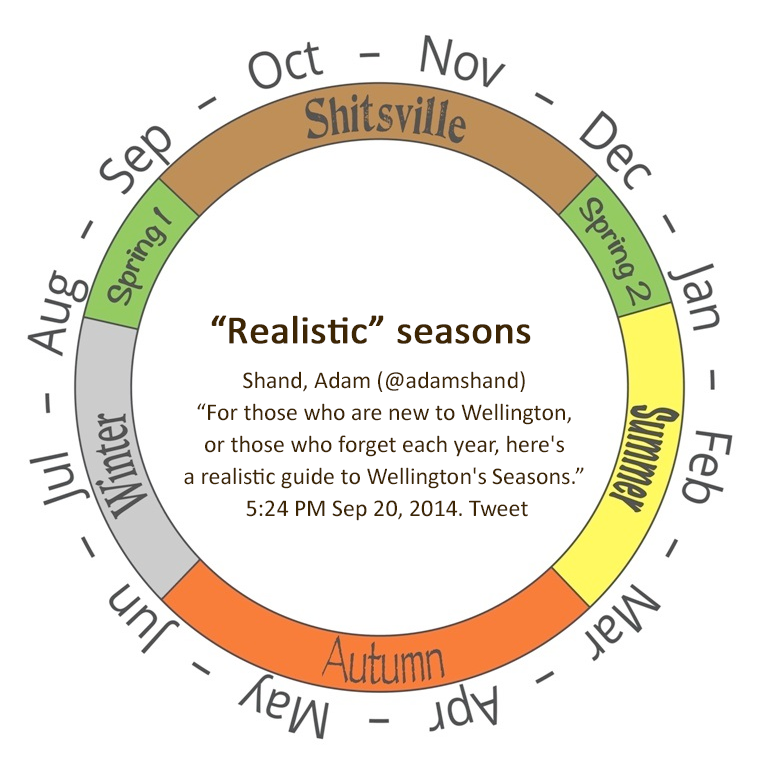
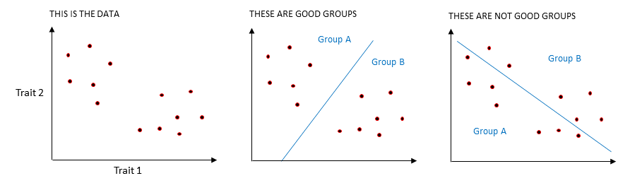
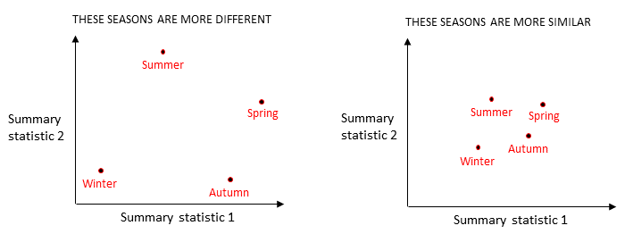
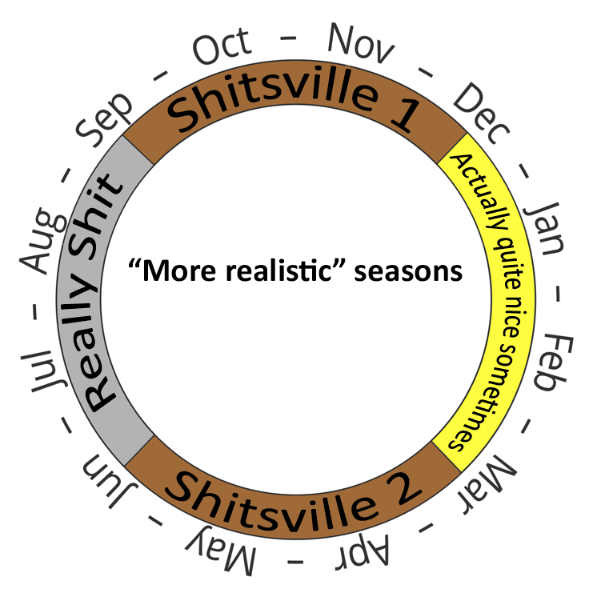

```{r setup, include = FALSE}

# Clear workspace
rm(list = ls(all.names = TRUE))

# Set default chunk options
knitr::opts_chunk$set(echo = FALSE, warning = FALSE, message = FALSE)

# Load packages
library(dplyr)
library(tidyr)
library(lubridate)
library(moments)
library(ggplot2)
library(GGally)
library(nortest)
library(Hotelling)
library(grid)
library(gridExtra)
library(pheatmap)
library(ComplexHeatmap)
library(viridis)
library(RColorBrewer)
library(cluster)
library(factoextra)
library(vegan)
library(caret)
```

```{css style settings, echo = FALSE}
blockquote {
    padding: 10px 20px;
    margin: 0 0 20px;
    font-size: 16px;
    border-left: 5px solid #eee;
}
```


\newpage

### You can't beat Wellington on a good day. Unfortunately you never know when those days will be

 > _"I wish I was in Wellington, the weather's not so great."_  
 > The Mutton Birds, "Wellington", 1994.

Wellington is notorious for its windy and unpredictable weather. We celebrate it in our public sculptures, our songs, and our (seemingly daily) complaints about it. Our weather seems to defy the seasons - we have hail storms in summer and gloriously sunny winter days. Spring can seem like a cruel joke. We envision hope and renewal, newly opened flowers and crisp sunny mornings. Instead we endure grey rainy days and a howling wind. Perhaps we need to adjust our expectations.
\
\

```{r blownaway, fig.cap = "The 'blown away' sign in Miramar, Wellington. Image by Wainuiomartian, CC BY-SA 4.0 https://creativecommons.org/licenses/by-sa/4.0, via Wikimedia Commons", fig.align = "center",  out.width = "60%", fig.show = "hold"}

# Display image of blown away sign
  knitr::include_graphics("../images/Wellington_blown_away_sign.jpg")
```


### We can't change the weather. But can we change the seasons?

In a popular 2014 [tweet](https://twitter.com/adamshand/status/513197000930521089?lang=en), Adam Shand proposed a new classification of Wellington's seasons that splits spring into two periods (August and December) and renames what was formerly spring (September to November) as “Shitsville”. People approved. There have been hundreds of retweets, you can [buy the t-shirt](https://shitsville.printmighty.co.nz) and [there's a website](https://www.realnzweather.com) that tells you what the "real" season is now.
\
\

```{r realseasonimg, fig.cap = "Schematic of the conventional seasons (left) and the alternative 'real' season classification (right). Adapted from https://www.realnzweather.com.", fig.ncol = 2, fig.align = "center",  out.width = "50%", fig.show = "hold"}

# Display image of conventional seasons
  knitr::include_graphics("../images/conventionalweather_forslides.png")
# Display image of 'Real NZ Weather' scheme
  
```


### Can we make an evidence-based case for official change?

So why not officially adopt these 'real' seasons? In a land where a [bat can win a bird-of-the-year competition](https://en.wikipedia.org/wiki/Bird_of_the_Year), and a [kiwi shooting lasers from its eyes](https://nzhistory.govt.nz/media/photo/fire-lazar) can almost become our national flag, redefining the seasons and calling one Shitsville doesn't seem like too big a stretch. 

But behind every great policy is ~~great~~ some evidence and as-yet no evidence for this proposal exists. Humans are notoriously prone to confirmation bias. Are 'real' season true believers merely seeing the weather patterns they expect to see or is our weather actually better described by the 'real' seasons? 

We decided to find out.


### We used weather data to compare the conventional and 'real' season classifications

We obtained five years of daily weather data from the National Institute of Water and Atmospheric Research (NIWA) and used four different statistical methods to compare how well the conventional and 'real' seasons classify actual weather patterns. We did this for Wellington and Auckland and got similar results. Here we only describe the Wellington results (to reduce length - you're welcome) but you can find the Auckland analysis in our [technical report](https://github.com/andreaknox-nz/real_seasons/blob/main/final_report%20(technical)/Final_report.pdf).

Our weather data had 5 measurements taken every day during the 5-year period 2017 to 2021:

* the maximum temperature recorded in the 24 hour period (in degrees Celsius).
* the minimum temperature recorded in the 24 hour period (in degrees Celsius).
* global radiation, which measures the total radiation from the sun during the 24 hours (in megajoules per square metre).
* wind run, which measures the distance travelled by surface wind during the 24 hours (in kilometres).
* the rainfall received during the 24 hours (in millimetres)

### A better classification puts days with similar weather into the same season and separates days with different weather into different seasons

Before we get to results, we need to talk about what makes a good classification. There's always some subjectivity in judging what is "good", but following [evaluation best practice](https://www.betterevaluation.org/frameworks-guides/rainbow-framework/frame/determine-what-success-looks), we can at least be transparent about our criteria.

In this work, we say that a classification is good if it:

* puts similar things into the same group
* puts different things into different groups.

So one classification is better than another if:

* the within-group differences are smaller
* the group to group differences are larger.

The diagram below demonstrates this in terms of distance. Imagine that you are looking down on a room of people and each red dot is a person. We see two clusters of people and intuitively we group them as shown in the middle chart. This is a good classification because the distances between people in the same group are small and the distances between people in different groups are larger. Alternatively, we could form two groups as shown in the right hand chart. This would be bad. Why? Because there are large distances between some people in the same group and short distances between some people in different groups. The classification in the middle is clearly superior.
\
\

```{r goodbadgroups, fig.cap = "Some classifications are better at grouping things than others.", fig.align = "center",  out.width = "100%", fig.show = "hold"}

# Display diagram of good and bad groups
  
```

Now imagine that the distances between people represent something else - say, eye colour (Trait 1 in the chart above) and hair colour (Trait 2). In one cluster people have varying shades of blonde hair and blue eyes and in the other they have shades of dark hair and brown eyes. The best classification groups together people whose hair and eye colours are close and separates people with more distant eye and hair colours.

Finally, imagine that the dots are days of the year. And the distances between them represent aspects of the weather. For example, Trait 1 could be rainfall and Trait 2 could be maximum temperature. A good classification groups together days with similar temperatures and rainfall and separates days with dissimilar temperatures and rainfall. This is the basis for how we decide whether conventional or 'real' seasons are better. The better classification will have, on average:

* shorter weather-based distances between days of the same season
* larger weather-based distances between days of different seasons.

All of the analysis we describe below uses this fundamental concept.


```{r loaddata, echo=FALSE}

# Load and clean dataset

# Load data
  climate <- read.csv("../data/RAW_climate_data_20220809.csv")


# Create tables for each variable ----

  ## Wind run (rows 10 to 3656) ----
  
    # Select rows
    wind <- climate[c(10:3655), ]
    # Add column names
    names(wind) <- climate[9, ]
    # Remove un-needed vars, rename some vars
    wind <- wind %>% 
      dplyr::select(Station, `Date(NZST)`, `WindRun` = `WindRUN(km)`)


  ## Rainfall (rows 3659 to 7301) ----

    # Select rows
    rain <- climate[c(3659:7300), ]
    # Add column names
    names(rain) <- climate[3658, ]
    # Remove un-needed vars, rename some vars for clarity
    rain <- rain %>%
      dplyr::select(Station, `Date(NZST)`, `Rainfall` = `Amount(mm)`)


  ## Max/min temps (rows 7304 to 10955) ----
    # Select rows
    temp <- climate[c(7304:10954), ]
    # Add column names
    names(temp) <- climate[7303, ]
    # Remove un-needed vars, rename some vars for clarity
    temp <- temp %>% 
      dplyr::select(Station, `Date(NZST)`, `Tmax` = `Tmax(C)`, `Tmin` = `Tmin(C)`) 


  ## Daily global radiation (rows 10958 to 14580) ----
    # Select rows
    rad <- climate[c(10958:14579), ]
    # Add column names
    names(rad) <- climate[10957, ]
    # Remove un-needed vars, rename some vars for clarity
    rad <- rad %>% 
      dplyr::select(Station, `Date(NZST)`, `GlobalRad` = `Amount(MJ/m2)`)
    
    
# Join all weather variables into one dataframe ----
# Start with temp table as it is complete

  weather <- temp %>%
      left_join(rad, by = c("Station", "Date(NZST)")) %>%
      left_join(wind, by = c("Station", "Date(NZST)")) %>%
      left_join(rain, by = c("Station", "Date(NZST)")) 
    
    
# Tidy weather variables ----
  # Tmax and Tmin have "-" for NA entries and the numeric variables are currently set as character vars

  ## Edit "-" in Tmax and Tmin to NA ----
    weather <- weather %>% 
      mutate(Tmax = na_if(Tmax, "-"),
             Tmin = na_if(Tmin, "-"))

  ## Edit the measures from character vars to numeric ----
    weather <- weather %>% 
      mutate(Tmax = as.numeric(Tmax),
             Tmin = as.numeric(Tmin),
             GlobalRad = as.numeric(GlobalRad),
             WindRun = as.numeric(WindRun),
             Rainfall = as.numeric(Rainfall)) %>% 
      # Create log(rainfall) variable for days with >0 rain
      mutate(logRainfall = ifelse(Rainfall > 0, log(Rainfall), NA))


# Create season and realseason variables ----
    
  # Create month column
    weather <- weather %>% 
      # Create month column to use in generating season variables
      mutate(month = month(dmy(`Date(NZST)`)))%>%
      # Create conventional season variable
      mutate(season = case_when(month < 3 | month == 12  ~ "Summer",
                                month > 2 & month < 6 ~ "Autumn",
                                month > 5 & month < 9 ~ "Winter",
                                month > 8 & month <12 ~ "Spring")) %>% 
      # Create real season variable
      mutate(realseason = case_when(month < 3 ~ "Summer",
                                    month > 2 & month < 6 ~ "Autumn",
                                    month > 5 & month < 8 ~ "Winter",
                                    month == 8 ~ "Spring 1",
                                    month == 12 ~ "Spring 2",
                                    month > 8 & month < 12 ~ "Shitsville")) %>% 
      # Create second real season variable with Spring 1 and 2 combined
      mutate(realseason2 = ifelse(realseason %in% c("Spring 1",  "Spring 2"),
                                  "Spring1 and 2",
                                  realseason)) %>% 
      # Order season variables chronologically for plotting
      mutate(season = factor(season,
                             levels = c("Spring", "Summer", "Autumn", "Winter")),
             realseason2 = factor(realseason2, 
                                  levels = c("Spring1 and 2", "Shitsville", "Summer", "Autumn", "Winter")))
    
  
# Create city variable (shorter name than station is better for plots)
    weather <- weather %>%
      mutate(city = sub("\\,.*", "", Station)) # extracts the string up to the comma
    
    
# remove the tables we no longer need ----
  rm(climate, rad, rain, temp, wind)
```


```{r sumstatsdataset, echo = F}

# Create datasets for each season classification

season_weather <- weather %>% 
  dplyr::select(city, season, Tmax, Tmin, GlobalRad, WindRun, Rainfall, logRainfall)

realseason_weather <- weather %>% 
  dplyr::select(city, realseason2, Tmax, Tmin, GlobalRad, WindRun, Rainfall, logRainfall)


# Create summary statistics dataframe for the season classification
  # Used rainfall stats based on log rainfall, where the summary stats for rainfall are uninformative.
  # So that each weather variable will be treated equally by the distance measure, each has 6 summary 
  # stats (plus sd and sample size.) Except that neither Rainfall nor logRainfall werre useful for the 
  # minimum, so only 5 for rainfall

season_summstats <- season_weather %>%
  # group by city and season so that the mutate function will give group-wise results
  group_by(city, season) %>%
  # for each city and season, calculate summary statistics
  mutate(Tmax_sample_size = length(na.omit(Tmax)),
         Tmax_minimum = min(Tmax, na.rm = T),
         Tmax_first_quartile = quantile(Tmax, .25, names = F, na.rm = T),
         Tmax_median = median(Tmax, na.rm = T),
         Tmax_third_quartile = quantile(Tmax, .75, names = F, na.rm = T),
         Tmax_maximum = max(Tmax, na.rm = T),
         Tmax_mean = mean(Tmax, na.rm = T),
         Tmax_sd = sd(Tmax, na.rm = T),
         Tmin_sample_size = length(na.omit(Tmin)),
         Tmin_minimum = min(Tmin, na.rm = T),
         Tmin_first_quartile = quantile(Tmin, .25, names = F, na.rm = T),
         Tmin_median = median(Tmin, na.rm = T),
         Tmin_third_quartile = quantile(Tmin, .75, names = F, na.rm = T),
         Tmin_maximum = max(Tmin, na.rm = T),
         Tmin_mean = mean(Tmin, na.rm = T),
         Tmin_sd = sd(Tmin, na.rm = T),
         GlobalRad_sample_size = length(na.omit(GlobalRad)),
         GlobalRad_minimum = min(GlobalRad, na.rm = T),
         GlobalRad_first_quartile = quantile(GlobalRad, .25, names = F, na.rm = T),
         GlobalRad_median = median(GlobalRad, na.rm = T),
         GlobalRad_third_quartile = quantile(GlobalRad, .75, names = F, na.rm = T),
         GlobalRad_maximum = max(GlobalRad, na.rm = T),
         GlobalRad_mean = mean(GlobalRad, na.rm = T),
         GlobalRad_sd = sd(GlobalRad, na.rm = T),
         WindRun_sample_size = length(na.omit(WindRun)),
         WindRun_minimum = min(WindRun, na.rm = T),
         WindRun_first_quartile = quantile(WindRun, .25, names = F, na.rm = T),
         WindRun_median = median(WindRun, na.rm = T),
         WindRun_third_quartile = quantile(WindRun, .75, names = F, na.rm = T),
         WindRun_maximum = max(WindRun, na.rm = T),
         WindRun_mean = mean(WindRun, na.rm = T),
         WindRun_sd = sd(WindRun, na.rm = T),
         Rainfall_sample_size = length(na.omit(Rainfall)),
         Rainfall_third_quartile = quantile(Rainfall, .75, names = F, na.rm = T),
         Rainfall_maximum = max(Rainfall, na.rm = T),
         Rainfall_mean = mean(Rainfall, na.rm = T),
         Rainfall_sd = sd(Rainfall, na.rm = T),
         logRainfall_sample_size = length(na.omit(logRainfall)), # has smaller sample sizes than rainfall because restricted to days with >0 rain
         logRainfall_first_quartile = quantile(logRainfall, .25, names = F, na.rm = T),
         logRainfall_median = median(logRainfall, na.rm = T),
         ) %>% 
  # remove original weather variable measurements
  dplyr::select(-Tmax, -Tmin, -GlobalRad, -WindRun, -Rainfall, -logRainfall) %>% 
  # retain rows with unique values only
  distinct() %>% 
  # remove grouping (as it may interfere with further analysis of the dataset)
  ungroup()


# Create summary statistics dataframe for the real season classification

realseason_summstats <- realseason_weather %>%
  # group by city and realseason2 so that the mutate function will give group-wise results
  group_by(city, realseason2) %>%
  # for each city and realseason2, calculate summary statistics
  mutate(Tmax_sample_size = length(na.omit(Tmax)),
         Tmax_minimum = min(Tmax, na.rm = T),
         Tmax_first_quartile = quantile(Tmax, .25, names = F, na.rm = T),
         Tmax_median = median(Tmax, na.rm = T),
         Tmax_third_quartile = quantile(Tmax, .75, names = F, na.rm = T),
         Tmax_maximum = max(Tmax, na.rm = T),
         Tmax_mean = mean(Tmax, na.rm = T),
         Tmax_sd = sd(Tmax, na.rm = T),
         Tmin_sample_size = length(na.omit(Tmin)),
         Tmin_minimum = min(Tmin, na.rm = T),
         Tmin_first_quartile = quantile(Tmin, .25, names = F, na.rm = T),
         Tmin_median = median(Tmin, na.rm = T),
         Tmin_third_quartile = quantile(Tmin, .75, names = F, na.rm = T),
         Tmin_maximum = max(Tmin, na.rm = T),
         Tmin_mean = mean(Tmin, na.rm = T),
         Tmin_sd = sd(Tmin, na.rm = T),
         GlobalRad_sample_size = length(na.omit(GlobalRad)),
         GlobalRad_minimum = min(GlobalRad, na.rm = T),
         GlobalRad_first_quartile = quantile(GlobalRad, .25, names = F, na.rm = T),
         GlobalRad_median = median(GlobalRad, na.rm = T),
         GlobalRad_third_quartile = quantile(GlobalRad, .75, names = F, na.rm = T),
         GlobalRad_maximum = max(GlobalRad, na.rm = T),
         GlobalRad_mean = mean(GlobalRad, na.rm = T),
         GlobalRad_sd = sd(GlobalRad, na.rm = T),
         WindRun_sample_size = length(na.omit(WindRun)),
         WindRun_minimum = min(WindRun, na.rm = T),
         WindRun_first_quartile = quantile(WindRun, .25, names = F, na.rm = T),
         WindRun_median = median(WindRun, na.rm = T),
         WindRun_third_quartile = quantile(WindRun, .75, names = F, na.rm = T),
         WindRun_maximum = max(WindRun, na.rm = T),
         WindRun_mean = mean(WindRun, na.rm = T),
         WindRun_sd = sd(WindRun, na.rm = T),
         Rainfall_sample_size = length(na.omit(Rainfall)),
         Rainfall_third_quartile = quantile(Rainfall, .75, names = F, na.rm = T),
         Rainfall_maximum = max(Rainfall, na.rm = T),
         Rainfall_mean = mean(Rainfall, na.rm = T),
         Rainfall_sd = sd(Rainfall, na.rm = T),
         logRainfall_sample_size = length(na.omit(logRainfall)), # has smaller sample sizes than rainfall because restricted to days with >0 rain
         logRainfall_first_quartile = quantile(logRainfall, .25, names = F, na.rm = T),
         logRainfall_median = median(logRainfall, na.rm = T),
         ) %>% 
  # remove original weather variable measurements
  dplyr::select(-Tmax, -Tmin, -GlobalRad, -WindRun, -Rainfall, -logRainfall) %>% 
  # retain rows with unique values only
  distinct() %>% 
  # remove grouping (as it may interfere with further analysis of the dataset)
  ungroup()
```

```{r computedistances}

# Create Wellington dataset for season
W_season_summstats <- season_summstats %>% 
  filter(city == "Wellington") %>% 
  dplyr::select(-c(# remove city variable because not numeric
    city, 
    # remove sample sizes because not relevant to calculating distances
    Tmax_sample_size, Tmin_sample_size, GlobalRad_sample_size, WindRun_sample_size, Rainfall_sample_size, logRainfall_sample_size,
    # remove SDs because we want them to be consistently small, not distant therefore don't include in distance measure
    Tmax_sd, Tmin_sd, GlobalRad_sd, WindRun_sd, Rainfall_sd))


# Create Wellington dataset for realseason
W_realseason_summstats <- realseason_summstats %>% 
  filter(city == "Wellington") %>% 
  rename(season = realseason2) %>% 
  dplyr::select(-c(# remove city variable because not numeric
    city, 
    # remove sample sizes because not relevant to calculating distances
    Tmax_sample_size, Tmin_sample_size, GlobalRad_sample_size, WindRun_sample_size, Rainfall_sample_size, logRainfall_sample_size,
    # remove SDs because we want them to be consistently small, not distant therefore don't include in distance measure
    Tmax_sd, Tmin_sd, GlobalRad_sd, WindRun_sd, Rainfall_sd))


# Source function to compute Canberra distances:

compute_can_dists <- function(data, season1, season2) { # data is a dataframe, season1 and season2 are strings
  
  # Filter for season1 and season2 then remove season variable from df
  df <- data %>% 
    filter(season %in% c(season1, season2)) %>% 
  dplyr::select(-season)
  
  # Compute coordinate-wise distances
  coord_fun <- function(x) {
    (abs(diff(x))) / (abs(max(x)) + abs(min(x)))
  }
  coords <-  apply(df, 2, coord_fun)
  
  # Sum the coordinate-wise distances
  can_distance <- colSums(as.matrix(coords))
  
  # Name the distance for the seasons
  season_cf <- paste0(season1, " vs ", season2)
  names(can_distance) <- season_cf
  
  can_distance
}

# Compute distances for Wellington, season

W_season_dists <- data.frame(t(cbind(
  t(compute_can_dists(W_season_summstats, "Spring", "Summer")),
  t(compute_can_dists(W_season_summstats, "Spring", "Autumn")),
  t(compute_can_dists(W_season_summstats, "Spring", "Winter")),
  t(compute_can_dists(W_season_summstats, "Summer", "Autumn")),
  t(compute_can_dists(W_season_summstats, "Summer", "Winter")),
  t(compute_can_dists(W_season_summstats, "Autumn", "Winter"))
  )))
  # Edit column name
  colnames(W_season_dists) <- "Canberra distance"
  # Create a row for the average distance across all seasons
  avg <- mean(W_season_dists[ , 1])
  names(avg) <- "Canberra distance"
  W_season_dists <- rbind(W_season_dists, t(avg))
  row.names(W_season_dists)[nrow(W_season_dists)] <- "Average distance"


# Compute distances for Wellington, realseason

W_realseason_dists <- data.frame(t(cbind(
  t(compute_can_dists(W_realseason_summstats, "Spring1 and 2", "Shitsville")),
  t(compute_can_dists(W_realseason_summstats, "Spring1 and 2", "Summer")),
  t(compute_can_dists(W_realseason_summstats, "Spring1 and 2", "Autumn")),
  t(compute_can_dists(W_realseason_summstats, "Spring1 and 2", "Winter")),
  t(compute_can_dists(W_realseason_summstats, "Shitsville", "Summer")),
  t(compute_can_dists(W_realseason_summstats, "Shitsville", "Autumn")),
  t(compute_can_dists(W_realseason_summstats, "Shitsville", "Winter")),
  t(compute_can_dists(W_realseason_summstats, "Summer", "Autumn")),
  t(compute_can_dists(W_realseason_summstats, "Summer", "Winter")),
  t(compute_can_dists(W_realseason_summstats, "Autumn", "Winter"))
  )))
  # Edit column name
  colnames(W_realseason_dists) <- "Canberra distance"
  # Create a row for the average distance across all seasons
  avg <- mean(W_realseason_dists[ , 1])
  names(avg) <- "Canberra distance"
  W_realseason_dists <- rbind(W_realseason_dists, t(avg))
  row.names(W_realseason_dists)[nrow(W_realseason_dists)] <- "Average distance"
```

```{r computeavgSDs}

# Create Wellington dataset for season SDs
W_season_SDs <- season_summstats %>% 
  filter(city == "Wellington") %>% 
  # retain only the season and standard deviations for each weather variable and rename variables
  dplyr::select(season, 
                Tmax_sd, 
                Tmin_sd, 
                GlobalRad_sd, 
                WindRun_sd, 
                Rainfall_sd)
  # add row with the average SD across the seasons for each weather variable
  avg <- data.frame(t(colMeans(W_season_SDs[ , c(2:6)]))) %>% 
    mutate(season = "Average across seasons")
  W_season_SDs <- bind_rows(W_season_SDs, avg) %>% 
    # rename variables
      dplyr::select(Season = season,
                    `SD(max temp)` = Tmax_sd,
                    `SD(min temp)` = Tmin_sd,
                    `SD(global radiation)` = GlobalRad_sd,
                    `SD(wind run)` = WindRun_sd,
                    `SD(rainfall)` = Rainfall_sd)

# Create Wellington dataset for real season SDs
W_realseason_SDs <- realseason_summstats %>% 
  filter(city == "Wellington") %>% 
  # retain only the season and standard deviations for each weather variable and rename variables
  dplyr::select(season = realseason2, 
                Tmax_sd, 
                Tmin_sd, 
                GlobalRad_sd, 
                WindRun_sd, 
                Rainfall_sd)
  # add row with the average SD across the seasons for each weather variable
  avg <- data.frame(t(colMeans(W_realseason_SDs[ , c(2:6)]))) %>% 
    mutate(season = "Average across seasons")
  W_realseason_SDs <- bind_rows(W_realseason_SDs, avg) %>% 
    # rename variables
      dplyr::select(Season = season,
                    `SD(max temp)` = Tmax_sd,
                    `SD(min temp)` = Tmin_sd,
                    `SD(global radiation)` = GlobalRad_sd,
                    `SD(wind run)` = WindRun_sd,
                    `SD(rainfall)` = Rainfall_sd)
```


### Standard deviations suggest that conventional seasons are better at grouping similar days together {#results-sd}

The standard deviation measures variability. Specifically, it measures the average distance of each observation from the centre (or the mean) of the group. For example, say we have only two days, one with a maximum temperature of 10 degrees and the other with a maximum temperature of 24 degrees. The mean maximum temperature is $\frac{10 + 24}{2} = 17^{\circ}C$. The standard deviation is the average distance of each day's measurement from $17^{\circ}C$, so in this case, it is $7^{\circ}C$.

For our analysis, we computed the standard deviations for each weather measurement, by season. And then we compared the standard deviations of the conventional seasons with those of the 'real' seasons. We are looking for smaller standard deviations as they would indicate shorter (weather-based) distances between days of the same season and therefore a better classification.
\
\
```{r WseasontableSDs}

# Wellington conventional seasons
  knitr::kable(W_season_SDs,
               format = "markdown",
               caption = "Standard deviations (SD) for conventional seasons, Wellington",
               digits = 2) 
```

```{r WrealseasontableSDs}
# Wellington real season
  knitr::kable(W_realseason_SDs,
               format = "markdown",
               caption = "Standard deviations (SD) for 'real' seasons, Wellington",
               digits = 2) 
```


In the tables of standard deviations above, we see that the average standard deviations are smaller for the conventional seasons than they are for the 'real' seasons (for every weather measurement except rainfall). And when we compare the standard deviations of 'Spring 1 and 2' with conventional Spring, we see that the 'Spring 1 and 2' standard deviations are almost all higher and that they are, in fact, are among the highest of any of the seasons. 

Overall, this suggests that conventional seasons may be better at grouping together days with similar weather and that 'Spring 1 and 2' may be grouping together days with dissimilar weather. So the conventional season classification may be better because, on average, it has shorter weather-based distances between days of the same season.

But what about our second criterion: a better classification has larger weather-based distances between days of different seasons. We looked at this next.


### Summary statistic-based distances between seasons suggest that conventional seasons are better at separating out different weather patterns {#results-distances}

Whenever we group objects together we can use summary statistics to describe the overall characteristics of the group. Summary statistics are mostly quite straightforward. They are things like maximum values, minimum values, medians (the middle value), and means (described above). 

We can use each season's weather data to compute summary statistics. And then we can use the values of those summary statistics to compute distances between the seasons. For example, in the charts below, imagine that Summary statistic 1 is the maximum daily rainfall value recorded for each season and summary statistic 2 is the maximum wind run value recorded for each season. In the left hand chart these values are quite different and so the seasons are far apart. In the right hand chart the values are much more similar and so the seasons are closer together. The result in the left hand chart is better. It suggests that this seasonal classification is better because the seasons are more different to each other.

```{r summstatdists, fig.cap = "We can use distances based on summary statistics to see how similar seasons are to each other.", fig.align = "center",  out.width = "100%", fig.show = "hold"}

# Display explanation of summary statistic distances
  
```

Similarly, we could use 3 summary statistics and then our distances between seasons would be computed as if they were in a 3-dimensional space. Same concept. Easy. Now here's where we break your brain. In fact, we used 30 different summary statistics. So we computed the distances between seasons as if they were in a 30-dimensional space. Can you visualise that? No? Us neither. This is unintuitive for humans living, as we do, in a measly 3-dimensional universe. By analogy though, it's simple. We computed distances based on 30 summary statistics exactly as we would in a 2 or 3-dimensional space - we just used more dimensions.

So what did we find out?

```{r Wdistanceheatmapsdata}

# Construct matrix for seasons heatmap, row by row
  # position 1 = Spring, 2 = Summer, 3 = Autumn, 4 = Winter
  Spring <- c(NA, W_season_dists[1, 1], W_season_dists[2, 1], W_season_dists[3, 1])
  Summer <- c(W_season_dists[1, 1], NA, W_season_dists[4, 1],  W_season_dists[5, 1])
  Autumn <- c(W_season_dists[2, 1],  W_season_dists[4, 1], NA,  W_season_dists[6, 1])
  Winter <- c(W_season_dists[3, 1],  W_season_dists[5, 1], W_season_dists[6, 1], NA)

  W_season_dist_matrix <- rbind(Spring, Summer, Autumn, Winter)
  colnames(W_season_dist_matrix) <- c("         Spring", "         Summer", "         Autumn", "         Winter")
  
# Construct matrix for realseasons heatmap, row by row
  # position 1 = Spring1_2, 2 = Shitsville, 3 = Summer, 4 = Autumn, 5 = Winter 
  Spring1_2 <- c(NA, W_realseason_dists[1, 1], W_realseason_dists[2, 1], W_realseason_dists[3, 1], W_realseason_dists[4, 1])
  Shitsville <- c(W_realseason_dists[1, 1], NA, W_realseason_dists[5, 1], W_realseason_dists[6, 1], W_realseason_dists[7, 1])
  Summer <- c(W_realseason_dists[2, 1], W_realseason_dists[5, 1], NA, W_realseason_dists[8, 1], W_realseason_dists[9, 1])
  Autumn <- c(W_realseason_dists[3, 1], W_realseason_dists[6, 1], W_realseason_dists[8, 1], NA, W_realseason_dists[10, 1])
  Winter <- c(W_realseason_dists[4, 1], W_realseason_dists[7, 1], W_realseason_dists[9, 1], W_realseason_dists[10, 1], NA)

  W_realseason_dist_matrix <- rbind(Spring1_2, Shitsville, Summer, Autumn, Winter)
  colnames(W_realseason_dist_matrix) <- c("Spring1 and 2", "Shitsville", "Summer", "Autumn", "Winter")
  rownames(W_realseason_dist_matrix) <- c("Spring1 and 2", "Shitsville", "Summer", "Autumn", "Winter")
```

```{r Wdistanceheatmaps, fig.cap = "Heatmaps of the summary statistic distances between each season, comparing the conventional seasons (left) with the 'real' seasons (right). Darker colours correspond to shorter distances and lighter colours to longer distances. Grey indicates distances of zero (a season's distance to itself).", fig.ncol = 2, out.width = "50%", fig.align = "center", fig.show = "hold"}

# conventional seasons
ComplexHeatmap::pheatmap(W_season_dist_matrix,
                         scale = "none", 
                         cluster_rows = F,
                         cluster_cols = F,
                         legend = F,
                         display_numbers = T,
                         number_format =  "%.2f",
                         color = mako(10),
                         na_col = "#FFFFFF",
                         # na_col = "white",
                         fontsize_number = 18,
                         number_color = c("grey", 
                                                rep("white", 4),
                                                "grey",
                                                "white",
                                                "black", 
                                                rep("white", 2), 
                                                "grey",
                                                rep("white", 2),
                                                "black", 
                                                "white"),
                         fontsize = 12, 
                         fontsize_col = 14,
                         fontsize_row = 14,
                         row_names_side = c("left"),
                         main = "Distances between conventional seasons (average = 5.25)")

# real seasons
ComplexHeatmap::pheatmap(W_realseason_dist_matrix,
                         scale = "none", 
                         cluster_rows = F,
                         cluster_cols = F,
                         legend = F,
                         display_numbers = T,
                         number_format =  "%.2f",
                         color = mako(10),
                         na_col = "white",
                         fontsize_number = 18,
                         number_color = c("grey",
                                                rep("white", 5), 
                                                "grey",
                                                rep("white", 5), 
                                                "grey",
                                                "white", 
                                                "black", 
                                                rep("white", 3),
                                                "grey",
                                                rep("white", 3),
                                                "black",
                                                "white",
                                                "grey"),
                         fontsize = 12,
                         fontsize_col = 14,
                         fontsize_row = 14,
                         main = "Distances between 'real' seasons  (average = 5.19)")

```
In the charts above you can follow each grid across and down to find the distances between pairs of seasons. For example, the distance between Summer and Winter was 9.00 for conventional seasons (left hand chart) and 9.44 for 'real' seasons (right hand chart). And the distance between Spring and Autumn in the conventional seasons is the same as the distance between Shitsville and Autumn in 'real' seasons because the 'real' season classification simply renames Spring to Shitsville and doesn't change Autumn.

The 'real' seasons do seem better at separating Winter and Summer from each other and from Spring and Autumn: all of these distances are longer between the 'real' seasons. This is perhaps not surprising given that Winter and Summer are both only 2 months long in the 'real' seasons classification ('Spring 1 and 2' takes a month from Winter and a month from Summer). It is easier for a shorter season to be more different to the others.

However, there are some quite short distances among the 'real' seasons, especially between 'Spring 1 and 2', Shitsville, and Autumn. The average distance between seasons is, in fact, slightly shorter for the 'real' seasons (5.19) than for the conventional seasons (5.25).

And importantly, the distance between 'Spring 1 and 2' and Shitsville is short: the second shortest of all the distances that we computed. This suggests that a key conjecture of the 'real' season classification: that 'Spring 1 and 2' and Shitsville have different weather patterns, may not hold.

Overall, this analysis suggests that the conventional seasons may be slightly better than the 'real' seasons at separating out different weather patterns, but they aren't much better. We would not call these results conclusive. Let's try another statistical tool.


### Silhouette plots show that conventional seasons are better at grouping days into appropriate seasons

We used silhouette plots to compare how well the conventional and 'real' seasons group days into the seasons that they are the most similar to. Silhouette plots use the silhouette coefficient, which is computed as described in our [technical report](https://github.com/andreaknox-nz/real_seasons/blob/main/final_report%20(technical)/Final_report.pdf). Go there if you want to see the maths. Less technically, how the coefficient works is as follows.

* It computes a representative point for each season, based on temperature, radiation, wind and rainfall measurements. In terms of distances, this point can be thought of as the middle of the season.
* It then uses each day's weather data to calculate two distances: the distance from the day to the representative point of the season it is assigned to, and the distance from the day to the closest representative point of another season.
* It compares these distances. The resulting coefficient is between 0 and 1 if the day has been assigned to its closest season and between 0 and -1 if it has been assigned to a season that is not its closest. 
* Higher coefficient values are better. The higher the value, the closer the day is to the "middle" of the season it is assigned to.

You can then average the coefficients to get a measure of the extent to which days are appropriately classified into their closest seasons. Higher average values indicate more appropriate groupings and, therefore, a better classification.

```{r silhouettedata}

# For each city/season categorisation create a dataframe of daily data with only the standardised numeric vars (and no NAs) and a corresponding one-column dataframe of the season classifications

  # Wellington non-standardised
    W_dailyweather <- weather %>% 
    filter(city == "Wellington") %>% 
    dplyr::select(Tmax, Tmin, GlobalRad, WindRun, Rainfall, season, realseason2) %>% 
    # remove observations with any NA values:
    filter(complete.cases(.))

    # column of season values where 1 = Spring, 2 = Summer, 3 = Autumn, 4 = Winter
    W_dailyweather_season <- W_dailyweather %>% 
      dplyr::select(season) %>% 
      mutate(season_code_1 = recode(season, 
                             "Spring" = 1,
                             "Summer" = 2, 
                             "Autumn" = 3, 
                             "Winter" = 4))
    # column of realseason values where 1 = Spring1 and 2, 2 = Shitsville, 3 = Summer, 4 = Autumn, 5 = Winter
    W_dailyweather_realseason <- W_dailyweather %>% 
      dplyr::select(realseason2) %>%
      mutate(realseason_code_1 = recode(realseason2, 
                             "Spring1 and 2" = 1,
                             "Shitsville" = 2,
                             "Summer" = 3, 
                             "Autumn" = 4, 
                             "Winter" = 5))
    # dataframe with standardised numeric variables only
    W_dailyweatherN <-  W_dailyweather %>% 
      dplyr::select(-c(season, realseason2)) %>% 
      scale()
```

```{r WcreatesilhouetteN, results = "hide"}

  # calculate dissimilarities
  disW_N <- vegdist(W_dailyweatherN, method = "euclidean")

  # create special palette for season so the seasonal colours match across plots
  season_cols <- brewer.pal(5, "Dark2")[c(1, 3, 4, 5)]
  
  # make silhouette plot for season
  Wsil_seasonN <- fviz_silhouette(silhouette(W_dailyweather_season$season_code_1, disW_N)) +
    ylim(c(-0.5, 0.5)) +
    ggtitle("") +
    scale_fill_manual(values = season_cols, labels = c("Spring", "Summer", "Autumn", "Winter")) +
    scale_color_manual(values = season_cols) +
    guides(col = FALSE) +
    theme(
      legend.title = element_blank(),
      legend.position = "bottom"
    )
  
  # Obtain average silhouette widths for each cluster
  W_season_avgsil <- Wsil_seasonN$data %>%
    group_by(cluster) %>% 
    mutate(avg_width = mean(sil_width)) %>% 
    dplyr::select(cluster, avg_width) %>% 
    distinct()
           
  
  # make silhouette plot for realseason
   Wsil_realseasonN <- fviz_silhouette(silhouette(W_dailyweather_realseason$realseason_code_1, disW_N)) +
    ylim(c(-0.5, 0.5)) +
    ggtitle("") +
    scale_fill_brewer(palette = "Dark2", labels = c("Spring1 and 2", "Shitsville", "Summer", "Autumn", "Winter")) +
    scale_color_brewer(palette = "Dark2") +
    guides(col = FALSE) +
    theme(
      legend.title = element_blank(),
      legend.position = "bottom"
    )
   
  # Obtain average silhouette widths for each cluster
  W_realseason_avgsil <- Wsil_realseasonN$data %>%
    group_by(cluster) %>% 
    mutate(avg_width = mean(sil_width)) %>% 
    dplyr::select(cluster, avg_width) %>% 
    distinct()
```

```{r WprintsilhouetteN, fig.cap = "Silhouette plots comparing the conventional and 'real' seasons. The average silhouette coefficient for each season is written above the plot of daily values and colour-coded by season. The average coefficient across all seasons is indicated by the red dashed line and the text at the bottom of each chart.", fig.ncol = 1, out.width = "80%", fig.align = "center", fig.show = "hold"}

# print silhouette plot for Wellington conventional seasons
Wsil_seasonN +
  # avg silhouette width label
  geom_text(label = paste0("average across all seasons: ", round(mean(Wsil_seasonN$data$sil_width), 3)), 
              x = 1400, y = -0.5, col = "black", check_overlap = T) +
  # spring silhouette width label
  geom_text(label = round(W_season_avgsil$avg_width[1], 3),  
            x = 210, y = 0.3, col = season_cols[1], check_overlap = T) +
  # summer silhouette width label
  geom_text(label = round(W_season_avgsil$avg_width[2], 3),  
            x = 700, y = 0.3, col = season_cols[2], check_overlap = T) +
  # autumn silhouette width label
  geom_text(label = round(W_season_avgsil$avg_width[3], 3),  
            x = 1100, y = 0.3, col = season_cols[3], check_overlap = T) +
  # winter silhouette width label
  geom_text(label = round(W_season_avgsil$avg_width[4], 3),  
            x = 1650, y = 0.3, col = season_cols[4], check_overlap = T) +
  ylab("Silhouette coefficient value\n") +
  ggtitle("Silhouette plot for the conventional seasons")

# print silhouette plot for Wellington real seasons
Wsil_realseasonN +
  # avg silhouette width label
  geom_text(label = paste0("average across all seasons: ", round(mean(Wsil_realseasonN$data$sil_width), 3)),
            x = 1400, y = -0.5, col = "black", check_overlap = T) +
  # spring1_2 silhouette width label
  geom_text(label = round(W_realseason_avgsil$avg_width[1], 3),  
            x = 145, y = 0.3, col = brewer.pal(5, "Dark2")[1], check_overlap = T) +
  # shitsville silhouette width label
  geom_text(label = round(W_realseason_avgsil$avg_width[2], 3),  
            x = 525, y = 0.3, col = brewer.pal(5, "Dark2")[2], check_overlap = T) +
  # summer silhouette width label
  geom_text(label = round(W_realseason_avgsil$avg_width[3], 3),  
            x = 920, y = 0.3, col = brewer.pal(5, "Dark2")[3], check_overlap = T) +
  # autumn silhouette width label
  geom_text(label = round(W_realseason_avgsil$avg_width[4], 3),  
            x = 1250, y = 0.3, col = brewer.pal(5, "Dark2")[4], check_overlap = T) +
  # winter silhouette width label
  geom_text(label = round(W_realseason_avgsil$avg_width[5], 3),  
            x = 1700, y = 0.3, col = brewer.pal(5, "Dark2")[5], check_overlap = T) +
  ylab("Silhouette coefficient value\n") +
  ggtitle("\nSilhouette plot for the 'real' seasons")
```

In the silhouette plots above, the coloured wedges are made up of vertical lines: one for each day. Lines extending upwards from zero represent days that are classified into their closest season and lines extending downwards from zero represent days that would be more appropriately put into a different season. It is bad news for the 'real' season classification that every day of 'Spring1 and 2' would be more appropriately grouped with a different season. 

Looking at the averaged coefficient values (written in black under each chart), we see that the average silhouette coefficient across all seasons is 10 times higher for the conventional seasons (0.067) than for the 'real' seasons (0.006). This suggests that the conventional seasons are better at grouping together days with similar weather. Things are not looking good for 'real' seasons! 

But wait, there's something else that we can see in these plots. In fact, neither the 'real' nor the conventional seasons do an especially good job. Both perform OK for Summer and Winter, with coefficients above zero for most days. But the other seasons: Spring, Autumn, and Shitsville, are not at all good, with most coefficients below zero. 

This brings us to our final analysis: what would an optimal weather-based classification look like and how do the conventional and 'real' seasons compare to that?


### K-means clustering can create better weather-based groupings of days

There are a number of statistical techniques for grouping objects together based on data. We used a method called k-means clustering to group days into 4 or 5 clusters based on their weather.

In k-means clustering we specify how many clusters we want and then we use an algorithm to generate that number of clusters. The algorithm works as follows. 

1. The computer makes a random guess at where the centre of each cluster might be (this is not an informed guess, it is purely random).
2. The distance between each day and each centre is measured.
3. Each day is assigned to the cluster whose centre it is the closest to.
4. Each centre is re-positioned to the middle of the cluster of days that were assigned to it.
5. The algorithm returns to step 2 and cycles through steps 2 to 4 repeatedly until the centres no longer move at step 4.

Here's a [nice visualisation](https://www.youtube.com/watch?v=5I3Ei69I40s) of the algorithm in action. 

We used this technique to generate 4 clusters (for comparison with conventional seasons) and 5 clusters (for comparison with 'real seasons). Since the clusters were generated from weather data directly, they should form fairly optimal groups of days with similar weather patterns. Almost certainly they will be more optimal than the seasons. Were they? We can check using silhouette plots.


```{r generatekmeans}

# Set seed (for consistent selection of the random start points)
set.seed(300281474, kind = "Mersenne-Twister")

# Perform kmeans clustering on standardised Wellington data, specifying 4 clusters
W_kmeans4 <- kmeans(W_dailyweatherN,
                  algorithm = "Hartigan-Wong",
                  centers = 4,
                  iter.max = 100,
                  nstart = 50)

# Perform kmeans clustering on standardised Wellington data, specifying 5 clusters
W_kmeans5 <- kmeans(W_dailyweatherN,
                  algorithm = "Hartigan-Wong",
                  centers = 5,
                  iter.max = 100,
                  nstart = 50)
```

```{r Wsilhouettekmean, results = "hide"}

  # make silhouette plot for 4 cluster kmeans
  Wsil_kmean4 <- fviz_silhouette(silhouette(W_kmeans4$cluster, dist(W_dailyweatherN))) +
    ylim(c(-0.25, 0.75)) +
    ggtitle("") +
    scale_fill_brewer(palette = "Dark2") +
    scale_color_brewer(palette = "Dark2") +
    guides(col = FALSE) +
    theme(
      legend.title = element_blank(),
      legend.position = "bottom"
    )
  
  # Obtain average silhouette widths for each cluster
  W_kmean4_avgsil <- Wsil_kmean4$data %>%
    group_by(cluster) %>% 
    mutate(avg_width = mean(sil_width)) %>% 
    dplyr::select(cluster, avg_width) %>% 
    distinct()
  
  
  # make silhouette plot for 5 cluster kmeans
   Wsil_kmean5 <- fviz_silhouette(silhouette(W_kmeans5$cluster, dist(W_dailyweatherN))) +
    ylim(c(-0.25, 0.75)) +
    ggtitle("") +
    scale_fill_brewer(palette = "Dark2") +
    scale_color_brewer(palette = "Dark2") +
    guides(col = FALSE) +
    theme(
      legend.title = element_blank(),
      legend.position = "bottom"
    )
   
  # Obtain average silhouette widths for each cluster
  W_kmean5_avgsil <- Wsil_kmean5$data %>%
    group_by(cluster) %>% 
    mutate(avg_width = mean(sil_width)) %>% 
    dplyr::select(cluster, avg_width) %>% 
    distinct()
    
```

```{r Wprintsilkmean, fig.cap = "Silhouette plots of the 4- and 5-cluster k-means clustering of days with similar weather. The average silhouette coefficient for each cluster is written above the plot of daily values and colour-coded by cluster. The average coefficient across all clusters is indicated by the red dashed line and the text at the bottom of each chart.", fig.ncol = 1, out.width = "80%", fig.align = "center", fig.show = "hold"}

# print silhouette plot for Welllington 4 cluster kmeans
Wsil_kmean4 +
  # avg silhouette width label
  geom_text(label = paste0("average across all clusters: ", round(mean(Wsil_kmean4$data$sil_width), 3)), 
              x = 1400, y = -0.25, col = "black", check_overlap = T) +
  # cluster 1 silhouette width label
  geom_text(label = round(W_kmean4_avgsil$avg_width[1], 3),  
            x = 210, y = 0.6, col = brewer.pal(4, "Dark2")[1], check_overlap = T) +
  # cluster 2 silhouette width label
  geom_text(label = round(W_kmean4_avgsil$avg_width[2], 3),  
            x = 490, y = 0.6, col = brewer.pal(4, "Dark2")[2], check_overlap = T) +
  # cluster 3 silhouette width label
  geom_text(label = round(W_kmean4_avgsil$avg_width[3], 3),  
            x = 850, y = 0.6, col = brewer.pal(4, "Dark2")[3], check_overlap = T) +
  # cluster 4 silhouette width label
  geom_text(label = round(W_kmean4_avgsil$avg_width[4], 3),  
            x = 1450, y = 0.6, col = brewer.pal(4, "Dark2")[4], check_overlap = T)+
  ylab("Silhouette coefficient value\n") +
  ggtitle("Silhouette plot for 4 k-means clusters")

# print silhouette plot for Welllington 5 cluster kmeans
Wsil_kmean5  +
  # avg silhouette width label
  geom_text(label = paste0("average across all clusters: ", round(mean(Wsil_kmean5$data$sil_width), 3)),
            x = 1400, y = -0.25, col = "black", check_overlap = T) +
  # spring1_2 silhouette width label
  geom_text(label = round(W_kmean5_avgsil$avg_width[1], 3),  
            x = 165, y = 0.6, col = brewer.pal(5, "Dark2")[1], check_overlap = T) +
  # shitsville silhouette width label
  geom_text(label = round(W_kmean5_avgsil$avg_width[2], 3),  
            x = 600, y = 0.6, col = brewer.pal(5, "Dark2")[2], check_overlap = T) +
  # summer silhouette width label
  geom_text(label = round(W_kmean5_avgsil$avg_width[3], 3),  
            x = 910, y = 0.6, col = brewer.pal(5, "Dark2")[3], check_overlap = T) +
  # autumn silhouette width label
  geom_text(label = round(W_kmean5_avgsil$avg_width[4], 3),  
            x = 1150, y = 0.6, col = brewer.pal(5, "Dark2")[4], check_overlap = T) +
  # winter silhouette width label
  geom_text(label = round(W_kmean5_avgsil$avg_width[5], 3),  
            x = 1550, y = 0.6, col = brewer.pal(5, "Dark2")[5], check_overlap = T)+
  ylab("Silhouette coefficient value\n") +
  ggtitle("Silhouette plot for 5 k-means clusters")

```

Yup, the charts above show that the average silhouette coefficients are consistently larger for the clusters than for the conventional and 'real' season classifications and that very few days have been grouped into inappropriate clusters.


### Conventional seasons are more similar than 'real' seasons to k-means clusters

Now that we have our more optimal groups, we can compare comventional and 'real' seasons to them and see which is closer to optimal. In this analysis we think of the k-means clusters as "correct" and we test how good the seasons are at placing days into their "correct" groups.

First we had to figure out how to match seasons to clusters. We want to give both classifications the best possible chance of generating correct predictions, so we tried all possible matches between seasons and groups and chose the concordance that returned the highest number of "correctly" classified days. The best concordances were:

* conventional seasons matched to 4 clusters: Spring = 1, Summer = 4, Autumn = 2, Winter = 3.
* 'real' seasons matched to 5 clusters: Spring1 and 2 = 3, Shitsville = 1, Summer = 5, Autumn = 4, Winter = 2.

We then computed four different performance metrics to compare how well the conventional and 'real' seasons make "correct" predictions. For example in the conventional seasons, a spring day is correctly classified if it is in cluster 1, Summer days are correct if they are in cluster 4, Autumn in cluster 2 and Winter in cluster 3. The first of our performance measures: overall accuracy, is straightforward. It is simply the overall percentage of correct predictions made by the seasonal classification. The higher the percentage the better. The other three performance measures are a bit more complicated and you can find a full description of them in our [technical report](https://github.com/andreaknox-nz/real_seasons/blob/main/final_report%20(technical)/Final_report.pdf). All you really need to know about them is that bigger is better. The classification with higher percentages is more similar to the "optimal" k-means clusters.

```{r Wcompareseasonkmeans, results = "hide"}

# This is to find the season encoding that most closely matches the k-means encoding, as judged by overall accuracy

# In season_code_1, "Spring" = 1, "Summer" = 2, "Autumn" = 3, "Winter" = 4
confusionMatrix(factor(W_dailyweather_season$season_code_1), factor(W_kmeans4$cluster))$table

# The categorisation that gives the highest number of correct predictions is:
# Spring = 1, Summer = 4, Autumn = 2, Winter = 3

# Create dataframe with the season encoding that gives the highest accuracy
W_season_encodings <- W_dailyweather_season %>%
  mutate(season_code_for_kmeans = recode(season,
                                         "Spring" = 1,
                                         "Summer" = 4,
                                         "Autumn" = 2,
                                         "Winter" = 3))
```

```{r Wcomparerealseasonkmeans, results = "hide"}

# This is to find the season encoding that most closely matches the k-means encoding, as judged by overall accuracy

# In season_code_1, "Spring1_2" = 1, "Shitsville" = 2, "Summer" = 3, "Autumn" = 4, "Winter" = 5
confusionMatrix(factor(W_dailyweather_realseason$realseason_code_1), factor(W_kmeans5$cluster))$table

# The categorisation that gives the highest number of correct predictions is:
# Spring1 and 2 = 1, Shitsville = 2, Summer = 3, Autumn = 4, Winter = 5

# Create dataframe with the season encoding that gives the highest accuracy
W_realseason_encodings <- W_dailyweather_realseason %>%
  mutate(realseason_code_for_kmeans = recode(realseason2,
                                         "Spring1 and 2" = 3,
                                         "Shitsville" = 1,
                                         "Summer" = 5,
                                         "Autumn" = 4,
                                         "Winter" = 2))
```
```{r W4CM}

# Create confusion matrix for k-means (4) clusters and the closest season categorisation
W_season_CM <- confusionMatrix(data = factor(W_season_encodings$season_code_for_kmeans),
                reference = factor(W_kmeans4$cluster))

# relabel row names for the seasons
row.names(W_season_CM$table) <- c("Spring", "Autumn", "Winter", "Summer")
```

```{r W5CM}


# Create confusion matrix for k-means (5) clusters and the closest season categorisation
W_realseason_CM <- confusionMatrix(data = factor(W_realseason_encodings$realseason_code_for_kmeans),
                reference = factor(W_kmeans5$cluster))

# relabel row names for the seasons
row.names(W_realseason_CM$table) <- c("Shitsville", "Winter", "Spring1 and 2", "Autumn", "Summer")

```

```{r Wseasonperf}

# Function to create performance metrics

  perf_metrics <- function(cm){
    precision <- diag(cm)/apply(cm, 1, sum)
    recall <- diag(cm)/apply(cm, 2, sum)
    return(c(
      `Overall accuracy` = sum(diag(cm))/sum(cm),
      `Macro Precision` = mean(precision),
      `Macro Recall` = mean(recall),
      `Macro F1` = mean(2 * precision * recall / (precision + recall))
      ))
  }


# Use perf_metrics function to create table of summary stats
W_season_perf <- scales::percent(perf_metrics(W_season_CM$table), accuracy = 0.1)

# Print performance metrics table
  knitr::kable(W_season_perf,
               caption = "Performance of the conventional season classification against four k-means clusters",
               col.names = NULL,
               format = "markdown",
               digits = 3) 
```

```{r Wrealseasonperf}

# Use perf_metrics function to create table of summary stats
W_realseason_perf <- scales::percent(perf_metrics(W_realseason_CM$table), accuracy = 0.1)

# Print table
  knitr::kable(W_realseason_perf,
               caption = "Performance of the 'real' season classification against five k-means clusters",
               col.names = NULL,
               format = "markdown",
               digits = 3) 
```

On every performance measure, the conventional seasons do better than 'real' seasons. 

We need to interpret this cautiously because performance here depends not just on how good the seasons are, but also on the how good the k-means clustering is. We might get a different result if we used a different clustering method. Nevertheless, the result is consistent with our other findings and provide one more piece of evidence suggesting that the conventional seasons are better than 'real' seasons.

However, we also see that even the conventional seasons are far from optimal, making "correct" predictions less than half of the time.


### Unfortunately we can't find evidence to support officially changing the seasons

Well, shit.

None of our findings support the idea that the 'real' seasons better describe Wellington's weather (or Auckland's either, see the [technical report](https://github.com/andreaknox-nz/real_seasons/blob/main/final_report%20(technical)/Final_report.pdf)). Instead of finding evidence to support an official change to the seasons, we have found the opposite.

There are caveats with our results: we only used 5 years of weather data and one of our weather variables, global radiation (which measures total heat from the sun), is inherently tied to day length, which may give conventional seasons an unfair advantage.

But perhaps we should remember something we learned in primary school: the seasons are, in fact, defined by the tilt of the earth relative to the sun. Redefining seasons based on weather patterns might not get past your average 9-year old's bullshit detector.


### But all is not lost: we can keep Shitsville

Importantly though, it's not the renaming of Spring to Shitsville that's the problem. The culprit here is 'Spring 1 and 2', which has very similar weather to Shitsville and performs worse than conventional Spring on the silhouette plots and the comparison of standard deviations.

So let's ditch 'Spring 1 and 2' but continue to call Spring Shitsville. 

And taking this further: in our analysis of distances, we saw that Shitsville and Autumn were the most similar of any pair of seasons. Autumn could be considered to be a second Shitsville, so why not rename it as such?

Here is our suggestion for a new, 'more realistic' re-envisioning of the seasons. __Last line - help, pithy sentence needed!__


```{r morerealseasonimg, fig.cap = "Schematic of the conventional seasons (left) and our proposed 'more real' seasons (right). Adapted from https://www.realnzweather.com.", fig.ncol = 2, fig.align = "center",  out.width = "50%", fig.show = "hold"}

# Display image of conventional seasons
  knitr::include_graphics("../images/conventionalweather_forslides.png")
# Display image of new 'more real' scheme
  
```

\
\
_The [work that this report is based on](https://github.com/andreaknox-nz/real_seasons/blob/main/final_report%20(technical)/Final_report.pdf) was done by Dr Andrea Knox and Jordan Monk in fulfillment of the group project requirements for the Victoria University of Wellington course: STAT394 Multivariate Statistics (Trimester 2, 2022). You can find the data, scripts, and reports in our [Github repository](https://github.com/andreaknox-nz/real_seasons)._