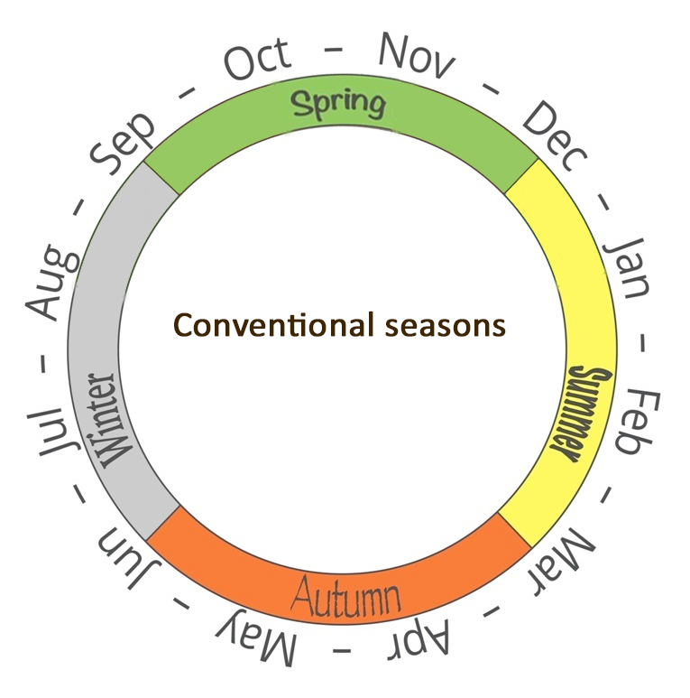

```{r setup, include = FALSE}

# Clear workspace
rm(list = ls(all.names = TRUE))

# Set default chunk options
knitr::opts_chunk$set(echo = FALSE, warning = FALSE, message = FALSE)

# Load packages
library(dplyr)
library(tidyr)
library(lubridate)
library(moments)
library(ggplot2)
library(GGally)
library(nortest)
library(Hotelling)
library(grid)
library(gridExtra)
library(pheatmap)
library(ComplexHeatmap)
library(viridis)
library(RColorBrewer)
library(cluster)
library(factoextra)
library(vegan)
library(caret)
```

```{css style settings, echo = FALSE}
blockquote {
    padding: 10px 20px;
    margin: 0 0 20px;
    font-size: 16px;
    border-left: 5px solid #eee;
}
```


\newpage

### You can't beat Wellington on a good day. Unfortunately you never know when those days will be

 > _"I wish I was in Wellington, the weather's not so great."_  
 > The Mutton Birds, "Wellington", 1994.

Wellington is notorious for its windy and unpredictable weather. We celebrate it in our public sculptures, our songs, and our (seemingly daily) complaints about it. Our weather seems to defy the seasons - we have hail storms in summer and gloriously sunny winter days. Spring can seem like a cruel joke. We envision hope and renewal, newly opened flowers and crisp sunny mornings. Instead we endure grey rainy days and a howling wind. Perhaps we need to adjust our expectations.
\
\

```{r blownaway, fig.cap = "The 'blown away' sign in Miramar, Wellington. Image by Wainuiomartian, CC BY-SA 4.0 https://creativecommons.org/licenses/by-sa/4.0, via Wikimedia Commons", fig.align = "center",  out.width = "60%", fig.show = "hold"}

# Display image of blown away sign
  
```


### We can't change the weather. But can we change the seasons?

In a popular 2014 [tweet](https://twitter.com/adamshand/status/513197000930521089?lang=en), Adam Shand proposed a new classification of Wellington's seasons that splits spring into two periods (August and December) and renames what was formerly spring (September to November) as “Shitsville”. And people approve. There have been hundreds of retweets, you can [buy the t-shirt](https://shitsville.printmighty.co.nz) and [there's a website](https://www.realnzweather.com) to tell you what the "real" season is now.
\
\

```{r realseasonimg, fig.cap = "Schematic of the conventional seasons (left) and the alternative 'real' season classification (right). Adapted from https://www.realnzweather.com.", fig.ncol = 2, fig.align = "center",  out.width = "50%", fig.show = "hold"}

# Display image of conventional seasons
  
# Display image of 'Real NZ Weather' scheme
  
```


### Can we make an evidence-based case for official change?

So why not officially adopt these 'real' seasons? In a land where a [bat can win a bird of the year competition](https://en.wikipedia.org/wiki/Bird_of_the_Year), and a [kiwi shooting lasers from its eyes](https://nzhistory.govt.nz/media/photo/fire-lazar) can almost become our national flag, redefining the seasons and calling one Shitsville doesn't seem like too big a stretch. 

But behind every great policy is ~~great~~ limited and contestable evidence and as-yet no evidence for this proposal exists. Humans are notoriously prone to confirmation bias. Are we merely seeing the weather patterns we expect to see or is our weather actually better described by the 'real' seasons? 

We decided to find out.


### We used weather data to compare the conventional and 'real' season classifications

We obtained five years of daily weather data from the National Institute of Water and Atmospheric Research (NIWA) and used four different statistical methods to compare how well the conventional and 'real' seasons classify actual weather patterns. We did this for Wellington and Auckland and got similar results. Here we only describe the Wellington results (to reduce length - you're welcome) but you can find the Auckland analysis in our [technical report](https://github.com/andreaknox-nz/real_seasons/blob/main/final_report%20(technical)/Final_report.pdf).

Our weather data had 5 measurements taken every day during the 5-year period 2017 to 2021:

* the maximum temperature recorded in the 24 hour period (in degrees Celsius).
* the minimum temperature recorded in the 24 hour period (in degrees Celsius).
* global radiation, which measures the total radiation from the sun during the 24 hours (in megajoules per square metre).
* wind run, which measures the distance travelled by surface wind during the 24 hours (in kilometres).
* the rainfall received during the 24 hours (in millimetres)

### A better classification puts days with similar weather into the same season and separates days with different weather into different seasons

Before we get to results, we need to talk about what makes a good classification. There's always some subjectivity in judging what is "good", but following [evaluation best practice](https://www.betterevaluation.org/frameworks-guides/rainbow-framework/frame/determine-what-success-looks), we can at least be transparent about our criteria.

In this work, we say that a classification is good if it:

* puts similar things into the same group
* puts different things into different groups.

So one classification is better than another if:

* the within-group differences are smaller
* the group to group differences are larger.

The diagram below demonstrates this in terms of distance. Imagine that you are looking down on a room of people and each red dot is person. We see two clusters of people and intuitively we group them as shown in the middle chart. This is a good classification because the distances between people in the same group are small and the distances between people in different groups are larger. Alternatively, we could form two groups as in the right hand chart. This would be bad. Why? Because there are large distances between some people in the same group and short distances between some people in different groups. The classification in the middle is clearly superior.
\
\

```{r goodbadgroups, fig.cap = "Some classifications are better at grouping things than others.", fig.align = "center",  out.width = "100%", fig.show = "hold"}

# Display diagram of good and bad groups
  knitr::include_graphics("../images/good_bad_groups.png")
```

Now imagine that the distances between people represent something else - say, eye colour (Trait 1) and hair colour (Trait 2). In one cluster people have varying shades of blonde hair and blue eyes and in the other they have shades of dark hair and brown eyes. The best classification groups together people whose hair and eye colours are close and separates people with more distant eye and hair colours.

Finally, imagine that the dots are days of the year. And the distances between them represent aspects of the weather. For example, Trait 1 could be rainfall and Trait 2 could be maximum temperature. A good classification groups together days with similar temperatures and rainfall and separates days with dissimilar temperatures and rainfall. This is the basis for how we decide whether conventional or 'real' seasons are better. The better classification will have, on average:

* shorter weather-based distances between days of the same season
* larger weather-based distances between days of different seasons.

We used four statistical methods and weather data from NIWA to assess this. All four methods are based on this fundamental concept.


```{r loaddata, echo=FALSE}

# Load and clean dataset

# Load data
  climate <- read.csv("../data/RAW_climate_data_20220809.csv")


# Create tables for each variable ----

  ## Wind run (rows 10 to 3656) ----
  
    # Select rows
    wind <- climate[c(10:3655), ]
    # Add column names
    names(wind) <- climate[9, ]
    # Remove un-needed vars, rename some vars
    wind <- wind %>% 
      dplyr::select(Station, `Date(NZST)`, `WindRun` = `WindRUN(km)`)


  ## Rainfall (rows 3659 to 7301) ----

    # Select rows
    rain <- climate[c(3659:7300), ]
    # Add column names
    names(rain) <- climate[3658, ]
    # Remove un-needed vars, rename some vars for clarity
    rain <- rain %>%
      dplyr::select(Station, `Date(NZST)`, `Rainfall` = `Amount(mm)`)


  ## Max/min temps (rows 7304 to 10955) ----
    # Select rows
    temp <- climate[c(7304:10954), ]
    # Add column names
    names(temp) <- climate[7303, ]
    # Remove un-needed vars, rename some vars for clarity
    temp <- temp %>% 
      dplyr::select(Station, `Date(NZST)`, `Tmax` = `Tmax(C)`, `Tmin` = `Tmin(C)`) 


  ## Daily global radiation (rows 10958 to 14580) ----
    # Select rows
    rad <- climate[c(10958:14579), ]
    # Add column names
    names(rad) <- climate[10957, ]
    # Remove un-needed vars, rename some vars for clarity
    rad <- rad %>% 
      dplyr::select(Station, `Date(NZST)`, `GlobalRad` = `Amount(MJ/m2)`)
    
    
# Join all weather variables into one dataframe ----
# Start with temp table as it is complete

  weather <- temp %>%
      left_join(rad, by = c("Station", "Date(NZST)")) %>%
      left_join(wind, by = c("Station", "Date(NZST)")) %>%
      left_join(rain, by = c("Station", "Date(NZST)")) 
    
    
# Tidy weather variables ----
  # Tmax and Tmin have "-" for NA entries and the numeric variables are currently set as character vars

  ## Edit "-" in Tmax and Tmin to NA ----
    weather <- weather %>% 
      mutate(Tmax = na_if(Tmax, "-"),
             Tmin = na_if(Tmin, "-"))

  ## Edit the measures from character vars to numeric ----
    weather <- weather %>% 
      mutate(Tmax = as.numeric(Tmax),
             Tmin = as.numeric(Tmin),
             GlobalRad = as.numeric(GlobalRad),
             WindRun = as.numeric(WindRun),
             Rainfall = as.numeric(Rainfall)) %>% 
      # Create log(rainfall) variable for days with >0 rain
      mutate(logRainfall = ifelse(Rainfall > 0, log(Rainfall), NA))


# Create season and realseason variables ----
    
  # Create month column
    weather <- weather %>% 
      # Create month column to use in generating season variables
      mutate(month = month(dmy(`Date(NZST)`)))%>%
      # Create conventional season variable
      mutate(season = case_when(month < 3 | month == 12  ~ "Summer",
                                month > 2 & month < 6 ~ "Autumn",
                                month > 5 & month < 9 ~ "Winter",
                                month > 8 & month <12 ~ "Spring")) %>% 
      # Create real season variable
      mutate(realseason = case_when(month < 3 ~ "Summer",
                                    month > 2 & month < 6 ~ "Autumn",
                                    month > 5 & month < 8 ~ "Winter",
                                    month == 8 ~ "Spring 1",
                                    month == 12 ~ "Spring 2",
                                    month > 8 & month < 12 ~ "Shitsville")) %>% 
      # Create second real season variable with Spring 1 and 2 combined
      mutate(realseason2 = ifelse(realseason %in% c("Spring 1",  "Spring 2"),
                                  "Spring1 and 2",
                                  realseason)) %>% 
      # Order season variables chronologically for plotting
      mutate(season = factor(season,
                             levels = c("Spring", "Summer", "Autumn", "Winter")),
             realseason2 = factor(realseason2, 
                                  levels = c("Spring1 and 2", "Shitsville", "Summer", "Autumn", "Winter")))
    
  
# Create city variable (shorter name than station is better for plots)
    weather <- weather %>%
      mutate(city = sub("\\,.*", "", Station)) # extracts the string up to the comma
    
    
# remove the tables we no longer need ----
  rm(climate, rad, rain, temp, wind)
```


```{r sumstatsdataset, echo = F}

# Create datasets for each season classification

season_weather <- weather %>% 
  dplyr::select(city, season, Tmax, Tmin, GlobalRad, WindRun, Rainfall, logRainfall)

realseason_weather <- weather %>% 
  dplyr::select(city, realseason2, Tmax, Tmin, GlobalRad, WindRun, Rainfall, logRainfall)


# Create summary statistics dataframe for the season classification
  # Used rainfall stats based on log rainfall, where the summary stats for rainfall are uninformative.
  # So that each weather variable will be treated equally by the distance measure, each has 6 summary 
  # stats (plus sd and sample size.) Except that neither Rainfall nor logRainfall werre useful for the 
  # minimum, so only 5 for rainfall

season_summstats <- season_weather %>%
  # group by city and season so that the mutate function will give group-wise results
  group_by(city, season) %>%
  # for each city and season, calculate summary statistics
  mutate(Tmax_sample_size = length(na.omit(Tmax)),
         Tmax_minimum = min(Tmax, na.rm = T),
         Tmax_first_quartile = quantile(Tmax, .25, names = F, na.rm = T),
         Tmax_median = median(Tmax, na.rm = T),
         Tmax_third_quartile = quantile(Tmax, .75, names = F, na.rm = T),
         Tmax_maximum = max(Tmax, na.rm = T),
         Tmax_mean = mean(Tmax, na.rm = T),
         Tmax_sd = sd(Tmax, na.rm = T),
         Tmin_sample_size = length(na.omit(Tmin)),
         Tmin_minimum = min(Tmin, na.rm = T),
         Tmin_first_quartile = quantile(Tmin, .25, names = F, na.rm = T),
         Tmin_median = median(Tmin, na.rm = T),
         Tmin_third_quartile = quantile(Tmin, .75, names = F, na.rm = T),
         Tmin_maximum = max(Tmin, na.rm = T),
         Tmin_mean = mean(Tmin, na.rm = T),
         Tmin_sd = sd(Tmin, na.rm = T),
         GlobalRad_sample_size = length(na.omit(GlobalRad)),
         GlobalRad_minimum = min(GlobalRad, na.rm = T),
         GlobalRad_first_quartile = quantile(GlobalRad, .25, names = F, na.rm = T),
         GlobalRad_median = median(GlobalRad, na.rm = T),
         GlobalRad_third_quartile = quantile(GlobalRad, .75, names = F, na.rm = T),
         GlobalRad_maximum = max(GlobalRad, na.rm = T),
         GlobalRad_mean = mean(GlobalRad, na.rm = T),
         GlobalRad_sd = sd(GlobalRad, na.rm = T),
         WindRun_sample_size = length(na.omit(WindRun)),
         WindRun_minimum = min(WindRun, na.rm = T),
         WindRun_first_quartile = quantile(WindRun, .25, names = F, na.rm = T),
         WindRun_median = median(WindRun, na.rm = T),
         WindRun_third_quartile = quantile(WindRun, .75, names = F, na.rm = T),
         WindRun_maximum = max(WindRun, na.rm = T),
         WindRun_mean = mean(WindRun, na.rm = T),
         WindRun_sd = sd(WindRun, na.rm = T),
         Rainfall_sample_size = length(na.omit(Rainfall)),
         Rainfall_third_quartile = quantile(Rainfall, .75, names = F, na.rm = T),
         Rainfall_maximum = max(Rainfall, na.rm = T),
         Rainfall_mean = mean(Rainfall, na.rm = T),
         Rainfall_sd = sd(Rainfall, na.rm = T),
         logRainfall_sample_size = length(na.omit(logRainfall)), # has smaller sample sizes than rainfall because restricted to days with >0 rain
         logRainfall_first_quartile = quantile(logRainfall, .25, names = F, na.rm = T),
         logRainfall_median = median(logRainfall, na.rm = T),
         ) %>% 
  # remove original weather variable measurements
  dplyr::select(-Tmax, -Tmin, -GlobalRad, -WindRun, -Rainfall, -logRainfall) %>% 
  # retain rows with unique values only
  distinct() %>% 
  # remove grouping (as it may interfere with further analysis of the dataset)
  ungroup()


# Create summary statistics dataframe for the real season classification

realseason_summstats <- realseason_weather %>%
  # group by city and realseason2 so that the mutate function will give group-wise results
  group_by(city, realseason2) %>%
  # for each city and realseason2, calculate summary statistics
  mutate(Tmax_sample_size = length(na.omit(Tmax)),
         Tmax_minimum = min(Tmax, na.rm = T),
         Tmax_first_quartile = quantile(Tmax, .25, names = F, na.rm = T),
         Tmax_median = median(Tmax, na.rm = T),
         Tmax_third_quartile = quantile(Tmax, .75, names = F, na.rm = T),
         Tmax_maximum = max(Tmax, na.rm = T),
         Tmax_mean = mean(Tmax, na.rm = T),
         Tmax_sd = sd(Tmax, na.rm = T),
         Tmin_sample_size = length(na.omit(Tmin)),
         Tmin_minimum = min(Tmin, na.rm = T),
         Tmin_first_quartile = quantile(Tmin, .25, names = F, na.rm = T),
         Tmin_median = median(Tmin, na.rm = T),
         Tmin_third_quartile = quantile(Tmin, .75, names = F, na.rm = T),
         Tmin_maximum = max(Tmin, na.rm = T),
         Tmin_mean = mean(Tmin, na.rm = T),
         Tmin_sd = sd(Tmin, na.rm = T),
         GlobalRad_sample_size = length(na.omit(GlobalRad)),
         GlobalRad_minimum = min(GlobalRad, na.rm = T),
         GlobalRad_first_quartile = quantile(GlobalRad, .25, names = F, na.rm = T),
         GlobalRad_median = median(GlobalRad, na.rm = T),
         GlobalRad_third_quartile = quantile(GlobalRad, .75, names = F, na.rm = T),
         GlobalRad_maximum = max(GlobalRad, na.rm = T),
         GlobalRad_mean = mean(GlobalRad, na.rm = T),
         GlobalRad_sd = sd(GlobalRad, na.rm = T),
         WindRun_sample_size = length(na.omit(WindRun)),
         WindRun_minimum = min(WindRun, na.rm = T),
         WindRun_first_quartile = quantile(WindRun, .25, names = F, na.rm = T),
         WindRun_median = median(WindRun, na.rm = T),
         WindRun_third_quartile = quantile(WindRun, .75, names = F, na.rm = T),
         WindRun_maximum = max(WindRun, na.rm = T),
         WindRun_mean = mean(WindRun, na.rm = T),
         WindRun_sd = sd(WindRun, na.rm = T),
         Rainfall_sample_size = length(na.omit(Rainfall)),
         Rainfall_third_quartile = quantile(Rainfall, .75, names = F, na.rm = T),
         Rainfall_maximum = max(Rainfall, na.rm = T),
         Rainfall_mean = mean(Rainfall, na.rm = T),
         Rainfall_sd = sd(Rainfall, na.rm = T),
         logRainfall_sample_size = length(na.omit(logRainfall)), # has smaller sample sizes than rainfall because restricted to days with >0 rain
         logRainfall_first_quartile = quantile(logRainfall, .25, names = F, na.rm = T),
         logRainfall_median = median(logRainfall, na.rm = T),
         ) %>% 
  # remove original weather variable measurements
  dplyr::select(-Tmax, -Tmin, -GlobalRad, -WindRun, -Rainfall, -logRainfall) %>% 
  # retain rows with unique values only
  distinct() %>% 
  # remove grouping (as it may interfere with further analysis of the dataset)
  ungroup()
```

```{r computedistances}

# Create Wellington dataset for season
W_season_summstats <- season_summstats %>% 
  filter(city == "Wellington") %>% 
  dplyr::select(-c(# remove city variable because not numeric
    city, 
    # remove sample sizes because not relevant to calculating distances
    Tmax_sample_size, Tmin_sample_size, GlobalRad_sample_size, WindRun_sample_size, Rainfall_sample_size, logRainfall_sample_size,
    # remove SDs because we want them to be consistently small, not distant therefore don't include in distance measure
    Tmax_sd, Tmin_sd, GlobalRad_sd, WindRun_sd, Rainfall_sd))


# Create Wellington dataset for realseason
W_realseason_summstats <- realseason_summstats %>% 
  filter(city == "Wellington") %>% 
  rename(season = realseason2) %>% 
  dplyr::select(-c(# remove city variable because not numeric
    city, 
    # remove sample sizes because not relevant to calculating distances
    Tmax_sample_size, Tmin_sample_size, GlobalRad_sample_size, WindRun_sample_size, Rainfall_sample_size, logRainfall_sample_size,
    # remove SDs because we want them to be consistently small, not distant therefore don't include in distance measure
    Tmax_sd, Tmin_sd, GlobalRad_sd, WindRun_sd, Rainfall_sd))


# Source function to compute Canberra distances:

compute_can_dists <- function(data, season1, season2) { # data is a dataframe, season1 and season2 are strings
  
  # Filter for season1 and season2 then remove season variable from df
  df <- data %>% 
    filter(season %in% c(season1, season2)) %>% 
  dplyr::select(-season)
  
  # Compute coordinate-wise distances
  coord_fun <- function(x) {
    (abs(diff(x))) / (abs(max(x)) + abs(min(x)))
  }
  coords <-  apply(df, 2, coord_fun)
  
  # Sum the coordinate-wise distances
  can_distance <- colSums(as.matrix(coords))
  
  # Name the distance for the seasons
  season_cf <- paste0(season1, " vs ", season2)
  names(can_distance) <- season_cf
  
  can_distance
}

# Compute distances for Wellington, season

W_season_dists <- data.frame(t(cbind(
  t(compute_can_dists(W_season_summstats, "Spring", "Summer")),
  t(compute_can_dists(W_season_summstats, "Spring", "Autumn")),
  t(compute_can_dists(W_season_summstats, "Spring", "Winter")),
  t(compute_can_dists(W_season_summstats, "Summer", "Autumn")),
  t(compute_can_dists(W_season_summstats, "Summer", "Winter")),
  t(compute_can_dists(W_season_summstats, "Autumn", "Winter"))
  )))
  # Edit column name
  colnames(W_season_dists) <- "Canberra distance"
  # Create a row for the average distance across all seasons
  avg <- mean(W_season_dists[ , 1])
  names(avg) <- "Canberra distance"
  W_season_dists <- rbind(W_season_dists, t(avg))
  row.names(W_season_dists)[nrow(W_season_dists)] <- "Average distance"


# Compute distances for Wellington, realseason

W_realseason_dists <- data.frame(t(cbind(
  t(compute_can_dists(W_realseason_summstats, "Spring1 and 2", "Shitsville")),
  t(compute_can_dists(W_realseason_summstats, "Spring1 and 2", "Summer")),
  t(compute_can_dists(W_realseason_summstats, "Spring1 and 2", "Autumn")),
  t(compute_can_dists(W_realseason_summstats, "Spring1 and 2", "Winter")),
  t(compute_can_dists(W_realseason_summstats, "Shitsville", "Summer")),
  t(compute_can_dists(W_realseason_summstats, "Shitsville", "Autumn")),
  t(compute_can_dists(W_realseason_summstats, "Shitsville", "Winter")),
  t(compute_can_dists(W_realseason_summstats, "Summer", "Autumn")),
  t(compute_can_dists(W_realseason_summstats, "Summer", "Winter")),
  t(compute_can_dists(W_realseason_summstats, "Autumn", "Winter"))
  )))
  # Edit column name
  colnames(W_realseason_dists) <- "Canberra distance"
  # Create a row for the average distance across all seasons
  avg <- mean(W_realseason_dists[ , 1])
  names(avg) <- "Canberra distance"
  W_realseason_dists <- rbind(W_realseason_dists, t(avg))
  row.names(W_realseason_dists)[nrow(W_realseason_dists)] <- "Average distance"
```

```{r computeavgSDs}

# Create Wellington dataset for season SDs
W_season_SDs <- season_summstats %>% 
  filter(city == "Wellington") %>% 
  # retain only the season and standard deviations for each weather variable and rename variables
  dplyr::select(season, 
                Tmax_sd, 
                Tmin_sd, 
                GlobalRad_sd, 
                WindRun_sd, 
                Rainfall_sd)
  # add row with the average SD across the seasons for each weather variable
  avg <- data.frame(t(colMeans(W_season_SDs[ , c(2:6)]))) %>% 
    mutate(season = "Average across seasons")
  W_season_SDs <- bind_rows(W_season_SDs, avg) %>% 
    # rename variables
      dplyr::select(Season = season,
                    `SD(max temp)` = Tmax_sd,
                    `SD(min temp)` = Tmin_sd,
                    `SD(global radiation)` = GlobalRad_sd,
                    `SD(wind run)` = WindRun_sd,
                    `SD(rainfall)` = Rainfall_sd)

# Create Wellington dataset for real season SDs
W_realseason_SDs <- realseason_summstats %>% 
  filter(city == "Wellington") %>% 
  # retain only the season and standard deviations for each weather variable and rename variables
  dplyr::select(season = realseason2, 
                Tmax_sd, 
                Tmin_sd, 
                GlobalRad_sd, 
                WindRun_sd, 
                Rainfall_sd)
  # add row with the average SD across the seasons for each weather variable
  avg <- data.frame(t(colMeans(W_realseason_SDs[ , c(2:6)]))) %>% 
    mutate(season = "Average across seasons")
  W_realseason_SDs <- bind_rows(W_realseason_SDs, avg) %>% 
    # rename variables
      dplyr::select(Season = season,
                    `SD(max temp)` = Tmax_sd,
                    `SD(min temp)` = Tmin_sd,
                    `SD(global radiation)` = GlobalRad_sd,
                    `SD(wind run)` = WindRun_sd,
                    `SD(rainfall)` = Rainfall_sd)
```


### Standard deviations suggest that conventional seasons are better at grouping similar days together {#results-sd}

The standard deviation measures variability. Specifically, it measures the average distance of each observation from the centre (or the mean) of the group. For example, say we have only two days, one with a maximum temperature of 10 degrees and the other with a maximum temperature of 24 degrees. The mean maximum temperature is $\frac{10 + 24}{2} = 17^{\circ}C$. The standard deviation is the average distance of each day's measurement from $17^{\circ}C$, so in this case, it is $7^{\circ}C$.

For our analysis, we computed the standard deviations for each weather measurement, by season. And then we compared the standard deviations of the conventional seasons with those of the 'real' seasons. We are looking for smaller standard deviations as they would indicate shorter (weather-based) distances between days of the same season and therefore a better classification.
\
\
```{r WseasontableSDs}

# Wellington conventional seasons
  knitr::kable(W_season_SDs,
               format = "markdown",
               caption = "Standard deviations (SD) for conventional seasons, Wellington",
               digits = 2) 
```

```{r WrealseasontableSDs}
# Wellington real season
  knitr::kable(W_realseason_SDs,
               format = "markdown",
               caption = "Standard deviations (SD) for 'real' seasons, Wellington",
               digits = 2) 
```


In the tables of standard deviations above, we see that average standard deviations are smaller for the conventional seasons than they are for the 'real' seasons (for every weather measurement except rainfall). And when we compare the standard deviations of 'Spring 1 and 2' with conventional Spring, we see that the 'Spring 1 and 2' standard deviations are almost all higher and that they are, in fact, are among the highest of any of the seasons. 

Overall, this suggests that conventional seasons may be better at grouping together days with similar weather and that 'Spring 1 and 2' may be grouping together days with dissimilar weather. So the conventional season classification may be better because, on average, it has shorter weather-based distances between days of the same season.

But what about our second criterion: a better classification has larger weather-based distances between days of different seasons. This is what we look at next ...


### Summary statistic-based distances between seasons suggest that conventional seasons are better at separating out different weather patterns {#results-distances}

Whenever we group objects together we can use summary statistics to describe the overall characteristics of the group. Summary statistics are mostly quite straightforward. They include things like maximum values, minimum values, medians (the middle value), and means (described above). 

We can use each season's weather data to compute summary statistics. And then we can use the values of those summary statistics to compute distances between the seasons. For example, in the charts below, imagine that Summary statistic 1 is the maximum daily rainfall value recorded for each season and summary statistic 2 is the maximum wind run value recorded for each season. In the left hand chart these values are quite different and so the seasons are far apart. In the right hand chart the values are much more similar and so the seasons are closer together. The result in the left hand chart is better. It suggests that the seasonal classification is good because the seasons are more different to each other.

```{r summstatdists, fig.cap = "We can use distances based on summary statistics to see how similar seasons are to each other.", fig.align = "center",  out.width = "100%", fig.show = "hold"}

# Display explanation of summary statistic distances
  
```

Similarly, we could use 3 summary statistics and then our distances between seasons would be computed as if they were in a 3-dimensional space. Same concept. Easy. Now here's where we break your brain. In fact, we used 30 different summary statistics. So we computed the distances between seasons as if they were in a 30-dimensional space. Can you visualise that? No? Us neither. This isn't intuitive for us poor humans living, as we do, in a measly 3-dimensional world. By analogy though, it's simple. We computed distances based on 30 summary statistics exactly as we would in a 2-dimensional space - we just used more dimensions.

So what did we find out?

```{r Wdistanceheatmapsdata}

# Construct matrix for seasons heatmap, row by row
  # position 1 = Spring, 2 = Summer, 3 = Autumn, 4 = Winter
  Spring <- c(NA, W_season_dists[1, 1], W_season_dists[2, 1], W_season_dists[3, 1])
  Summer <- c(W_season_dists[1, 1], NA, W_season_dists[4, 1],  W_season_dists[5, 1])
  Autumn <- c(W_season_dists[2, 1],  W_season_dists[4, 1], NA,  W_season_dists[6, 1])
  Winter <- c(W_season_dists[3, 1],  W_season_dists[5, 1], W_season_dists[6, 1], NA)

  W_season_dist_matrix <- rbind(Spring, Summer, Autumn, Winter)
  colnames(W_season_dist_matrix) <- c("         Spring", "         Summer", "         Autumn", "         Winter")
  
# Construct matrix for realseasons heatmap, row by row
  # position 1 = Spring1_2, 2 = Shitsville, 3 = Summer, 4 = Autumn, 5 = Winter 
  Spring1_2 <- c(NA, W_realseason_dists[1, 1], W_realseason_dists[2, 1], W_realseason_dists[3, 1], W_realseason_dists[4, 1])
  Shitsville <- c(W_realseason_dists[1, 1], NA, W_realseason_dists[5, 1], W_realseason_dists[6, 1], W_realseason_dists[7, 1])
  Summer <- c(W_realseason_dists[2, 1], W_realseason_dists[5, 1], NA, W_realseason_dists[8, 1], W_realseason_dists[9, 1])
  Autumn <- c(W_realseason_dists[3, 1], W_realseason_dists[6, 1], W_realseason_dists[8, 1], NA, W_realseason_dists[10, 1])
  Winter <- c(W_realseason_dists[4, 1], W_realseason_dists[7, 1], W_realseason_dists[9, 1], W_realseason_dists[10, 1], NA)

  W_realseason_dist_matrix <- rbind(Spring1_2, Shitsville, Summer, Autumn, Winter)
  colnames(W_realseason_dist_matrix) <- c("Spring1 and 2", "Shitsville", "Summer", "Autumn", "Winter")
```

```{r Wdistanceheatmaps, fig.cap = "Heatmaps of the summary statistic distances between each season, comparing the conventional seasons (left) with the 'real' seasons (right). Darker colours correspond to shorter distances and lighter colours to longer distances.", fig.ncol = 2, out.width = "50%", fig.align = "center", fig.show = "hold"}

# conventional seasons
ComplexHeatmap::pheatmap(W_season_dist_matrix,
                         scale = "none", 
                         cluster_rows = F,
                         cluster_cols = F,
                         legend = F,
                         display_numbers = T,
                         number_format =  "%.2f",
                         color = mako(10),
                         na_col = "#FFFFFF",
                         # na_col = "white",
                         fontsize_number = 18,
                         number_color = c("grey", 
                                                rep("white", 4),
                                                "grey",
                                                "white",
                                                "black", 
                                                rep("white", 2), 
                                                "grey",
                                                rep("white", 2),
                                                "black", 
                                                "white"),
                         fontsize = 12, 
                         fontsize_col = 14,
                         fontsize_row = 14,
                         row_names_side = c("left"),
                         main = "Distances between conventional seasons (average = 5.25)")

# real seasons
ComplexHeatmap::pheatmap(W_realseason_dist_matrix,
                         scale = "none", 
                         cluster_rows = F,
                         cluster_cols = F,
                         legend = F,
                         display_numbers = T,
                         number_format =  "%.2f",
                         color = mako(10),
                         na_col = "white",
                         fontsize_number = 18,
                         number_color = c("grey",
                                                rep("white", 5), 
                                                "grey",
                                                rep("white", 5), 
                                                "grey",
                                                "white", 
                                                "black", 
                                                rep("white", 3),
                                                "grey",
                                                rep("white", 3),
                                                "black",
                                                "white",
                                                "grey"),
                         fontsize = 12,
                         fontsize_col = 14,
                         fontsize_row = 14,
                         main = "Distances between 'real' seasons  (average = 5.19)")

```
The two charts above are heatmaps


FROM FULL REPORT - TO REWORD

We find that the average distance between seasons is greater for the conventional season classification than for the real season. For Wellington, the average Canberra distance between seasons is 5.25 for conventional seasons and only slightly lower, at 5.19 for  real seasons. While these differences between classifications are only moderate, they suggest that conventional seasons may be a slightly better fit with observed weather patterns, for both cities.

A comparison of the distances between specific seasons shows that, for conventional seasons, the largest distances are between summer and winter (as we would expect) and the smallest distances are between spring and autumn and between spring and summer. The real season classification also has its largest distances between summer and winter. Notably, given that a central tenet of the real season classification is that there is a difference between Spring1_2 and Shitsville weather, we see only small distances between these two seasons. This suggests that Spring1_2 and Shitsville may not have especially different weather patterns.


